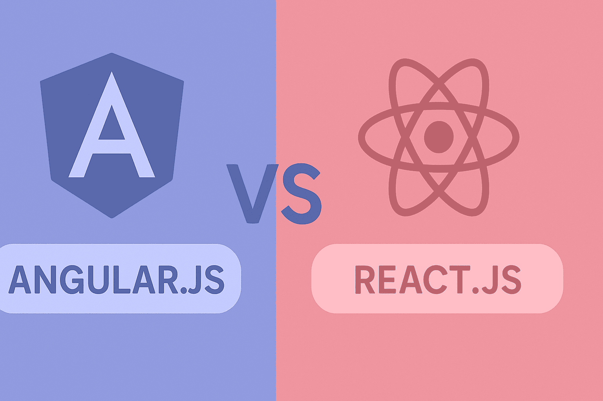

#  یادگیری Angular برای توسعه دهندگان React 



اگر یک توسعه‌دهنده React هستید و می‌خواهید Angular را یاد بگیرید یا حتی Angular Developer هستید و می خواهید وارد دنیای React شوید، احتمالاً با خودتان فکر می‌کنید: "چقدر سخت می‌تواند باشد؟" خبر خوب این است که بسیاری از مفاهیم بنیادین مشترک هستند، اما Angular رویکرد متفاوتی دارد که درک آن می‌تواند مسیر یادگیری شما را هموارتر کند.

React یک کتابخانه انعطاف‌پذیر است که به  شما آزادی عمل می‌دهد، در حالی که Angular یک فریم‌ورک کامل با ساختار مشخص است. اگر عادت کرده‌اید برای هر نیازی کتابخانه جدیدی نصب کنید، ممکن است کمی غافلگیر شوید که Angular همه چیز را از پیش آماده کرده است!

در این مقاله، به جای اینکه از صفر شروع کنیم، **دانش React شما را به عنوان پل ارتباطی** استفاده می‌کنیم و مفاهیم را یک‌به‌یک مقایسه می‌کنیم. قرار است با هم این موارد را بررسی کنیم:

- **تفاوت‌های بنیادین** بین کتابخانه و فریم‌ورک و نحوه راه‌اندازی پروژه
- **ساختار کامپوننت‌ها**: چگونه از توابع JSX به کلاس‌های TypeScript می‌رسیم
- **مدیریت State**: از `useState` تا متغیرهای کلاس و Signals جدید
- **Props و Data Flow**: تفاوت بین ارسال props و دکوریتور `@Input`
- **شرط‌ها و حلقه‌ها**: از `map` و `&&`  تا Control Flow مدرن Angular
- **چرخه حیات کامپوننت**: معادل‌های `useEffect` در Angular
- **مدیریت فرم‌ها**:  Two-Way Binding با `[(ngModel)]`
- **استراتژی‌های مدیریت State**: از Services و RxJS تا NgRx
- **یک مثال عملی کامل**: Todo List در React و Angular کنار هم

هدف این نیست که بگوییم کدام بهتر است، بلکه می‌خواهیم **الگوی فکری** شما را از React به Angular منتقل کنیم. پس فنجان چای تان را بردارید و بیایید این سفر را با هم شروع کنیم!

بیایید مفاهیم را یک‌به‌یک مقایسه کنیم.

## ۱. همه چیز در نگاه اول (Framework vs Library)

*   **React:** یک کتابخانه (Library) است. شما برای روتینگ، فرم‌ها و درخواست‌های HTTP باید کتابخانه‌های جانبی نصب کنید.
*   **Angular:** یک فریم‌ورک (Framework) کامل است. همه چیز (Router، HTTP Client، Form Validation) داخل خود آن تعبیه شده است. همچنین انگولار به شدت به **TypeScript** وابسته است.

### نحوه نصب و راه اندازی یک پروژه Angular

برای نصب و اجرای یک پروژه انگولار (Angular)، باید مراحل زیر را به ترتیب دنبال کنید.

قبل از هر چیز باید Node.js بر روی سیستم شما نصب باشد.


مرحله اول - نصب Angular CLI

ابزار خط فرمان انگولار (CLI) برای ساخت، مدیریت و اجرای پروژه ضروری است. برای نصب سراسری آن دستور زیر را در ترمینال بنویسید

```
npm install -g @angular/cli
```

مرحله دوم - ایجاد پروژه جدید

پس از نصب CLI، می‌توانید یک پروژه جدید بسازید. دستور زیر را اجرا کنید (به جای my-project نام دلخواه خود را بگذارید)

```bash
ng new my-project
```


مرحله سوم - ورود به پوشه پروژه

با استفاده از دستور cd وارد پوشه‌ای که ساخته شده است شوید

```
cd my-project
```

مرحله چهارم - اجرا و مشاهده پروژه

برای کامپایل و اجرای پروژه بر روی سرور محلی، دستور زیر را وارد کنید

```
ng serve --open
```


## ۲. ساختار کامپوننت (Component Structure)

در React، کامپوننت یک تابع است که JSX برمی‌گرداند. در Angular، کامپوننت یک **کلاس (Class)** است که با یک دکوریتور (Decorator) مشخص شده است و قالب (HTML) و منطق (TS) معمولاً جدا هستند.

**React:**
```jsx
// App.jsx
import { useState } from 'react';

function App() {
  return <h1>Hello React!</h1>;
}
export default App;
```

**Angular:**
```typescript
// app.component.ts
import { Component } from '@angular/core';

@Component({
  selector: 'app-root',
  standalone: true,
  template: `<h1>Hello Angular!</h1>`, // یا آدرس فایل html: templateUrl: './app.component.html'
  styleUrls: ['./app.component.css']
})
export class AppComponent {
  // منطق برنامه اینجا نوشته می‌شود
}
```


### ۳. مدیریت State (State Management)

در React از هوک `useState` استفاده می‌کنید. در Angular کلاسیک، متغیرهای کلاس همان State هستند و انگولار به صورت خودکار تغییرات را می‌فهمد.

*(نکته: در نسخه‌های جدید Angular مفهومی به نام Signal آمده که شبیه useState است، اما فعلاً روش کلاسیک را می‌بینیم).*

**React:**
```jsx
function Counter() {
  const [count, setCount] = useState(0);

  const increment = () => {
    setCount(count + 1);
  };

  return <button onClick={increment}>Count: {count}</button>;
}
```

**Angular:**
```typescript
@Component({
  selector: 'app-counter',
  standalone: true,
  template: `
    <button (click)="increment()">Count: {{ count }}</button>
  `
})
export class CounterComponent {
  count = 0; // این state است

  increment() {
    this.count++; // تغییر مستقیم متغیر مجاز است
  }
}
```
**تفاوت‌های کلیدی:**
*   نمایش متغیر: React `{val}` vs Angular `{{val}}`
*   رویدادها: React `onClick` vs Angular `(click)`


### ۴. پراپ‌ها (Props / Input)

در React پراپ‌ها را به عنوان آرگومان تابع دریافت می‌کنید. در Angular از دکوریتور `@Input` استفاده می‌کنید.

**React (Parent -> Child):**
```jsx
// Parent
<UserCard name="Ali" />

// Child
function UserCard({ name }) {
  return <p>User: {name}</p>;
}
```

**Angular (Parent -> Child):**
```typescript
// Parent HTML
<app-user-card [name]="'Ali'"></app-user-card>

// Child (user-card.component.ts)
import { Component, Input } from '@angular/core';

@Component({ ... template: `<p>User: {{ name }}</p>` })
export class UserCardComponent {
  @Input() name: string = ''; // تعریف پراپ
}
```


### ۵. حلقه‌ها و شرط‌ها (Loops & Conditionals)

در React از `map` و عملگرهای جاوااسکریپت (`&&` یا `? :`) استفاده می‌کنید. در Angular مدرن (v17+) از "Control Flow" جدید استفاده می‌شود که بسیار خوانا است.

**شرط‌ها (Conditional Rendering):**

**React:**
```jsx
{isAdmin && <button>Edit</button>}
```

**Angular:**
```html
@if (isAdmin) {
  <button>Edit</button>
}
```

**حلقه‌ها (List Rendering):**

**React:**
```jsx
<ul>
  {users.map(user => (
    <li key={user.id}>{user.name}</li>
  ))}
</ul>
```

**Angular:**
```html
<ul>
  @for (user of users; track user.id) {
    <li>{{ user.name }}</li>
  }
</ul>
```


### ۶. چرخه حیات (Lifecycle)

شما `useEffect` را می‌شناسید. در Angular متدهای خاصی در کلاس وجود دارد.

*   **`useEffect(() => {}, [])` (Mount):** معادل `ngOnInit` در انگولار است.
*   **`useEffect(() => { return () => {} }, [])` (Unmount):** معادل `ngOnDestroy` است.

**Angular:**
```typescript
import { Component, OnInit, OnDestroy } from '@angular/core';

export class ExampleComponent implements OnInit, OnDestroy {
  
  ngOnInit() {
    console.log('کامپوننت لود شد - مثل useEffect با آرایه خالی');
    // جای مناسب برای فراخوانی API
  }

  ngOnDestroy() {
    console.log('کامپوننت در حال حذف شدن است - مثل cleanup function');
  }
}
```


### ۷. مدیریت فرم (Two-Way Binding)

در React برای اتصال Input به State باید `value` و `onChange` بنویسید. در Angular یک دستور جادویی به نام `[(ngModel)]` وجود دارد.

**React:**
```jsx
<input value={name} onChange={e => setName(e.target.value)} />
```

**Angular:**
```html
<!-- نیاز به ایمپورت FormsModule دارد -->
<input [(ngModel)]="name" />
<p>Hello {{ name }}</p>
```
وقتی در input تایپ کنید، متغیر `name` در کلاس خود به خود آپدیت می‌شود و برعکس.


## ۳.روش مدیریت State در انگولار 

در انگولار، برخلاف ری‌اکت که کتابخانه‌های جانبی (مثل Redux یا Zustand) خیلی زود وارد پروژه می‌شن، خودِ فریم‌ورک ابزارهای داخلی بسیار قدرتمندی داره. مدیریت استیت در انگولار رو می‌شه به سه سطح اصلی تقسیم کرد:
۱. روش Native (سرویس‌ها و RxJS)
این رایج‌ترین روش در پروژه‌های متوسط و بزرگه. در ری‌اکت شما از Context API استفاده می‌کردید؛ در انگولار از Services به همراه RxJS استفاده می‌کنیم.
 * BehaviorSubject: معمولاً یک متغیر در سرویس تعریف می‌شه که استیت رو نگه می‌داره.
 * Observable: کامپوننت‌ها به این استیت "Subscribe" می‌کنن تا از تغییرات باخبر بشن.
۲. استفاده از Signals (روش مدرن و جدید)
اگر با useState در ری‌اکت راحت هستی، Signals (که از نسخه ۱۶ به بعد معرفی شد) بهترین دوست تو در انگولار خواهد بود. سیگنال‌ها مدیریت استیت رو بسیار ساده‌تر، پرفورمنس رو بالاتر و کد رو خواناتر کردن.
 * Writable Signals: مشابه useState عمل می‌کنه.
 * Computed Signals: مشابه useMemo برای محاسبات وابسته به استیت.
 * Effect: مشابه useEffect برای اجرای کدهای جانبی هنگام تغییر استیت.
۳. مدیریت استیت جهانی (NgRx)
اگر در ری‌اکت از Redux استفاده می‌کردی، NgRx دقیقاً معادل همونه. این کتابخانه بر پایه الگوهای Redux ساخته شده و شامل اکشن‌ها (Actions)، ردیوسرها (Reducers) و افکت‌ها (Effects) می‌شه.
 * مناسب برای: پروژه‌های بسیار بزرگ با پیچیدگی زیاد.
 * نکته: یادگیری NgRx به دلیل Boilerplate زیاد، کمی زمان‌بره.

مقایسه سریع :

| مفهوم در ری‌اکت | معادل در انگولار |
|---|---|
| useState / useReducer | Signals یا Internal Component State |
| Context API | Services + RxJS (BehaviorSubject) |
| Redux / Zustand | NgRx یا NGXS |
| useEffect | Signals Effect یا RxJS Hooks |

این قسمت از ماجرا چون ریزه کاری زیادی داره توی بخش بعدی از این سری به طور کامل برسی خواهیم داد. اگر می خواید زودتر اماده بشه لطفا تو کامنت ها بهم بگید تا سریعتر بریم سراغش.
 


## ۴. یک مثال کد کامل ( Todo List ساده) 

بیایید یک **Todo List** کامل بسازیم .در اینجا کدها را کنار هم می‌گذاریم تا تفاوت الگوی فکری را ببینید.


### ۱. نسخه React (روش تابعی با Hooks)

این کدی است که شما احتمالاً با آن آشنا هستید:

```jsx
import { useState } from 'react';
import './App.css';

function TodoApp() {
  // 1. State Definition
  const [text, setText] = useState('');
  const [todos, setTodos] = useState([
    { id: 1, title: 'یادگیری React', completed: true },
    { id: 2, title: 'یادگیری Angular', completed: false }
  ]);

  // 2. Logic Methods
  const addTodo = () => {
    if (!text.trim()) return;
    const newTodo = { id: Date.now(), title: text, completed: false };
    
    setTodos([...todos, newTodo]);
    setText('');
  };

  const deleteTodo = (id) => {
    setTodos(todos.filter(t => t.id !== id));
  };

  const toggleTodo = (id) => {
    setTodos(todos.map(t => 
      t.id === id ? { ...t, completed: !t.completed } : t
    ));
  };

  // 3. Template (JSX)
  return (
    <div className="container">
      <h2>لیست کارهای من (React)</h2>
      
      <div className="input-group">
        <input 
          value={text} 
          onChange={(e) => setText(e.target.value)} 
          placeholder="کار جدید..."
        />
        <button onClick={addTodo}>افزودن</button>
      </div>

      <ul>
        {todos.map(todo => (
          <li key={todo.id}>
            <span 
              onClick={() => toggleTodo(todo.id)}
              style={{ textDecoration: todo.completed ? 'line-through' : 'none' }}
            >
              {todo.title}
            </span>
            <button onClick={() => deleteTodo(todo.id)}>حذف</button>
          </li>
        ))}
      </ul>
    </div>
  );
}

export default TodoApp;
```


### ۲. نسخه Angular 

در انگولار، فایل‌ها معمولاً جدا هستند (TS, HTML, CSS)، اما اینجا برای سادگی همه را در یک فایل نشان می‌دهم.


```typescript
import { Component } from '@angular/core';
import { FormsModule } from '@angular/forms'; // 1. لازم برای [(ngModel)]

// اینترفیس برای تایپ‌اسکریپت (اختیاری ولی توصیه شده)
interface Todo {
  id: number;
  title: string;
  completed: boolean;
}

@Component({
  selector: 'app-todo',
  standalone: true,
  imports: [FormsModule], // ایمپورت ماژول‌های مورد نیاز در خود کامپوننت
  template: `
    <div class="container">
      <h2>لیست کارهای من (Angular)</h2>

      <div class="input-group">
        <!-- 3. Two-Way Binding: مقدار text همزمان در UI و کلاس آپدیت می‌شود -->
        <input 
          [(ngModel)]="text" 
          placeholder="کار جدید..."
          (keydown.enter)="addTodo()" 
        />
        <button (click)="addTodo()">افزودن</button>
      </div>

      <ul>
        <!-- 4. Control Flow: سینتکس جدید حلقه -->
        @for (todo of todos; track todo.id) {
          <li>
            <span 
              (click)="toggleTodo(todo)"
              [style.text-decoration]="todo.completed ? 'line-through' : 'none'"
              class="todo-text"
            >
              {{ todo.title }}
            </span>
            <button (click)="deleteTodo(todo.id)">حذف</button>
          </li>
        } @empty {
          <p>هیچ کاری وجود ندارد!</p>
        }
      </ul>
    </div>
  `,
  styles: [`
    .todo-text { cursor: pointer; margin-right: 10px; }
  `]
})
export class TodoComponent {
  // State Definition (متغیرهای ساده کلاس)
  text: string = '';
  todos: Todo[] = [
    { id: 1, title: 'یادگیری React', completed: true },
    { id: 2, title: 'یادگیری Angular', completed: false }
  ];

  // Logic Methods
  addTodo() {
    if (!this.text.trim()) return;
    
    const newTodo: Todo = { 
      id: Date.now(), 
      title: this.text, 
      completed: false 
    };

    this.todos.push(newTodo);
    this.text = ''; // پاک کردن اینپوت با تغییر متغیر
  }

  deleteTodo(id: number) {
    // اینجا هم می‌توانیم از splice استفاده کنیم یا فیلتر کنیم و دوباره به this.todos اختصاص دهیم
    this.todos = this.todos.filter(t => t.id !== id);
  }

  toggleTodo(todo: Todo) {
    // ما رفرنس آبجکت را داریم، مستقیم تغییرش می‌دهیم!
    // نیازی به map کردن کل آرایه نیست
    todo.completed = !todo.completed;
  }
}
```


## ۵.سخن آخر

اگر تا اینجا با من همراه بوده‌اید، تبریک می‌گویم! شما الان دید کلی نسبت به تفاوت‌های Angular و React پیدا کرده‌اید و می‌دانید که انتقال از یکی به دیگری به آن سختی که فکر می‌کردید نیست.

همان‌طور که در ابتدای مقاله گفتم، اگر می‌خواهید بخش **مدیریت State پیشرفته** (Services، RxJS، و NgRx) را زودتر منتشر کنم، حتماً در کامنت‌ها بهم اطلاع بدهید تا در اولویت قرار بگیرد.

موفق باشید! 🚀


_اگر این مقاله برایتان مفید بود، آن را با دوستان توسعه‌دهنده‌تان به اشتراک بگذارید. سوالات و تجربیات خودتان را در کامنت‌ها با من در میان بگذارید._