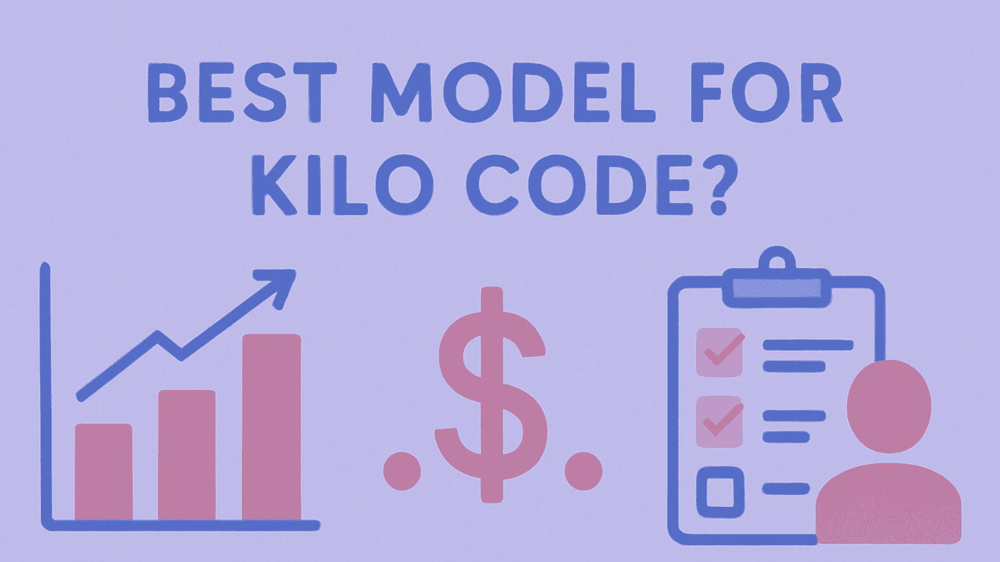

# بهترین مدل برای Kilo Code کدام است؟ بررسی KiloBench، هزینه و انتخاب مدل

اگر عبارت **«بهترین مدل برای Kilo Code»** را جست‌وجو کنید، خیلی زود با یک مشکل روبه‌رو می‌شوید: گزینه‌های زیادی وجود دارد و جواب این سؤال آن‌قدرها هم ساده نیست.

Kilo Code به مجموعه بزرگی از مدل‌های AI دسترسی می‌دهد. از طرف دیگر، مدلی که در یک leaderboard عمومی برنامه‌نویسی امتیاز بالایی می‌گیرد، الزاماً بهترین انتخاب برای هر task در Kilo Code نیست. مستندات فعلی Kilo علاوه بر benchmark، به leaderboard زنده‌ای متکی هستند که از usage واقعی توسعه‌دهندگان استفاده می‌کند. KiloBench هم عملکرد مدل‌ها را داخل Agent Harness خود Kilo ارزیابی می‌کند.

پس پاسخ ثابتی به این سؤال وجود ندارد.

سؤال کاربردی‌تر این است:

> **برای taskی که در Kilo Code انجام می‌دهم، کدام مدل ترکیب بهتری از کیفیت، هزینه، ظرفیت context و میزان کنترل به من می‌دهد؟**

نتایج فعلی KiloBench نقطه شروع خوبی هستند. در بررسی فعلی، GPT-5.6 Sol با نرخ تکمیل ۷۶.۲٪ در صدر benchmark قرار دارد و بعد از آن GPT-5.5 با ۷۴.۲٪ و Grok 4.6 با ۷۳.۰٪ قرار گرفته‌اند. اما Kilo هزینه را هم در کنار نرخ تکمیل گزارش می‌کند و چند مدل ارزان‌تر فاصله زیادی با صدر جدول ندارند.

بنابراین انتخاب مدل بیشتر از اینکه پیدا کردن یک «قهرمان همیشگی» باشد، پیدا کردن **trade-off مناسب برای workflow خودتان** است.

## پاسخ کوتاه: یک مدل برنده همیشگی وجود ندارد

جدول فعلی KiloBench چنین تصویری می‌دهد:

| رتبه | مدل | نرخ تکمیل | هزینه هر attempt |
|---:|---|---:|---:|
| ۱ | GPT-5.6 Sol | ۷۶.۲٪ | ۸۷.۴۱ دلار |
| ۲ | GPT-5.5 | ۷۴.۲٪ | ۷۲.۶۳ دلار |
| ۳ | Grok 4.6 | ۷۳.۰٪ | ۳۳.۸۳ دلار |
| ۴ | Kimi K3 | ۷۲.۸٪ | ۴۸.۳۸ دلار |
| ۵ | Claude Opus 5 | ۷۱.۵٪ | ۱۱۳.۵۴ دلار |
| ۶ | Claude Fable 5 | ۷۱.۰٪ | ۸۷.۵۲ دلار |
| ۷ | Grok 4.5 | ۷۰.۸٪ | ۲۷.۲۹ دلار |
| ۸ | Claude Opus 4.7 | ۷۰.۱٪ | ۱۰۰.۵۱ دلار |
| ۹ | Claude Opus 4.8 | ۶۷.۶٪ | ۸۵.۱۹ دلار |
| ۱۰ | Gemini 3.5 Flash | ۶۴.۷٪ | ۱۰۴.۴۹ دلار |

این اعداد، **نتایج رسمی Kilo** در Terminal Bench 2.0 هستند که از طریق Agent Harness خود Kilo به دست آمده‌اند. هزینه نمایش‌داده‌شده هم فقط قیمت خام token نیست و هزینه اجرای کامل benchmark را در نظر می‌گیرد.

اولین نکته مهم این است که **نرخ موفقیت و هزینه، الزاماً یک داستان واحد را روایت نمی‌کنند**.

GPT-5.6 Sol فعلاً بالاترین نرخ تکمیل را دارد. Grok 4.6 فقط چند واحد درصد پایین‌تر است، اما هزینه benchmark آن بسیار کمتر است. Grok 4.5 هم نرخ تکمیل پایین‌تری دارد ولی در میان مدل‌های بالای جدول، هزینه بسیار پایین‌تری نشان می‌دهد.

این به‌تنهایی ثابت نمی‌کند که Grok 4.6 «بهترین مدل از نظر ارزش خرید» است. اما خیلی خوب نشان می‌دهد که **رتبه‌بندی صرفاً بر اساس score کافی نیست**.

### یک چارچوب ساده برای انتخاب مدل

| اولویت شما | نقطه شروع مناسب |
|---|---|
| بیشترین توان فعلی در benchmark | GPT-5.6 Sol یا یکی از مدل‌های frontier فعلی |
| توان بالا با هزینه کمتر | مقایسه GPT-5.5، Grok 4.6 و Kimi K3 |
| توسعه روزمره | مدل mid-tier یا Efficient |
| کمینه‌کردن هزینه inference | Auto Efficient |
| استفاده رایگان | Auto Free |
| کنترل کامل روی مدل | انتخاب دستی مدل |

این جدول یک starting point است، نه یک ranking دائمی. خود Kilo هم تأکید می‌کند که مدل‌ها، قیمت‌ها و availability به‌سرعت تغییر می‌کنند.

## KiloBench دقیقاً چه چیزی را اندازه می‌گیرد؟

KiloBench یک leaderboard عمومیِ کپی‌شده از benchmark دیگری نیست.

Kilo مدل‌ها را روی **Terminal Bench 2.0** و از طریق Agent Harness واقعی خودش ارزیابی می‌کند. در این ارزیابی، مدل باید taskها را به‌صورت end-to-end انجام دهد؛ یعنی فقط تولید کد مطرح نیست و planning، استفاده از toolها، اجرای چندمرحله‌ای و self-correction هم در workflow وارد می‌شوند.

دو معیار اصلی در benchmark عبارت‌اند از:

- **Completion percentage** یا درصد taskهای تکمیل‌شده
- **Cost per attempt** یا هزینه اجرای یک attempt کامل

Kilo توضیح می‌دهد که هزینه benchmark فقط به قیمت token محدود نیست و reasoning tokenها، ارسال دوباره context و overhead مربوط به agent loop هم در آن نقش دارند.

این تفاوت مهم است.

فرض کنید دو مدل یک task سخت را با موفقیت انجام دهند. مدل اول با چند درخواست محدود کار را تمام می‌کند، اما مدل دوم مدت بیشتری reasoning می‌کند، context بیشتری می‌خواند، tool بیشتری صدا می‌زند و چند بار retry می‌کند. مقایسه صرفِ قیمت token می‌تواند این اختلاف را پنهان کند.

KiloBench دقیقاً به همین دلیل نگاه agentic‌تری به هزینه دارد.

### نکته مهم: KiloBench یک benchmark مخصوص Kilo است

استدلال Kilo این است که عملکرد یک مدل می‌تواند بسته به Agent Harness تغییر کند. toolها، context pipeline، retryها و orchestration اطراف مدل بخشی از محیطی هستند که مدل در آن کار می‌کند.

بنابراین KiloBench برای کاربری که دقیقاً از Kilo Code استفاده می‌کند، از یک امتیاز generic که در محیط دیگری به دست آمده، کاربردی‌تر است.

اما باز هم یک محدودیت مهم وجود دارد:

**امتیاز Terminal Bench تضمین نمی‌کند همان مدل در repository شما هم دقیقاً همان عملکرد را نشان دهد.**

نوع پروژه، prompt، حجم context، test suite، toolها و حتی نسخه محصول می‌توانند نتیجه را تغییر دهند.

## KiloBench تنها یک سیگنال است

یکی از مهم‌ترین نکات در رویکرد فعلی Kilo این است که انتخاب مدل فقط به یک leaderboard ثابت محدود نمی‌شود.

مستندات فعلی Kilo به یک **leaderboard لحظه‌ای مبتنی بر usage واقعی توسعه‌دهندگان** اشاره می‌کنند. این داده‌ها کمک می‌کنند مشخص شود کدام مدل‌ها در workflow واقعی کاربران Kilo نتیجه خوبی می‌دهند.

پس در عمل سه سیگنال دارید:

| سیگنال | چه چیزی به شما می‌گوید؟ |
|---|---|
| KiloBench | عملکرد مدل در یک ارزیابی کنترل‌شده داخل Kilo |
| Usage واقعی Kilo | مدل‌هایی که توسعه‌دهندگان در عمل بیشتر و موفق‌تر استفاده می‌کنند |
| Workflow خود شما | اینکه مدل واقعاً با repository، taskها و بودجه شما سازگار است یا نه |

برای تصمیم واقعی، سیگنال سوم در نهایت مهم‌ترین است.

ممکن است مدلی benchmark بسیار خوبی داشته باشد، اما برای workflow شما که پر از تغییرات کوچک و تکراری است انتخاب اقتصادی مناسبی نباشد. برعکس، مدلی با benchmark ضعیف‌تر ممکن است برای بیشتر taskهای روزانه شما کاملاً کافی باشد و هزینه بسیار کمتری داشته باشد.

این همان تفاوت بین **“best benchmark model”** و **“best model for my workflow”** است.

## کدام مدل‌ها در نتایج فعلی KiloBench بیشتر جلب توجه می‌کنند؟

لازم نیست همه مدل‌های فهرست‌شده در KiloBench را تحلیل کنید تا بتوانید تصمیم خوبی بگیرید.

همان چند مدل بالای جدول، trade-off اصلی را کاملاً نشان می‌دهند.

### GPT-5.6 Sol

GPT-5.6 Sol فعلاً با **۷۶.۲٪ completion** و **۸۷.۴۱ دلار هزینه متوسط برای هر attempt** در صدر KiloBench است.

اگر اولویت اول شما بیشترین توان benchmark فعلی است و هزینه اهمیت ثانویه دارد، این مدل واضح‌ترین starting point در جدول فعلی است.

اما این نتیجه، به معنی «بهترین مدل برای همه taskها» نیست.

### GPT-5.5

GPT-5.5 با **۷۴.۲٪ completion** و **۷۲.۶۳ دلار هزینه برای هر attempt** قرار دارد.

فاصله آن با صدر جدول نسبتاً کم است، در حالی که هزینه benchmark پایین‌تر است.

بنابراین برای کسی که دنبال capability بالا بدون انتخاب گران‌ترین گزینه فعلی است، مقایسه GPT-5.5 با مدل‌های دیگر منطقی است.

### Grok 4.6

Grok 4.6 به **۷۳.۰٪ completion** با **۳۳.۸۳ دلار هزینه در هر attempt** رسیده است.

این مدل یکی از جالب‌ترین نقاط جدول فعلی است، چون completion آن به مدل‌های صدر نزدیک است اما هزینه‌اش به‌مراتب پایین‌تر گزارش شده است.

بهتر است آن را یک **گزینه قابل‌توجه از نظر نسبت عملکرد به هزینه** بدانیم، نه اینکه بدون محاسبه و تکرار کافی، آن را «بهترین مدل از نظر ارزش» معرفی کنیم.

### Kimi K3

Kimi K3 فعلاً **۷۲.۸٪ completion** و **۴۸.۳۸ دلار هزینه برای هر attempt** دارد.

باز هم نکته اصلی جایگاه آن روی منحنی کیفیت/هزینه است. عملکرد benchmark آن به مدل‌های بالای جدول نزدیک است، اما در بالاترین رده هزینه قرار ندارد.

### Claude Opus 5

Claude Opus 5 فعلاً **۷۱.۵٪ completion** و **۱۱۳.۵۴ دلار هزینه در هر attempt** دارد.

یعنی وقتی capability برای شما از کاهش هزینه مهم‌تر است، این مدل می‌تواند در دسته گزینه‌های premium قرار بگیرد؛ اما اعداد KiloBench به‌تنهایی مزیت تولیدی عمومی و همیشگی‌ای را ثابت نمی‌کنند.

برای taskهای پیچیده یا حساس، این نوع انتخاب با راهنمای فعلی Kilo هم سازگار است؛ Kilo برای نیازهای پیچیده، refactorهای بزرگ و کارهای معماری، مدل‌های premium را توصیه می‌کند.

### گزینه‌های ارزان‌تر

در جدول KiloBench چند گزینه ارزان‌تر هم دیده می‌شوند، از جمله:

- **Grok 4.5:** ۷۰.۸٪ با ۲۷.۲۹ دلار
- **Claude Sonnet 5:** ۵۹.۶٪ با ۳۶.۱۹ دلار
- **Qwen3.7 Max:** ۵۴.۶٪ با ۲۰.۶۵ دلار
- **Kimi K2.6:** ۵۴.۴٪ با ۲۴.۸۴ دلار
- **MiMo-V2.5-Pro:** ۴۷.۶٪ با ۴.۹۲ دلار
- **MiniMax M3:** ۴۷.۶٪ با ۱۰.۳۵ دلار
- **DeepSeek V4 Pro 0423:** ۴۴.۰٪ با ۱۵.۹۱ دلار
- **Hy3:** ۴۷.۶٪ با ۰ دلار

از این اعداد نباید نتیجه گرفت که «مدل‌های ارزان تقریباً به‌اندازه مدل‌های frontier خوب هستند». فاصله completion در بعضی موارد قابل‌توجه است.

نتیجه واقعی این است که **منحنی هزینه/عملکرد آن‌قدر گسترده است که استفاده از گران‌ترین مدل برای هر task منطقی نیست.**

## برای کارهای روزمره Kilo Code چه مدلی مناسب‌تر است؟

برای توسعه روزمره، دلیل خوبی وجود دارد که همیشه سراغ frontier نروید.

راهنمای فعلی Kilo می‌گوید مدل‌های mid-tier برای بسیاری از taskهای روزمره می‌توانند تعادل بهتری بین سرعت، هزینه و کیفیت ایجاد کنند.

این دسته شامل کارهایی مثل:

- اضافه‌کردن یک feature محدود
- به‌روزرسانی testها
- تغییر ساده در UI
- اصلاح یک API call مشخص
- نگهداری documentation
- cleanupهای قابل‌پیش‌بینی

است.

هدف استفاده از ارزان‌ترین مدل ممکن نیست.

هدف این است که برای taskی که نیازی به capability حداکثری ندارد، بیش از نیاز هزینه نکنید.

یک قاعده کاربردی:

> **برای task پیچیده‌ای که خطا در آن پرهزینه است، مدل قوی‌تر انتخاب کنید؛ برای taskهای روتین، مدل efficient یا mid-tier می‌تواند منطقی‌تر باشد.**

این یک چارچوب تصمیم‌گیری است، نه نتیجه یک benchmark مستقل روی همه انواع task.

## برای taskهای پیچیده چه مدلی مناسب‌تر است؟

برای requirementهای پیچیده، refactorهای بزرگ و تصمیم‌های معماری، راهنمای فعلی Kilo مدل‌های premium را پیشنهاد می‌کند؛ از جمله مدل‌های رده Claude، GPT-5 و Gemini Pro.

در چنین taskهایی هزینه یک failure می‌تواند از قیمت خود مدل مهم‌تر شود.

یک تلاش ناموفق ممکن است باعث شود:

- debugging بیشتری انجام دهید،
- testهای خراب را دوباره بررسی کنید،
- بخشی از تغییرات را دستی اصلاح کنید،
- context بیشتری مصرف شود،
- یا task را دوباره اجرا کنید.

بنابراین ارزان‌ترین attempt لزوماً ارزان‌ترین **completed task** نیست.

با این حال، این نکته را نباید به یک ranking دائمی برای مدل‌ها تبدیل کرد. خود Kilo هم تأکید می‌کند که landscape مدل‌ها سریع تغییر می‌کند.

## بهترین گزینه رایگان برای Kilo Code چیست؟

پاسخ آینده‌نگرانه‌تر، نام یک مدل مشخص نیست.

**Auto Free** انتخاب پایدارتری برای استفاده رایگان است.

مستندات فعلی Kilo می‌گویند `kilo-auto/free` درخواست‌ها را به مدل‌های رایگان در دسترس route می‌کند. چون availability مدل‌های رایگان تغییر می‌کند، مدلی که امروز بهترین گزینه رایگان است لزوماً فردا همان مدل نیست.

نتایج فعلی KiloBench هم این تفاوت را نشان می‌دهند. برای نمونه، Hy3 در جدول فعلی **۴۷.۶٪ completion با هزینه صفر** دارد، در حالی که مدل رایگان دیگری مانند Nemotron 3 Super نرخ پایین‌تری نشان می‌دهد.

پس «رایگان» یک معیار هزینه است، نه یک سطح کیفیت.

### یک نکته مهم درباره داده و حریم خصوصی

مستندات فعلی Auto Model هشدار می‌دهند که Auto Free ممکن است درخواست‌ها را به providerهایی بفرستد که prompt و outputها را log می‌کنند. Kilo برای داده‌های شخصی یا محرمانه توصیه می‌کند قبل از استفاده، handling مربوط به provider را بررسی کنید.

بنابراین Auto Free برای experimentation و taskهای کم‌ریسک می‌تواند مناسب باشد، اما نباید صرفاً به دلیل رایگان‌بودن آن را برای هر repository حساس انتخاب کنید.

## بهتر است مدل را دستی انتخاب کنیم یا Auto Model را؟

برای بسیاری از توسعه‌دهندگان، این سؤال از «کدام مدل رتبه اول را دارد؟» مهم‌تر است.

Kilo در حال حاضر سه tier برای Auto Model ارائه می‌کند:

- `kilo-auto/frontier`
- `kilo-auto/efficient`
- `kilo-auto/free`

### Auto Frontier

`kilo-auto/frontier` برای زمانی طراحی شده که هدف شما capability بالاتر است و ترجیح می‌دهید Kilo خودش routing بین مدل‌های مناسب را انجام دهد.

برای کسی مناسب است که نمی‌خواهد برای هر درخواست بین چند مدل مختلف تصمیم بگیرد.

### Auto Efficient

`kilo-auto/efficient` روی routing اقتصادی متمرکز است.

Kilo این tier را به‌عنوان روشی برای تطبیق difficulty task با مدلی توصیف می‌کند که برای آن سطح از کار، دقت کافی داشته باشد.

در benchmark فعلی، Auto Efficient با **۴۶.۷٪ completion** و **۱۹.۶۰ دلار هزینه در هر attempt** گزارش شده است.

این به معنی تضمین صرفه‌جویی برای workflow شما نیست.

اما نشان می‌دهد که Kilo در این tier، **هزینه هر task را در برابر capability** به‌صورت صریح وارد تصمیم‌گیری می‌کند.

برای workloadی که از taskهای ساده تا دشوار تشکیل شده، این رویکرد می‌تواند منطقی‌تر از اجرای یک مدل گران روی همه درخواست‌ها باشد.

### Auto Free

`kilo-auto/free` به مدل‌های رایگان موجود route می‌کند و mapping مدل‌ها می‌تواند در سمت سرور تغییر کند.

### چه زمانی انتخاب دستی بهتر است؟

مدل را دستی انتخاب کنید وقتی که:

- از قبل می‌دانید کدام مدل روی repository شما بهتر جواب می‌دهد،
- مدل یا provider مشخصی لازم دارید،
- reproducibility برایتان مهم است،
- context window خاصی نیاز دارید،
- دارید مدل‌ها را با هم مقایسه می‌کنید،
- یا می‌خواهید کنترل کامل روی انتخاب مدل داشته باشید.

Kilo در workflow فعلی خود انتخاب دستی model و reasoning variant را هم پشتیبانی می‌کند.

## Context Window مهم‌تر از چیزی است که leaderboard نشان می‌دهد

کیفیت مدل تنها محدودیت نیست.

مدل باید بتواند حجم کاری شما را هم در context خود جا دهد.

راهنمای فعلی Kilo برای انتخاب مدل، به‌صورت تقریبی این بازه‌ها را مطرح می‌کند:

- **۳۲ تا ۶۴ هزار token** برای scriptها و componentهای کوچک
- **۱۲۸ هزار token** برای applicationهای معمول
- **۲۵۶ هزار token یا بیشتر** برای codebaseهای بزرگ
- و مدل‌هایی با context بسیار بزرگ‌تر هم وجود دارند، هرچند Kilo هشدار می‌دهد که در contextهای بسیار بزرگ، effectiveness می‌تواند افت کند.

این‌ها requirementهای جهانی نیستند؛ صرفاً guidance فعلی Kilo هستند.

نکته اصلی این است که ممکن است مدلی که کمی پایین‌تر در benchmark قرار دارد، به دلیل context مناسب‌تر برای repository شما انتخاب بهتری باشد.

Kilo همچنین اشاره می‌کند که در مدل‌های thinking، تنظیم output token می‌تواند ظرفیت باقی‌مانده برای conversation history را کاهش دهد. در راهنمای فعلی، برای modeهایی مثل Architect و Debug بودجه بیشتری برای thinking پیشنهاد شده و برای Code mode محدودتر نگه‌داشتن آن منطقی‌تر دانسته شده است.

پس هنگام انتخاب مدل فقط این سؤال را نپرسید:

> «کدام مدل امتیاز بالاتری دارد؟»

این سؤال را هم بپرسید:

> **«آیا این مدل می‌تواند context موردنیاز task من را به‌خوبی مدیریت کند؟»**

## بهترین مدل Kilo Code واقعاً چقدر هزینه دارد؟

مدل‌سازی هزینه در Kilo می‌تواند کمی گیج‌کننده باشد، چون چند نوع هزینه مختلف وجود دارد.

طبق قیمت‌گذاری فعلی Kilo، این موارد از هم تفکیک می‌شوند:

1. **دسترسی به خود پلتفرم Kilo**
2. **هزینه inference مدل**
3. **هزینه cloud compute**

پلن پلتفرم Kilo برای افراد رایگان است؛ هزینه AI inference بسته به روش استفاده می‌تواند از free/local models، BYOK، Kilo Gateway یا Kilo Pass تأمین شود. Cloud compute برای قابلیت‌های cloud به‌صورت جداگانه محاسبه می‌شود. Kilo همچنین اعلام می‌کند که Kilo Gateway به بیش از ۵۰۰ مدل و بیش از ۶۰ provider دسترسی می‌دهد و نرخ inference را بدون markup نسبت به provider دریافت می‌کند.

این با **هزینه هر attempt در KiloBench** یکی نیست.

KiloBench هزینه اجرای workflow benchmark را گزارش می‌کند و reasoning tokenها، ارسال دوباره context و agent-loop overhead را هم در نظر می‌گیرد.

به همین دلیل یک معیار بسیار کاربردی برای benchmark مستقل این است:

### هزینه هر task موفق

فرمول ساده:

**هزینه هر task موفق = کل هزینه / تعداد taskهای موفق**

این معیار، یک **متریک پیشنهادی برای تحلیل عملی** است، نه اینکه آن را یک معیار رسمی Kilo معرفی کنیم.

دلیل مهم‌بودنش هم روشن است: مدلی که در هر attempt ارزان‌تر است، اگر دائماً fail شود، ممکن است در پایان کار هزینه بیشتری ایجاد کند.

## یک استراتژی عملی برای انتخاب مدل در Kilo Code

لازم نیست ranking مدل‌ها را همیشه حفظ کنید.

این روند ساده‌تر است:

### مدل frontier انتخاب کنید وقتی:

- task پیچیده است،
- architecture مهم است،
- failure هزینه زیادی دارد،
- repository برای مدل ناآشناست،
- reasoning سنگین لازم است.

راهنمای فعلی Kilo برای requirementهای nuanced، refactorهای بزرگ و تصمیم‌های معماری، مدل‌های premium را پیشنهاد می‌کند.

### مدل efficient یا mid-tier انتخاب کنید وقتی:

- task روتین است،
- scope محدود است،
- بازبینی خطا ساده است،
- سرعت و هزینه اهمیت دارد.

این هم با guidance فعلی Kilo درباره تعادل کیفیت/هزینه در کارهای روزمره سازگار است.

### Auto Efficient را انتخاب کنید وقتی:

- workload شما مرتب از taskهای آسان تا دشوار تغییر می‌کند،
- نمی‌خواهید دائماً مدل عوض کنید،
- هزینه مهم است،
- ترجیح می‌دهید Kilo routing را انجام دهد.

### Auto Free را انتخاب کنید وقتی:

- هزینه اصلی‌ترین محدودیت است،
- taskها کم‌ریسک هستند،
- داده‌ای که می‌فرستید برای providerهای routed مناسب است.

برای repository محرمانه، قبل از استفاده، شرایط داده provider فعلی را بررسی کنید.

### انتخاب دستی مدل زمانی بهتر است که:

- evidence مخصوص repository خودتان دارید،
- reproducibility مهم است،
- capability مشخصی لازم دارید،
- یا می‌خواهید مدل‌ها را عمداً با هم مقایسه کنید.

هرچه بیشتر از Kilo استفاده کنید، ارزش تصمیم‌گیری بر اساس **task history خودتان** بیشتر از دنبال‌کردن یک «top five» ثابت روی اینترنت می‌شود.

## KiloBench چه چیزی را می‌تواند و چه چیزی را نمی‌تواند به شما بگوید؟

### KiloBench می‌تواند نشان دهد:

- مدل‌ها در ارزیابی منتشرشده توسط Kilo چه عملکردی دارند،
- completion و benchmark cost چگونه با هم تغییر می‌کنند،
- کدام مدل‌ها فعلاً روی منحنی کیفیت/هزینه جایگاه بهتری دارند،
- چرا Kilo-specific harness اهمیت دارد.

### KiloBench نمی‌تواند نشان دهد:

- یک مدل دقیقاً روی repository شما چگونه رفتار خواهد کرد،
- هزینه هر task موفق برای شما چقدر خواهد بود،
- کدام مدل برای تمام taskهای شما بهترین خواهد بود،
- رتبه‌بندی فعلی ماه آینده هم همان خواهد بود.

خود Kilo تأکید می‌کند که landscape مدل‌ها سریع تغییر می‌کند و به همین دلیل کاربران باید وضعیت زنده مدل‌ها را بررسی کنند.

به همین دلیل، یک مقاله خوب درباره انتخاب مدل در Kilo Code باید بیشتر روی **اصول تصمیم‌گیری** متمرکز باشد تا حفظ کردن نام چند مدل ثابت.

## «بهترین مدل» را بهتر است چطور تعریف کنیم؟

برای جلوگیری از تصمیم‌های اشتباه، «بهترین» را یک متغیر واحد در نظر نگیرید.

به این چهار سؤال نگاه کنید:

| سؤال | چیزی که باید بهینه شود |
|---|---|
| task چقدر سخت است؟ | قابلیت مدل |
| شکست چقدر پرهزینه است؟ | قابلیت اطمینان |
| task را چند بار انجام می‌دهید؟ | هزینه |
| آیا می‌خواهید مدل را دستی مدیریت کنید؟ | اتوماسیون |

از اینجا به چند قاعده ساده می‌رسیم:

**Task با ریسک بالا:** مدل قوی‌تر را ترجیح دهید.

**Task روتین:** مدل efficient را ترجیح دهید.

**Workload متنوع:** Auto Efficient را در نظر بگیرید.

**آزمایش رایگان:** Auto Free را با توجه به نحوه پردازش داده‌ها استفاده کنید.

**Workflow تخصصی یا قابل‌تکرار:** مدل را دستی انتخاب کنید.

این چارچوب از یک ranking ثابت پایدارتر است، چون مدل‌ها، قیمت‌ها و routing در Kilo مرتب تغییر می‌کنند.

## سوالات متداول

### بهترین مدل برای Kilo Code چیست؟

در حال حاضر GPT-5.6 Sol بالاترین نرخ completion منتشرشده در KiloBench را با ۷۶.۲٪ دارد. اما این به معنی بهترین‌بودن همیشگی آن برای همه کاربران نیست. هزینه، نوع task، context موردنیاز و workflow شما می‌توانند انتخاب دیگری را منطقی‌تر کنند.

### KiloBench چیست؟

KiloBench benchmark اختصاصی Kilo برای ارزیابی مدل‌های coding agent است که از Terminal Bench 2.0 و Agent Harness خود Kilo استفاده می‌کند و completion و هزینه هر attempt را گزارش می‌دهد.

### آیا بالاترین امتیاز KiloBench یعنی بهترین مدل؟

خیر. KiloBench عملکرد مدل را در یک ارزیابی کنترل‌شده و Kilo-specific نشان می‌دهد. repository شما، context، task، budget و شرایط workflow می‌توانند نتیجه متفاوتی ایجاد کنند.

### Auto Efficient بهتر است یا انتخاب دستی مدل؟

Auto Efficient برای workloadهای متنوع مناسب است؛ جایی که می‌خواهید Kilo routing را بر اساس task انجام دهد. انتخاب دستی زمانی منطقی‌تر است که مدل یا provider خاصی بخواهید، reproducibility برایتان مهم باشد یا کنترل مستقیم لازم داشته باشید.

### بهترین گزینه رایگان در Kilo Code چیست؟

برای استفاده رایگان، Auto Free گزینه پایدارتری است چون به مدل‌های رایگان موجود route می‌کند و شما را به یک مدل ثابت وابسته نمی‌کند. availability مدل‌های رایگان ممکن است تغییر کند.

### آیا Kilo Code از مدل‌ها و providerهای مختلف پشتیبانی می‌کند؟

بله. Kilo در حال حاضر از بیش از ۵۰۰ مدل پشتیبانی می‌کند و Kilo Gateway را برای دسترسی به بیش از ۶۰ provider ارائه می‌دهد؛ علاوه بر آن، BYOK و مدل‌های local نیز در گزینه‌های inference قرار دارند.

### آیا Context Window در Kilo Code اهمیت دارد؟

بله. راهنمای فعلی Kilo بر اساس اندازه پروژه، contextهای کوچک‌تر تا بسیار بزرگ‌تر را پیشنهاد می‌کند و هم‌زمان هشدار می‌دهد که context بسیار بزرگ هم همیشه به معنی عملکرد بهتر نیست.

### چرا یک مدل یکسان ممکن است در Agentهای مختلف عملکرد متفاوتی داشته باشد؟

چون Agent Harness محیط اطراف مدل را تغییر می‌دهد: toolها، context pipeline، execution loop و retryها بخشی از این محیط هستند. KiloBench مشخصاً برای سنجش مدل‌ها داخل Kilo طراحی شده است.

## جمع‌بندی: مدلی را انتخاب کنید که با task شما جور باشد

در benchmark فعلی KiloBench یک برنده روشن وجود دارد: **GPT-5.6 Sol با نرخ completion برابر ۷۶.۲٪**.

اما «بالاترین امتیاز» با «بهترین مدل برای همه کاربران Kilo Code» یکی نیست.

نتایج فعلی نشان می‌دهند که GPT-5.5، Grok 4.6، Kimi K3 و مدل‌های دیگر در نقاط مختلف منحنی کیفیت/هزینه قرار دارند. در کنار آن‌ها، مدل‌های ارزان‌تر و free هم برای taskهای کم‌ریسک می‌توانند منطقی باشند.

رویکرد فعلی Kilo یک سیگنال دیگر هم اضافه می‌کند: leaderboard زنده usage واقعی توسعه‌دهندگان و Auto Model که برای routing از داده‌های usage و benchmark استفاده می‌کند.

پس توصیه عملی این است:

**برای taskهای سخت و پرریسک، سراغ مدل‌های frontier بروید.**

**برای توسعه روزمره، مدل mid-tier یا efficient را در نظر بگیرید.**

**برای workloadهای متنوع، Auto Efficient را امتحان کنید.**

**برای استفاده رایگان، Auto Free را با توجه به شرایط داده و provider استفاده کنید.**

**و وقتی کنترل دقیق لازم دارید، مدل را دستی انتخاب کنید.**

در نهایت بهتر است به‌جای این سؤال:

> «کدام مدل رتبه اول را دارد؟»

این سؤال را بپرسید:

> **«کدام مدل بیشترین احتمال را دارد که این task را با هزینه قابل‌قبول و کمترین نیاز به اصلاح دستی تمام کند؟»**

این تعریف، برای انتخاب **بهترین مدل در Kilo Code** بسیار کاربردی‌تر است.
