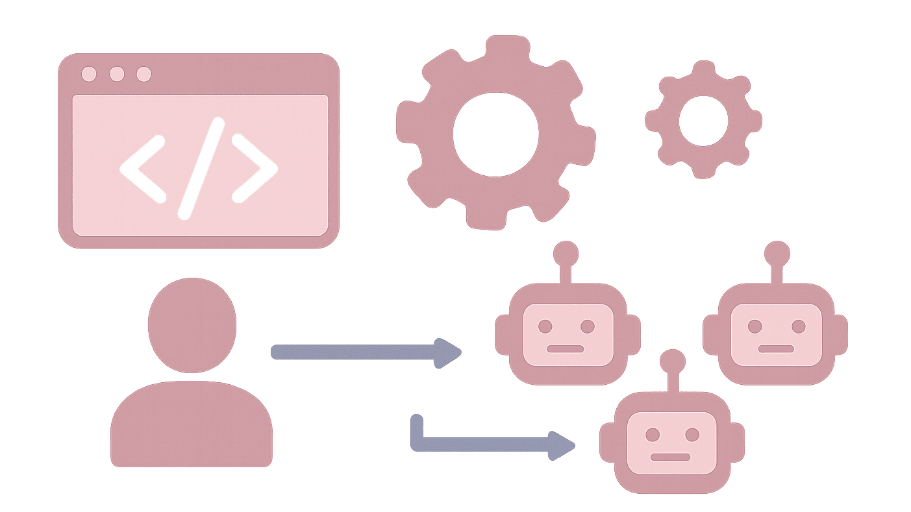

# Kilo Code Agent Manager: How to Run Multiple AI Agents in Parallel




Running one AI coding agent is straightforward. The harder problem starts when a project contains several pieces of work that could be done at the same time.

You can ask one agent to handle the backend, another to work on tests, and a third to investigate an unrelated bug. But putting several agents on the same working directory is a recipe for conflicting edits and messy context. Kilo Code's Agent Manager addresses that problem by giving parallel sessions their own Git worktrees while keeping them manageable from a single VS Code interface.

The important part, though, is not simply starting more agents. A productive workflow is:

**decompose the work → isolate each task → let agents run → verify their changes → review the diffs → integrate the results.**

This guide walks through that workflow, including when parallelization makes sense, how worktrees are used, how to deal with ports and other shared resources, and why four or five agents can already be enough to create a coordination bottleneck.

## What Kilo Code Agent Manager Actually Does

Kilo Code Agent Manager is a full-panel feature in the Kilo Code VS Code extension for managing multiple agent sessions. It supports parallel sessions in Git worktrees, a diff/review panel, dedicated terminals, setup scripts, environment-file handling, and importing existing branches, worktrees, or GitHub pull requests. It uses the extension's embedded runtime, so the Agent Manager workflow does not require a separate Kilo CLI installation.

That makes it different from simply opening several chat tabs.

### Agent Manager vs. the normal Kilo sidebar

Kilo's own workflow documentation draws a useful distinction:

| Workflow | Best for | Isolation |
|---|---|---|
| Sidebar | Small, interactive tasks on your current branch | Current branch |
| Agent Manager worktree | Long-running or independent work | Separate Git worktree and branch |
| Multiple sessions on one worktree | Planner/implementer splits, fresh context, read-only investigations | Same branch |

The Agent Manager worktree model isolates the checked-out files, Git state, and terminal directory for each session. Providers, BYOK keys, models, MCP servers, and extension settings are still shared.

That last point matters. A Git worktree is not a completely separate development machine.

### Parallel sessions are not the same as subagents

Kilo also has a `task` tool that spawns a child session, while the `agent_manager` tool starts Agent Manager sessions in VS Code. These are different mechanisms with different workflows.

For this article, the useful mental model is simple:

> **Agent Manager gives you independently reviewable development sessions.**

That is why Git worktrees are central to the feature.

### What a Git worktree isolates—and what it does not

Each worktree gets its own checked-out files, branch, and terminal. That prevents one agent from directly overwriting another agent's working copy.

But worktrees do not automatically isolate external resources.

Two agents can still fight over:

- the same localhost port,
- the same database,
- the same Docker container,
- the same emulator,
- shared caches,
- other resources outside the worktree.

Kilo explicitly calls out these collisions in its workflow documentation.

That distinction becomes important as soon as you move from a toy repository to a real application.

## When Multiple Kilo Agents Are Actually Useful

Parallel work is most useful when tasks are independent.

Kilo recommends parallelizing independent features, module-scoped refactors, unrelated fixes, or several approaches to the same problem. Work that changes the same files or has tight sequential dependencies is a poor candidate.

### Good tasks to parallelize

Suppose you're adding a new preference system to a web application. You might split the work into:

- backend API changes,
- frontend settings UI,
- automated tests,
- documentation.

Those tasks can be designed around relatively stable boundaries.

Another good case is a difficult problem where you genuinely want to compare approaches. Kilo's multi-version workflow lets you run two to four versions of the same task and optionally use different models, then compare the resulting worktrees.

### Tasks that should stay sequential

Parallelism is much less attractive when each step depends on the previous one.

For example:

```text
Design API contract
      ↓
Implement backend
      ↓
Build frontend against API
      ↓
Update integration tests
```

Starting all four agents at once does not make the dependency chain disappear.

A better workflow is to establish the shared contract first, merge that foundation, and then branch independent slices from it. Kilo documents this "build a skeleton, then split the work" pattern explicitly.

### Read-only work is the easy case

Investigation, code tours, log analysis, and some test runs are especially safe to parallelize because they do not modify the working tree. Kilo's workflow guide calls read-only investigation a safe use of multiple sessions on the same branch.

## What You Need Before Creating Parallel Sessions

Agent Manager is a VS Code extension feature. To create new worktree-based sessions, Kilo currently requires an open VS Code workspace and a Git repository, with the main repository checkout open rather than an existing worktree.

Before you create several sessions, make sure:

1. Your repository is clean enough that you understand its starting state.
2. The main checkout is open in VS Code.
3. Your Kilo provider and model settings are already configured.
4. Your project's baseline build and tests work.

Agent Manager inherits the same provider settings, BYOK configuration, models, MCP servers, and extension permissions used by the sidebar.

That shared configuration is useful, but it also means changing a model or provider setting is not the same thing as giving each worktree a completely independent runtime configuration.

## How to Create Multiple Kilo Code Agent Sessions

Open Agent Manager from the extension or use its current keyboard shortcut: `Cmd+Shift+M` on macOS or `Ctrl+Shift+M` on Windows/Linux. You can also use the Command Palette entry `Kilo Code: Open Agent Manager`.

### Step 1 — Create a worktree-backed task

Use the new-worktree action and describe one focused task.

For example:

```text
Implement the user preferences API.
Add the necessary validation and tests.
Do not modify the frontend.
```

The scope matters more than the exact wording. A narrow prompt gives you a smaller diff, which is easier to test and review.

Kilo's workflow guidance emphasizes keeping worktree scope small for exactly this reason.

### Step 2 — Create another independent task

For the same application, a second session might receive:

```text
Build the settings page for user preferences.
Use the existing frontend patterns.
Do not change the backend API implementation.
```

A third task could own the relevant automated tests.

The goal is not to make every prompt identical. The goal is to make each branch responsible for a coherent slice.

### Step 3 — Start the sessions

Once the worktrees exist, let the agents run independently.

You can switch between sessions rather than waiting for one to finish before starting the next. Each session has its own integrated terminal rooted in its worktree.

You can also start Agent Manager sessions from Kilo chat through the `agent_manager` tool. Current documentation says a request can contain **1–20 tasks**, with each task able to specify a prompt, name, or branch name; individual tasks can also override the model selection.

That number is a **task-request capacity**, not a recommendation to run twenty agents at once.

## A Real Parallel-Agent Workflow

A useful workflow looks like this:

```text
Feature request
      ↓
Define shared contracts
      ↓
Split independent tasks
      ↓
Create worktrees
      ↓
Run agents in parallel
      ↓
Verify each worktree
      ↓
Review diffs
      ↓
Integrate foundational change
      ↓
Update remaining branches
      ↓
Merge / PR / apply locally
```

Consider a small web application where the goal is to add user preferences.

### Agent A — Backend

Owns the API and persistence layer.

### Agent B — Frontend

Owns the settings screen and client-side state.

### Agent C — Tests

Owns tests that can be written independently or against an agreed contract.

### Agent D — Documentation

Updates user-facing documentation without touching application code.

This is a much better parallelization strategy than telling four agents to "implement user preferences" and letting them all discover the same architecture independently.

### Establish contracts before splitting tightly coupled work

If the frontend depends on a new API shape, define that interface before sending both agents into separate worktrees.

For larger multi-part changes, Kilo recommends a skeleton-first workflow: establish the shared types, API boundaries, folder structure, or other conventions, merge that foundation, and then branch feature slices from it.

That is essentially the same coordination pattern a human development team would use.

## Prepare Each Worktree for Real Development

Git isolation is only useful when the application itself can run independently.

Kilo's Agent Manager supports setup scripts and `.env` handling specifically to make newly created worktrees runnable.

### Setup scripts

Kilo documents `.kilo/setup-script` as the place to automate worktree preparation. The script runs after Kilo copies root-level `.env` and `.env.*` files and before the agent starts in the new worktree. The script receives `WORKTREE_PATH` and `REPO_PATH` in its environment.

For example, a setup script might install dependencies or create project-specific configuration that cannot simply be copied from the repository root.

The important limitation is that Kilo's automatic environment-file copying is deliberately narrow. It does not recursively copy every environment-related file or local resource.

### Give each worktree its own runtime resources

Suppose every agent starts the application on port 3000.

The first process may work. The second one fails.

A worktree solves the Git problem, not the networking problem.

Kilo recommends either making the application accept its address from the environment or deriving a unique value from `WORKTREE_PATH`. Its workflow documentation provides an example using a stable hash of the worktree path to choose a port.

For Docker Compose, the same principle applies to container and volume names. Kilo recommends using a distinct `COMPOSE_PROJECT_NAME` per worktree so separate sessions do not collide.

A generic pattern looks like this:

```bash
#!/bin/sh
set -e

name=$(basename "$WORKTREE_PATH" | tr -cd '[:alnum:]_-')
export COMPOSE_PROJECT_NAME="project_${name}"

docker compose up
```

The exact setup is project-specific; the important idea is that parallel worktrees need **parallelizable external state** too.

## Verify What Each Agent Changed

Do not stop when an agent reports success.

Kilo's recommended loop is explicit:

1. Let the agent work.
2. Verify the application or tests yourself.
3. Review the diff.
4. Send feedback back to the agent if necessary.
5. Repeat until the change is ready.

### Run the application or tests

Use the worktree's integrated terminal to run project commands. The terminal is rooted in the active worktree, so commands such as `git status` and your test commands operate against that branch.

Kilo also supports a `.kilo/run-script` pattern for project-specific verification and can expose `WORKTREE_PATH` and `REPO_PATH` to that script.

The important distinction is:

> "The agent reported that tests pass" is not the same thing as "I independently verified the result."

### Review the diff

Use the Agent Manager diff view to inspect what changed.

Look for:

- unexpected files,
- unrelated refactors,
- missing tests,
- altered interfaces,
- accidental dependency changes,
- code that passes tests but does not match the intended design.

Kilo explicitly recommends reviewing the diff and iterating until the diff is ready rather than stopping when the agent says the work is complete.

That human review step is where much of the real coordination cost of multi-agent development appears.

## Merge Multiple Agent Results Safely

At some point, several branches will be ready.

There are three documented paths for moving work from a worktree back toward the parent branch:

- **Apply to local** from the diff panel.
- **Merge directly** from a terminal.
- **Open a pull request** and let CI/review handle the normal team workflow.

For solo development, applying a small, well-understood change locally can be the fastest route.

For team development, a pull request often provides a cleaner review boundary.

### Merge foundational changes first

Suppose Agent A establishes an API contract and Agent B builds against it.

Merge A first.

Then update B's branch from the current parent before integrating it.

Kilo recommends this ordering when several worktrees finish close together: merge the most foundational change first, then pull that updated parent into the remaining worktrees.

### Be careful with stale branches

A branch that sits untouched for several days can drift away from the parent.

Kilo recommends integrating work within a day or two when practical, or regularly bringing the parent branch into a long-lived worktree rather than letting it accumulate divergence.

### Do not use `git stash` inside managed worktrees

This is an unusual but important detail.

Kilo warns against using `git stash` inside an Agent Manager worktree because the stash is stored in the shared Git directory. A stash created by one worktree can therefore be visible to another worktree.

For temporary unfinished work, prefer a work-in-progress commit or another branch instead.

### When two agents finish at once

Do not automatically merge both at the same time.

Instead:

1. Identify which change is foundational.
2. Merge or apply that change.
3. Update the remaining worktree(s) from the new parent state.
4. Resolve any conflicts with the original intent of both branches in mind.
5. Review again before merging.

Kilo's workflow documentation recommends precisely this approach.

## How Many Kilo Agents Should You Run?

The current Agent Manager documentation creates an easy misconception: the chat tool can accept up to 20 tasks in a request, so it is tempting to treat 20 as a target. It is not.

Kilo's workflow guidance says **not to run more than four or five agents at once**. The practical limit is described as review and integration cost rather than memory.

That is better understood as workflow guidance than as a universal technical limit.

### A practical rule

**One agent:**  
Use it when the task is small, tightly coupled, or highly interactive.

**Two agents:**  
A good default when you have two genuinely independent pieces.

**Three to four agents:**  
Useful for a feature that has several clean boundaries or for comparing multiple approaches.

**Five agents:**  
Potentially useful, but review and integration overhead become much more significant.

**Beyond five:**  
Only makes sense when you have a strong reason, a well-defined decomposition, and a workflow that can absorb the additional review load.

The question is not:

> "How many agents can Kilo start?"

It is:

> "How many independently reviewable workstreams can I actually integrate?"

## Multi-Version Is a Different Use Case

Not every parallel workflow means dividing one feature into different pieces.

Sometimes the problem is uncertainty.

You have one difficult task and want to see several approaches.

Kilo's multi-version workflow is designed for this case: create two to four versions of the same task, optionally select different models, review the resulting diffs side by side, and keep the approach that works best.

That makes multi-version useful for questions such as:

- Which implementation strategy is cleaner?
- Which model handles this refactor better?
- Is a simpler solution more reliable than a sophisticated one?

This is fundamentally different from:

```text
Agent A → backend
Agent B → frontend
Agent C → tests
```

Here the tasks differ.

With multi-version:

```text
Same task
   ↓
Approach A
Approach B
Approach C
   ↓
Compare
   ↓
Choose
```

Use the first pattern to **increase parallel throughput**.

Use the second to **reduce uncertainty**.

## Common Failure Modes

### Overlapping file edits

Two worktrees can change the same files without overwriting each other during execution, but the changes can still conflict during integration.

Worktrees isolate filesystem state. They do not eliminate semantic conflicts.

The fix is usually better task decomposition, not more aggressive conflict resolution.

### Shared ports

Two apps cannot both bind to the same port.

Use environment-driven ports or a unique per-worktree value. Kilo recommends addressing this at the application or run-script level rather than treating it as a one-off Agent Manager problem.

### Shared containers and databases

Docker containers, volumes, databases, emulators, and caches may sit outside the worktree.

Give each worktree a unique resource namespace where necessary.

### Stale branches

Long-lived worktrees diverge from the parent and become harder to integrate.

Keep them short-lived or regularly update them from the parent branch.

### Too many agents

At some point, more agents create more review and merge work than useful parallelism.

Kilo's own guidance is to keep simultaneous agents around four or five or fewer.

### Performance at large scale

There is also evidence that Agent Manager itself is being tuned for larger numbers of managed worktrees and sessions. A current GitHub issue reports long startup/hydration times in a workspace containing dozens of worktrees and many sessions. That issue is evidence of a large-scale performance problem under that workload, not proof that every normal Agent Manager setup will be slow.

## Kilo Code Agent Manager Limitations

Agent Manager makes parallel development more manageable, but it does not remove the fundamental costs of parallel work.

### You still need to review the code

Agents can work independently, but someone still needs to decide whether the result is correct.

In practice, multi-agent development shifts some work from **implementation** to **coordination and verification**.

### Worktrees consume resources

Each worktree has its own checked-out files, and dependencies, build artifacts, caches, databases, and generated files inside that worktree also consume resources. Closing the worktree removes the checkout, but it does not automatically clean up every external resource it created.

### Shared settings remain shared

Worktree isolation does not create independent Kilo configurations. Providers, BYOK keys, models, MCP servers, and extension settings are shared with the sidebar.

### The feature is actively evolving

Kilo's recent releases contain ongoing Agent Manager improvements and fixes, so UI details, performance characteristics, and operational behavior should be rechecked against the current documentation before publishing or following an older tutorial.

## A Practical Decision Framework

Use Agent Manager when:

- the work can be split into genuinely independent tasks,
- separate branches make review easier,
- you can define clear boundaries between workstreams,
- the additional review cost is manageable.

Prefer one agent when:

- the work is tightly coupled,
- the task is small,
- requirements are still changing quickly,
- interactive back-and-forth matters more than concurrency.

Use multiple versions when:

- the task is difficult or uncertain,
- you want to compare approaches,
- model choice itself is part of the experiment.

Avoid aggressive parallelism when:

- every agent needs the same files,
- every agent depends on the previous one's output,
- the application relies heavily on shared local resources,
- you cannot realistically review the resulting diffs.

A good first test is not twenty agents.

It is **two well-scoped agents on a task where the boundaries are obvious**.

## FAQ

### What is Kilo Code Agent Manager?

Agent Manager is Kilo Code's VS Code control panel for running and orchestrating multiple agent sessions, including parallel sessions with Git worktree isolation. It also provides per-session terminals and a diff/review workflow.

### How do I run multiple Kilo Code agents in parallel?

Open Agent Manager, create separate worktree-backed sessions for independent tasks, let the agents work, verify each worktree, review the diffs, and then integrate the accepted branches.

### Does Kilo Code use Git worktrees for parallel agents?

Yes. In worktree mode, each Agent Manager session runs on its own Git worktree and branch.

### How many Kilo Code agents should I run at once?

Kilo's current workflow guidance says not to run more than four or five at once. That is practical workflow guidance based on review and integration cost, not a universal technical maximum.

### Do worktrees prevent merge conflicts?

No. They prevent agents from directly sharing the same checked-out files, but changes can still conflict semantically when branches are merged.

### Can different agents use different models?

Yes. Current Agent Manager documentation supports model overrides for individual tasks, and the multi-version workflow can assign different models to parallel versions.

### Can Kilo Agent Manager run without Git?

Agent Manager supports a `local` session mode without Git worktree isolation. Git is required for the worktree-based workflow.

### Why can agents still conflict if each one has a worktree?

Because worktrees isolate files and Git state, not external resources. Shared ports, databases, containers, emulators, and caches can still collide.

### What should I do when several worktrees finish at once?

Integrate the most foundational change first, then update the remaining worktrees from the new parent state before merging them. This reduces the amount of stale work that must be reconciled at the end.

### Is running more Kilo agents always faster?

No reliable universal benchmark establishes that. Kilo's own guidance emphasizes that review and integration costs become the practical bottleneck as concurrency grows.

## Conclusion

Kilo Code Agent Manager is most useful when you treat parallel agents as a software-engineering workflow rather than as a simple concurrency switch.

Start by finding work that can genuinely be separated. Give each task a narrow scope and an isolated worktree. Make the worktree runnable, including its ports and other external resources. Then verify the result yourself, review the diff, and integrate the branches in a deliberate order.

The important distinction is that **parallel execution is only half of the workflow**. The other half is coordination.

For a new project, start with two independent tasks. Once that workflow feels predictable, move to three or four. If the task is uncertain rather than divisible, use multi-version comparison instead.

The goal is not to run the maximum number of agents Kilo can create. The goal is to produce more useful, reviewed, integrated code without creating more coordination work than the parallelism saves.


