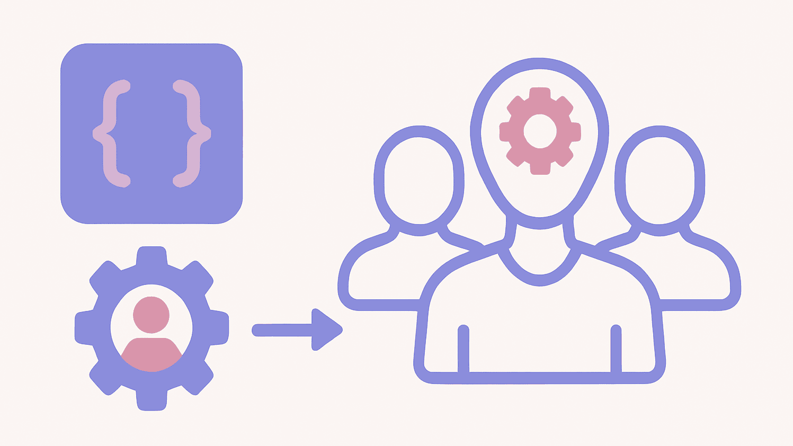

# Kilo Code Custom Subagents؛ چطور یک تیم توسعه هوش مصنوعی اختصاصی بسازیم؟



یک Agent کدنویسی می‌تواند repository را بررسی کند، کد بنویسد، تست اجرا کند و تغییرات را review کند. اما این به این معنی نیست که سپردن همه این کارها به یک Agent همیشه بهترین معماری است.

تحقیق روی codebase با code review یک نیاز نیست. یک Security Review ممکن است به دسترسی خواندن نیاز داشته باشد، اما نباید فایل‌ها را تغییر دهد. در مقابل، Agentی که قرار است feature پیاده‌سازی کند باید write access داشته باشد.

اینجاست که **Kilo Code Custom Subagents** کاربرد پیدا می‌کنند. می‌توانید برای هر نقش یک Agent تخصصی بسازید، prompt و model و ابزارهای موردنیازش را مشخص کنید و permissionهای آن را محدود کنید. سپس یا خودتان آن Subagent را فراخوانی کنید یا اجازه دهید Agent اصلی، task مناسب را به آن واگذار کند. هر Subagent نیز session و context جداگانه خودش را دارد و نتیجه کار را به Agent والد برمی‌گرداند.

به‌عبارت ساده، هدف این قابلیت ساختن «Agentهای بیشتر» نیست؛ هدف، **جدا کردن مسئولیت‌های مهندسی به شکل کنترل‌شده** است.

در ادامه، از ساخت اولین Subagent تا طراحی یک تیم کوچک شامل Explorer، Implementer، Reviewer و Test Writer پیش می‌رویم و تفاوت آن را با Agent Manager هم روشن می‌کنیم.

## Kilo Code Custom Subagent چیست؟

در Kilo Code، Subagent یک Agent تخصصی است که برای انجام یک task مشخص، معمولاً از طرف یک Agent اصلی، به کار گرفته می‌شود. Agent اصلی مثل Code، Plan یا Debug با شما در تعامل است و Subagent برای یک زیرکار مشخص در context مستقل خودش فعالیت می‌کند.

یک مدل ذهنی ساده:

```text
Primary Agent
     │
     ├── Task → Explorer
     │
     ├── Task → Implementer
     │
     └── Task → Reviewer
                │
                └── Result → Primary Agent
```

Custom Subagent می‌تواند مواردی مثل این‌ها را داشته باشد:

- `description` مشخص برای توضیح وظیفه‌اش
- prompt اختصاصی
- model جداگانه
- permissionهای مستقل
- `mode` مشخص
- محدودیت `steps`
- تنظیماتی مثل `hidden` یا `disable`

Kilo Code همچنین دو Subagent داخلی دارد:

- `general` برای کارهای چندمرحله‌ای و تحقیق‌های عمومی
- `explore` برای جست‌وجوی سریع و فقط‌خواندنی در codebase

پس Custom Subagent زمانی معنا پیدا می‌کند که نقش موردنظر شما از این Agentهای عمومی تخصصی‌تر باشد.

### Subagent فقط یک chat جدید نیست

تفاوت اصلی در **context و مسئولیت** است.

فرض کنید task شما این است:

> قابلیت refresh-token rotation را به یک اپلیکیشن موجود اضافه کن.

به‌جای اینکه همان Agent اصلی همه چیز را بررسی کند، می‌توانید یک زیرکار مشخص به Explorer بدهید:

> محل ایجاد، ذخیره و اعتبارسنجی refresh tokenها را در codebase پیدا کن و فایل‌های مرتبط را گزارش بده.

Subagent همین task را در session خودش انجام می‌دهد و نتیجه را به Agent والد برمی‌گرداند.

این مدل زمانی ارزشمند است که task ورودی و خروجی مشخص داشته باشد.

### چه زمانی بهتر است Subagent نسازیم؟

برای هر کار کوچکی نباید یک Agent جدا درست کنید.

همان Agent اصلی معمولاً انتخاب بهتری است وقتی:

- task خیلی کوچک است؛
- همه مراحل به‌شدت به یکدیگر وابسته‌اند؛
- context کمی برای جدا کردن وجود دارد؛
- هزینه هماهنگی بیشتر از ارزش جداسازی است.

در مقابل، وقتی یک task به prompt، model، permission یا context متفاوتی نیاز دارد، Subagent گزینه منطقی‌تری است.


## Kilo Code چگونه task را به Subagent واگذار می‌کند؟

در معماری فعلی Kilo Code، برای delegation معمولی نیازی به یک Orchestrator جداگانه ندارید. Agentهایی مثل Code، Plan و Debug می‌توانند به‌صورت native از Task برای واگذاری کار به Subagentها استفاده کنند و مستندات فعلی Kilo، Orchestrator mode را deprecated اعلام می‌کنند.

روند کلی این است:

```text
Agent اصلی task را تحلیل می‌کند
        ↓
یک زیرکار مشخص پیدا می‌کند
        ↓
Subagent را با Task اجرا می‌کند
        ↓
Subagent در context مستقل کار می‌کند
        ↓
نتیجه را برمی‌گرداند
        ↓
Agent اصلی کار اصلی را ادامه می‌دهد
```

Kilo همچنین امکان اجرای چند Subagent session را به‌صورت هم‌زمان فراهم می‌کند.

### Delegation خودکار

فیلد `description` فقط برای نمایش به انسان نیست. Kilo از این توضیح برای کمک به Agent اصلی در انتخاب Subagent مناسب استفاده می‌کند.

این دو description را مقایسه کنید:

> Helps with coding.

و:

> Reviews TypeScript API changes for authentication, authorization, input validation, and edge cases without modifying files.

دومی مشخص می‌کند:

- حوزه کاری چیست؛
- چه زمانی باید از Agent استفاده شود؛
- چه نوع خروجی‌ای انتظار می‌رود؛
- چه کاری نباید انجام دهد.

برای workflowهای چندعاملی، چنین تفاوتی مهم است.

### فراخوانی دستی با `@agent-name`

لازم نیست همیشه به delegation خودکار تکیه کنید. می‌توانید Subagent را مستقیم با `@agent-name` فراخوانی کنید.

مثلاً:

```text
@code-reviewer review the latest authentication changes for security issues
```

این روش برای توسعه و تست یک Subagent بسیار مفید است، چون قبل از اینکه Agent اصلی را مسئول delegation کنید، می‌توانید رفتار specialist را جداگانه ارزیابی کنید.


## اولین Custom Subagent خودتان را بسازید

Kilo Code در مستندات فعلی سه مسیر اصلی برای ساخت Custom Subagent ارائه می‌کند:

1. تعریف Agent در `kilo.jsonc`
2. ساخت فایل Markdown برای Agent
3. استفاده از `kilo agent create` در CLI

مستندات اختصاصی Custom Subagents در حال حاضر پیکربندی این Subagentها را از طریق فایل config یا فایل‌های Markdown توضیح می‌دهند و برای همین قابلیت، UI جداگانه‌ای را در دسترس نمی‌دانند.

### مرحله ۱ — یک Reviewer بسازید

برای شروع، یک Code Reviewer گزینه خوبی است، چون یک وظیفه روشن دارد و می‌توان permissionهای آن را محدود کرد.

CLI فعلی Kilo این شکل را مستند کرده است:

```bash
kilo agent create \
  --path .kilo \
  --description "Reviews code for security vulnerabilities" \
  --mode subagent \
  --tools "read,grep,glob"
```

این command می‌تواند Agent را برای یک مسیر مشخص، با description، mode و ابزارهای انتخابی بسازد. Kilo همین command را در مستندات Custom Subagents نشان می‌دهد.

بعد لیست Agentها را ببینید:

```bash
kilo agent list
```

حالا Subagent را دستی تست کنید:

```text
@code-reviewer review the latest authentication changes
```

### چرا از Reviewer شروع کنیم؟

چون نقش Reviewer معمولاً به write access نیاز ندارد.

هدفش این است که:

- کد را بخواند؛
- مشکل پیدا کند؛
- edge caseها را بررسی کند؛
- نتیجه را گزارش دهد.

پس می‌توان authority آن را خیلی محدود نگه داشت.


## ساخت Subagent در `kilo.jsonc`

Kilo امکان تعریف Agent در بخش `agent` فایل `kilo.jsonc` را دارد. یک نمونه ساده:

```jsonc
{
  "$schema": "https://app.kilo.ai/config.json",
  "agent": {
    "code-reviewer": {
      "description": "Reviews code for security, performance, maintainability, and edge cases",
      "mode": "subagent",
      "prompt": "You are a code reviewer. Analyze changes without modifying files.",
      "permission": {
        "edit": "deny",
        "bash": "deny"
      }
    }
  }
}
```

این ساختار با الگوی فعلی مستندات Kilo برای Custom Subagents مطابقت دارد. `description` نقش Agent را توضیح می‌دهد، `mode: "subagent"` آن را برای استفاده به‌عنوان Subagent محدود می‌کند و permissionها می‌توانند دسترسی به ابزارها را محدود کنند.

### ساخت Subagent با فایل Markdown

وقتی prompt طولانی‌تر می‌شود، فایل Markdown معمولاً خواناتر است.

Kilo در حال حاضر این مسیرها را برای Agentهای Markdown مستند می‌کند:

```text
Global:
~/.config/kilo/agents/

Project-specific:
.kilo/agents/
```

نام فایل، بدون `.md`، نام Agent می‌شود.

مثال:

```markdown
description: Reviews API changes for security, correctness, and edge cases
mode: subagent
permission:
  edit: deny
  bash: deny

You are a focused API code reviewer.

Check for:

- authentication and authorization flaws
- input validation problems
- edge cases
- error handling
- missing tests
- risky changes to security-sensitive code

Do not modify files.

Return findings with file paths, severity, and remediation suggestions.
```

در این روش، متن Markdown به‌عنوان system prompt آن Agent استفاده می‌شود؛ به همین دلیل برای نقش‌های پیچیده‌تر، نگهداری prompt ساده‌تر است.

### قبل از ساختن چند Agent، یکی را تست کنید

یک روند ساده و قابل‌اعتماد:

1. یک Subagent بسازید.
2. آن را با `kilo agent list` بررسی کنید.
3. با `@agent-name` دستی اجرا کنید.
4. یک task واقعی به آن بدهید.
5. خروجی را بررسی کنید.
6. permissionهایش را هم جداگانه تست کنید.
7. فقط بعد از آن، آن را وارد delegation خودکار کنید.

این کار بسیار ساده‌تر از debugging یک سیستم پنج‌Agentی است که معلوم نیست کدام بخشش مشکل دارد.


## Subagentها را بر اساس نقش واقعی طراحی کنید

یک Subagent خوب باید شبیه یک نقش واقعی در تیم توسعه نرم‌افزار باشد.

| Agent | مسئولیت | دسترسی معمول | خروجی |
|---|---|---|---|
| Explorer | شناخت codebase | فقط خواندن | یافته‌ها و مسیر فایل‌ها |
| Implementer | اعمال تغییرات | خواندن/نوشتن | تغییرات کد |
| Reviewer | بررسی تغییرات | فقط خواندن | ایرادها و پیشنهادها |
| Test Writer | نوشتن یا بهبود تست | خواندن/نوشتن | تست‌ها |
| Security Reviewer | بررسی امنیتی | فقط خواندن | یافته‌های امنیتی |

مهم‌ترین اصل این جدول تعداد Agentها نیست؛ **مرز روشن مسئولیت‌هاست**.

توضیح ضعیف:

> Help with the project.

توضیح بهتر:

> Inspect API authentication code for authorization mistakes, token handling issues, input validation gaps, and missing test coverage. Do not edit files.

در نسخه دوم مشخص است که Agent دقیقاً برای چه کاری ساخته شده و چه کاری نباید انجام دهد.

### به هر Subagent یک کار اصلی بدهید

قبل از ساخت Agent از خودتان بپرسید:

> این Agent دقیقاً چرا باید وجود داشته باشد؟

اگر پاسخ شما پنج مسئولیت کاملاً متفاوت دارد، احتمالاً آن نقش بیش از حد بزرگ است.


## دسترسی Subagentها را کنترل کنید

یکی از مهم‌ترین بخش‌های Custom Subagents، permission است.

Kilo Code سه رفتار اصلی برای permissionها دارد:

- `allow` — بدون تأیید کار را انجام بدهد؛
- `ask` — قبل از اجرا از کاربر تأیید بگیرد؛
- `deny` — ابزار یا عمل موردنظر مسدود شود.

یک Reviewer ساده می‌تواند چنین محدودیتی داشته باشد:

```yaml
permission:
  read: allow
  edit: deny
  bash: deny
```

در این حالت Agent می‌تواند repository را بررسی کند اما قرار نیست فایل را تغییر دهد یا shell command اجرا کند.

Kilo امکان تعریف ruleهای جزئی‌تر برای ابزارها، فایل‌ها و commandها را هم دارد. برای Bash حتی می‌توانید pattern مشخص کنید و Kilo ruleها را به‌ترتیب بررسی می‌کند؛ در صورت چند match، آخرین rule منطبق برنده است.

مثلاً:

```yaml
permission:
  edit:
    "*": deny
    "*.md": allow
  bash:
    "*": ask
    "git diff": allow
    "git log*": allow
```

این الگو برای Agentی مثل Documentation Writer یا Reviewer می‌تواند بسیار کاربردی باشد.

### Read-only به معنی «کاملاً بی‌خطر» نیست

محدود کردن edit access یعنی Agent نمی‌تواند فایل را تغییر دهد؛ اما این به‌خودی‌خود به معنی بی‌خطر بودن تمام اطلاعاتی که Agent می‌خواند نیست.

Kilo برای فایل‌های حساس مثل `.env` و `.env.*` رفتار ویژه‌ای در permissionها دارد. بنابراین هنگام طراحی یک Agent امنیتی یا Reviewer، باید به **داده‌ای که می‌تواند بخواند** هم توجه کنید، نه فقط به توانایی‌اش برای نوشتن.


## مشخص کنید هر Agent به چه Subagentهایی می‌تواند دسترسی داشته باشد

فقط ابزارها نیستند که باید محدود شوند. می‌توانید delegation خود Agentها را نیز کنترل کنید.

Kilo از `permission.task` برای تعیین Subagentهای مجاز پشتیبانی می‌کند.

مثلاً:

```jsonc
{
  "agent": {
    "planner": {
      "mode": "primary",
      "permission": {
        "task": {
          "*": "deny",
          "code-reviewer": "allow",
          "docs-writer": "allow"
        }
      }
    }
  }
}
```

در این الگو، Planner فقط می‌تواند task را به `code-reviewer` و `docs-writer` واگذار کند.

این مدل برای workflowهایی مفید است که می‌خواهید delegation کاملاً قابل‌پیش‌بینی باشد.


## برای هر Subagent می‌توانید Model متفاوتی انتخاب کنید

Kilo برای Custom Subagent امکان override کردن model را دارد. اگر model جداگانه مشخص نکنید، مستندات فعلی می‌گویند Subagent مدل Agent اصلی را به ارث می‌برد.

در نتیجه می‌توانید معماری‌ای شبیه این داشته باشید:

```text
Explorer
→ مدل مناسب برای تحلیل سریع codebase

Implementer
→ مدل مناسب برای کار پیچیده‌تر روی کد

Reviewer
→ مدل مناسب برای تحلیل دقیق تغییرات
```

اما این به معنی وجود یک «بهترین مدل» برای همه نقش‌ها نیست.

بهتر است اول نقش را تعریف کنید و بعد از خودتان بپرسید چه سطحی از reasoning و چه نوع tool use برای آن لازم است.

برای مثال، Repository Explorer احتمالاً بیشتر از هر چیز به جست‌وجوی خوب و خلاصه‌سازی نیاز دارد؛ درحالی‌که Implementation task پیچیده ممکن است model متفاوتی بخواهد.

این‌ها **تصمیم‌های workflow** هستند، نه claim عمومی درباره برتری یک model بر مدل دیگر.


## یک تیم توسعه واقعی با Kilo Code بسازید

حالا یک سناریوی مشخص را در نظر بگیریم:

> به یک اپلیکیشن موجود، قابلیت refresh-token rotation اضافه کنیم.

به‌جای سپردن کل task به یک Agent، می‌توانیم مسئولیت‌ها را تفکیک کنیم:

```text
Feature Request
      ↓
Explorer
      ↓
Primary Agent → برنامه پیاده‌سازی
      ↓
Implementer
      ↓
Reviewer
      ↓
Test Writer
      ↓
Primary Agent → بررسی نهایی
```

### ۱. Explorer

Explorer باید به پرسش‌هایی مثل این جواب بدهد:

- authentication در کجا پیاده شده است؟
- refresh token کجا ساخته می‌شود؟
- کجا ذخیره می‌شود؟
- کجا validate می‌شود؟
- چه تست‌هایی در حال حاضر این flow را پوشش می‌دهند؟

کار Explorer **شناختن** است، نه تغییر دادن.

یک خروجی مفید می‌تواند شبیه این باشد:

```text
Refresh-token handling is implemented in:

- src/auth/token-service.ts
- src/auth/session-store.ts
- src/api/auth/refresh.ts
- tests/auth/refresh.test.ts

The current flow creates a new access token,
but the stored refresh token is not rotated.
```

این خروجی برای Agent اصلی بسیار کاربردی‌تر از یک گزارش مبهم است، چون می‌تواند بر اساس آن plan دقیقی بسازد.

### ۲. Implementer

حالا Implementer یک task مشخص دریافت می‌کند:

> Add refresh-token rotation using the existing session-store abstraction. Preserve the current API response shape and add coverage for token reuse.

اینجا write access معنا دارد.

اما Implementer نباید مجبور باشد خودش از صفر تصمیم بگیرد «کل سیستم authentication را چطور بازطراحی کنیم». بهتر است task و context کافی دریافت کند و تغییر محدود انجام دهد.

### ۳. Reviewer

بعد Reviewer به‌صورت مستقل تغییرات را بررسی می‌کند.

این جداسازی ارزشمند است، چون یک Agent دیگر غیر از implementer به کد نگاه می‌کند.

Reviewer می‌تواند مواردی مثل این‌ها را بررسی کند:

- correctness
- security boundary
- edge caseها
- error handling
- test coverage

مثلاً ممکن است چنین نتیجه‌ای بدهد:

```text
High: The old refresh token can still be reused after rotation.

Medium: The reuse case is not covered by the refresh endpoint tests.

Low: The helper name does not match the naming convention used elsewhere.
```

Agent اصلی سپس تصمیم می‌گیرد کدام یافته‌ها را اصلاح کند.

### ۴. Test Writer

Test Writer behavior موردنظر را به تست تبدیل می‌کند:

- rotation موفق؛
- استفاده مجدد از token قدیمی؛
- token منقضی‌شده؛
- token نامعتبر؛
- token گم‌شده؛
- خطای session store.

این Agent ممکن است به write access نیاز داشته باشد، برخلاف Reviewer.

### نکته اصلی این workflow

قرار نیست برای هر task دقیقاً چهار Agent داشته باشید.

اصل بهتر این است:

**Explore → Implement → Verify**

هر جا این جداسازی واقعاً ارزش ایجاد می‌کند، Subagent بسازید.


## Kilo Code Custom Subagents یا Agent Manager؟

این دو قابلیت به یک مسئله مرتبط‌اند، اما دقیقاً یک کار انجام نمی‌دهند.

**Custom Subagent** برای ساخت یک specialist مناسب است.

**Agent Manager** برای مدیریت چند session از Agentها طراحی شده و از sessionهای موازی با Worktreeهای مستقل پشتیبانی می‌کند. در حالت `worktree`، هر session روی Git Worktree و branch جداگانه اجرا می‌شود؛ Agent Manager همچنین از حالت `local` برای sessionهایی که در workspace فعلی اجرا می‌شوند و Worktree جداگانه نمی‌سازند نیز پشتیبانی می‌کند.

پس این دو را نباید صرفاً با معیار «چند Agent» با هم مقایسه کرد.

| مورد | Custom Subagent | Agent Manager |
|---|---|---|
| هدف اصلی | اجرای task تخصصی | مدیریت چند Agent session |
| context مستقل | بله | بله |
| Git Worktree مستقل | ذاتاً نه | در حالت `worktree` بله |
| اجرای session در workspace فعلی | در قالب workflow عادی | در حالت `local` |
| مناسب برای | Research، Review، taskهای تخصصی | چند session موازی و مدیریت‌شده |
| branch جداگانه | تضمین‌شده نیست | در حالت `worktree` بله |
| تمرکز | specialist | session/workflow management |

راهنمای تصمیم ساده‌تر این است:

> **اگر specialist می‌خواهید، Custom Subagent بسازید. اگر می‌خواهید چند Agent session را مدیریت کنید، Agent Manager را بررسی کنید. اگر این sessionها باید از نظر Git و فایل‌های پروژه جدا باشند، از Worktree mode استفاده کنید.**

Agent Manager در مستندات فعلی Kilo یک control panel برای اجرای چند Agent و مدیریت sessionهای موازی است و Worktree isolation یکی از قابلیت‌های اصلی آن به‌شمار می‌آید.

### چه زمانی Agent Manager مناسب‌تر است؟

مثلاً فرض کنید سه مسیر مستقل دارید:

```text
Worktree A → Backend implementation
Worktree B → Frontend implementation
Worktree C → Integration tests
```

در این حالت branch و filesystem مستقل واقعاً ارزش دارند.

### چه زمانی Subagent ساده‌تر است؟

اگر فقط می‌خواهید بپرسید:

> «authentication code دقیقاً در کجا قرار دارد؟»

ساخت یک Worktree جدا برای یک بررسی read-only احتمالاً مسئله اضافه ایجاد می‌کند.


## مشکلات و محدودیت‌هایی که باید در نظر بگیرید

Multi-agent workflow فقط مزیت اضافه نمی‌کند؛ یک لایه coordination جدید هم به پروژه اضافه می‌کند.

مهم است بین **رفتار مستندشده محصول** و **گزارش‌های نسخه‌محور کاربران** تفاوت بگذاریم.

### مشکل در session والد

در GitHub issue شماره 11708، یک کاربر گزارشی درباره CLI ثبت کرده که در آن Taskی که یک Subagent را اجرا کرده بود، session والد را تا پایان اجرای child درگیر کرده و کنترل مستقل روی cancellation محدود بوده است. این گزارش به یک سناریو و نسخه خاص مربوط است و نباید به رفتار قطعی همه نسخه‌های فعلی Kilo تعمیم داده شود. 

موضوع جدیدتری نیز در issue شماره 12706 گزارش شده است. این issue که مربوط به Kilo 7.4.17 بود، درباره retry شدن بعضی Taskهای Subagent، cancellation در مرز timeout و ایجاد وضعیت orphaned برای Task گزارش‌هایی ارائه می‌کند. این هم یک **گزارش نسخه‌محور** است، نه مدرکی برای اینکه همه Subagentهای Kilo چنین رفتاری دارند. 

نتیجه عملی:

> روی این فرض حساب نکنید که هر delegated task همیشه کاملاً detached، قابل‌لغو و بدون مشکل lifecycle اجرا می‌شود.

اگر workflow شما به delegation طولانی‌مدت وابسته است، آن را روی همان نسخه‌ای که در پروژه واقعی استفاده می‌کنید آزمایش کنید.

### ابزارهای interactive ممکن است در child workflow متفاوت رفتار کنند

وقتی یک Subagent جداگانه اجرا می‌شود، ممکن است به ابزار یا MCP عملیاتی برسد که برای ادامه کار به تعامل مستقیم کاربر نیاز دارد.

بنابراین این فرض که:

> «هر چیزی که در main session کار می‌کند، داخل Subagent هم دقیقاً همان‌طور کار می‌کند»

فرض امنی نیست.

این نوع workflow باید جداگانه تست شود.

### model configuration را بررسی کنید

اگر یک Subagent باید از model مشخصی استفاده کند، بهتر است model را صریح تنظیم کنید و effective configuration را هم بررسی کنید.

Kilo در حال حاضر از per-agent model override و inheritance پشتیبانی می‌کند.

### تعداد Agentها را بی‌دلیل زیاد نکنید

هر Subagent جدید یعنی:

- یک prompt جدید؛
- permission جدید؛
- یک مسیر delegation جدید؛
- یک وضعیت lifecycle دیگر؛
- یک چیز دیگر که باید هنگام خطا debug شود.

اگر ساختن Subagent، فهمیدن workflow را سخت‌تر می‌کند، احتمالاً بیش از حد آن را شکسته‌اید.


## بهترین روش‌ها برای ساخت Custom Subagentهای قابل‌اعتماد

### ۱. قبل از prompt، نقش را تعریف کنید

اول بنویسید:

> این Agent دقیقاً برای چه کاری وجود دارد؟

بعد مشخص کنید:

- چه چیزی را بررسی می‌کند؛
- چه چیزی تحویل می‌دهد؛
- چه چیزی نباید انجام دهد.

### ۲. `description` را دقیق بنویسید

چون description به Agent اصلی در انتخاب specialist کمک می‌کند، نوشتن آن را جدی بگیرید.

بهتر است بنویسید:

> Audits authentication and authorization code for security problems without modifying files.

نه:

> Helps with security.

### ۳. Permission را از ابتدا محدود کنید

Reviewerی که قرار نیست فایل را تغییر دهد، نیازی به edit access ندارد.

Agentی که فقط باید `git diff` را ببیند، لزوماً نباید unrestricted Bash داشته باشد.

Kilo امکان محدود کردن toolها و حتی Bash commandها را به‌شکل جزئی فراهم می‌کند.

### ۴. ابتدا دستی تست کنید

با:

```text
@agent-name
```

Agent را مستقیم اجرا کنید.

بعد ببینید:

- آیا نقش را درست فهمید؟
- آیا فایل درست را پیدا کرد؟
- آیا خروجی‌اش مفید بود؟
- آیا تلاش کرد کاری خارج از مسئولیتش انجام دهد؟
- permissionها همان چیزی بودند که انتظار داشتید؟

### ۵. تیم را کوچک نگه دارید

برای هر task یک Agent نسازید.

چهار نقش روشن ممکن است بسیار مفید باشند؛ ده Agent با مسئولیت‌های هم‌پوشان ممکن است coordination را سخت‌تر کنند.

### ۶. از `steps` برای bounded workflow استفاده کنید

Kilo برای Custom Subagentها تنظیم `steps` را ارائه می‌کند که حداکثر تعداد iterationهای agentic را محدود می‌کند. خود مستندات Kilo این گزینه را برای کنترل هزینه مفید می‌دانند.

برای نقش‌هایی مثل repository exploration که باید محدود و مشخص باشند، چنین محدودیتی می‌تواند کاربردی باشد.

### ۷. Role و authority را با هم طراحی کنید

این دو باید کنار هم تعریف شوند:

```text
Role:
Security Reviewer

Authority:
Read code, no edits, no unrestricted shell
```

اگر مسئولیت مشخص باشد ولی authority آن نامحدود، طراحی شما ناقص است.


## یک Template قابل استفاده برای تیم Subagent

یک معماری ساده و قابل توسعه می‌تواند این باشد:

```text
Primary Agent
│
├── explorer
│   └── Read-only repository investigation
│
├── implementer
│   └── Scoped code changes
│
├── reviewer
│   └── Read-only quality/security review
│
└── test-writer
    └── Test changes and validation
```

برای مثال، Reviewer می‌تواند چنین فایلی داشته باشد:

```markdown
description: Reviews API changes for correctness, security, and edge cases without modifying files
mode: subagent
permission:
  edit: deny
  bash: deny

You are a focused API code reviewer.

Inspect the requested changes and report:

1. correctness issues
2. authentication or authorization risks
3. input-validation problems
4. edge cases
5. missing tests

Do not modify files.

Return findings with file paths, severity, and actionable recommendations.
```

Kilo در مستندات رسمی خود همین الگوی کلی را برای Subagentهایی با prompt تخصصی و permission محدود پشتیبانی می‌کند.

قرار نیست این Template را بدون تغییر روی هر پروژه‌ای کپی کنید. prompt، model و permission باید با repository شما هماهنگ باشند.


## یک چارچوب ساده برای انتخاب

قبل از ساختن Subagent بعدی، این سؤال‌ها را از خودتان بپرسید.

### Custom Subagent بسازید وقتی:

- task یک نقش تخصصی روشن دارد؛
- context جداگانه ارزش دارد؛
- permission متفاوت لازم است؛
- model متفاوت می‌تواند مفید باشد؛
- نتیجه task را می‌توان به Agent والد برگرداند؛
- آن نقش در پروژه‌های مختلف تکرار می‌شود.

### با Primary Agent بمانید وقتی:

- task ساده است؛
- مراحل به هم وابسته‌اند؛
- context کم است؛
- delegation فقط overhead ایجاد می‌کند.

### Agent Manager را بررسی کنید وقتی:

- می‌خواهید چند session را هم‌زمان مدیریت کنید؛
- taskها طولانی‌تر یا مستقل‌ترند؛
- session-oriented workflow برای شما مهم است؛
- قصد دارید توسعه را بین چند session تقسیم کنید.

### Worktree mode را انتخاب کنید وقتی:

- Agentها به branchهای مستقل نیاز دارند؛
- تغییرات فایل سیستم باید از هم جدا بمانند؛
- review و integration برای هر task جدا انجام می‌شود.

### Local mode را انتخاب کنید وقتی:

- چند session باید در همان workspace کار کنند؛
- Git Worktree isolation لازم نیست؛
- همچنان می‌خواهید sessionها را از طریق Agent Manager مدیریت کنید.

اصل تصمیم این نیست که:

> «یک Agent یا چند Agent؟»

اصل این است:

> **کجا واقعاً ایجاد isolation به workflow مهندسی شما کمک می‌کند؟**


## FAQ

### Kilo Code Custom Subagent چیست؟

Custom Subagent یک Agent تخصصی برای taskهای مشخص است که context مستقل دارد و می‌تواند prompt، model، tool access و permissionهای خودش را داشته باشد. این Agent می‌تواند توسط Agent اصلی یا به‌صورت دستی فراخوانی شود.

### چطور در Kilo Code یک Custom Subagent بسازم؟

طبق مستندات فعلی، می‌توانید آن را در `kilo.jsonc` تعریف کنید، یک فایل Markdown در مسیر Agentها بسازید یا از `kilo agent create` استفاده کنید.

### آیا می‌توان برای هر Subagent مدل متفاوتی انتخاب کرد؟

بله. می‌توانید برای هر Subagent مدل مشخص کنید. اگر model جداگانه تعریف نشود، Kilo می‌گوید Subagent مدل Agent اصلی را به ارث می‌برد.

### آیا می‌توان یک Subagent را فقط‌خواندنی کرد؟

بله. با permissionها می‌توانید edit را deny کنید و دسترسی به Bash یا سایر ابزارها را نیز محدود کنید.

### آیا یک Agent می‌تواند مشخص کند به کدام Subagentها دسترسی داشته باشد؟

بله. `permission.task` برای allow یا deny کردن delegation به Subagentهای مشخص قابل استفاده است.

### تفاوت Custom Subagent و Agent Manager چیست؟

Subagent بیشتر برای یک **نقش تخصصی و delegated task** است. Agent Manager برای **مدیریت چند Agent session** طراحی شده و در حالت `worktree` امکان اجرای sessionها روی branch و Worktree مستقل را می‌دهد؛ در حالت `local` sessionها در workspace فعلی اجرا می‌شوند.

### آیا هنوز به Orchestrator در Kilo Code نیاز دارم؟

برای native delegation معمولی، نه. مستندات فعلی Kilo می‌گویند Code، Plan و Debug می‌توانند مستقیم به Subagentها delegation کنند و Orchestrator mode deprecated است.

### چرا ممکن است یک Subagent در Kilo Code گیر کند؟

در GitHub issueهای مشخصی، مشکلاتی در زمینه parent-session blocking، cancellation، retry و lifecycle گزارش شده است. این موارد باید نسخه‌محور در نظر گرفته شوند و نباید به‌عنوان رفتار عمومی همه نسخه‌های Kilo معرفی شوند. 

### آیا Custom Subagent همان Skill در Kilo Code است؟

خیر. Subagent یک Agent delegated با context، prompt، model، tool و permissionهای خودش است. Skill بخشی از سیستم customization است و هدف متفاوتی دارد. Kilo این دو را در مستندات customization به‌عنوان قابلیت‌های جداگانه معرفی می‌کند.


## جمع‌بندی

ارزش واقعی **Kilo Code Custom Subagents** در «زیاد کردن تعداد Agentها» نیست؛ در **تفکیک درست مسئولیت‌های مهندسی** است.

Explorer می‌تواند codebase را بررسی کند، بدون اینکه چیزی را تغییر دهد. Implementer می‌تواند تغییرات scoped را انجام دهد. Reviewer می‌تواند نتیجه را مستقل بررسی کند. Test Writer هم می‌تواند رفتار موردنظر را به تست تبدیل کند.

وقتی این نقش‌ها با **prompt روشن، permission محدود و context مناسب** ترکیب شوند، یک workflow چندعاملی قابل‌فهم‌تر و قابل‌کنترل‌تر خواهید داشت.

در عین حال، همه taskها به Subagent نیاز ندارند. برای یک تغییر ساده، یک Agent اصلی احتمالاً کافی است. برای چند session مستقل، Agent Manager ممکن است انتخاب بهتری باشد. و اگر branch و filesystem مستقل لازم دارید، Worktree mode در Agent Manager همان جایی است که isolation واقعی Git را وارد workflow می‌کند.

بهترین راه شروع ساده است:

**یک specialist بسازید، یک مسئولیت مشخص به آن بدهید، permissionهایش را محدود کنید، با `@agent-name` دستی تستش کنید و فقط وقتی مطمئن شدید، آن را وارد delegation خودکار کنید.**

به این شکل، به‌جای ساخت مجموعه‌ای از promptهای پراکنده، یک **تیم توسعه هوش مصنوعی با نقش‌های مشخص** می‌سازید.


