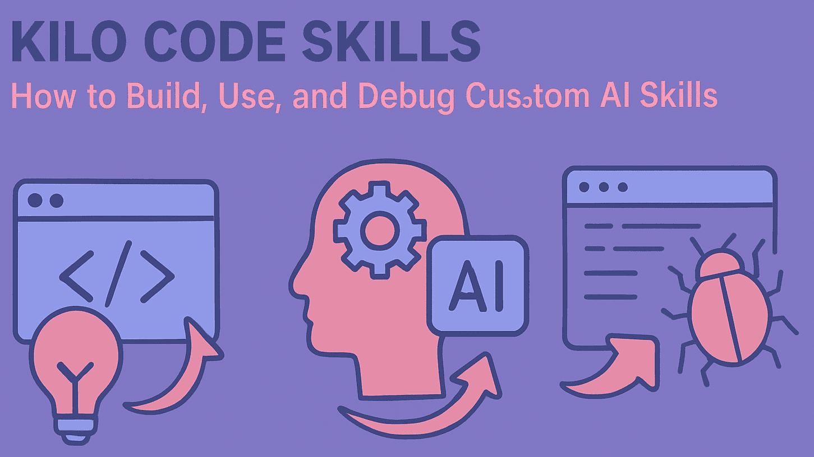

# Kilo Code Skills؛ چطور Skill سفارشی بسازیم، استفاده کنیم و آن را دیباگ کنیم؟



یک Skill سفارشی زمانی واقعاً ارزشمند است که برای یک نوع کار مشخص، مدام همان دستورالعمل‌ها را به Kilo Code توضیح می‌دهید.

مثلاً شاید تیم شما برای طراحی API استانداردهای مشخصی داشته باشد، یا یک فرآیند Code Review را بارها تکرار کند. Kilo Code Skills این امکان را می‌دهند که چنین دانش و workflowای را در یک بسته قابل‌استفاده مجدد قرار دهید؛ بسته‌ای که هسته آن فایل `SKILL.md` است و می‌تواند `scripts/`، `references/` و `assets/` هم داشته باشد.

اما ساختن `SKILL.md` پایان کار نیست.

یک Skill خوب باید چرخه مشخصی داشته باشد:

Create → Discover → Invoke → Verify → Debug → Secure → Maintain

در این مقاله از ابتدا تا انتهای این چرخه را بررسی می‌کنیم؛ از محل قرار دادن Skill و نوشتن `description` گرفته تا بررسی اینکه Kilo واقعاً آن را Invoke کرده یا نه و پیدا کردن علت وقتی Skill درست کار نمی‌کند.

## Kilo Code Skill چیست و چه زمانی باید از آن استفاده کنیم؟

Kilo Code از فرمت باز **Agent Skills** پشتیبانی می‌کند. در ساده‌ترین حالت، یک Skill یک پوشه است که فایل `SKILL.md` را در خود دارد. این فایل شامل metadata و دستورالعمل‌های Skill است و در صورت نیاز می‌توان فایل‌های کمکی مثل `scripts/`، `references/` و `assets/` را هم کنار آن قرار داد.

یک مدل ذهنی ساده برای Skill این است:

> **Skill دانش تخصصی و دستورالعمل‌های یک workflow قابل‌استفاده مجدد را بسته‌بندی می‌کند.**

بنابراین Skill صرفاً یک prompt طولانی نیست. به‌جای اینکه همان دستورالعمل را در هر conversation دوباره وارد کنید، آن را به یک artifact قابل نگهداری تبدیل می‌کنید.

### Skill، Rule، Workflow، Subagent و MCP چه تفاوتی دارند؟

Kilo چند مکانیزم مختلف برای سفارشی‌سازی دارد، از جمله Rules، Instructions، Subagents، Permissions، Workflows و Skills. جدول زیر یک **چارچوب تصمیم‌گیری عملی** است، نه یک taxonomy رسمی از طرف Kilo.

| نیاز شما | نقطه شروع مناسب |
|---|---|
| دانش تخصصی قابل‌استفاده برای یک نوع task | **Skill** |
| یک محدودیت یا دستورالعمل رفتاری عمومی | **Rule / Instruction** |
| اجرای یک فرآیند چندمرحله‌ای مشخص | **Workflow** |
| داشتن یک Agent تخصصی با تنظیمات و رفتار مستقل | **Subagent** |
| دسترسی به ابزار، سرویس یا داده خارجی | **MCP** |

مثلاً اگر تیم شما برای طراحی REST API یک سری convention مشخص دارد، Skill انتخاب مناسبی است؛ چون این دانش فقط زمانی اهمیت پیدا می‌کند که کاربر در حال طراحی یا review کردن API باشد.

در مقابل، قاعده‌ای مثل «secret را commit نکن» دامنه عمومی‌تری دارد و بیشتر شبیه یک project instruction است.

یک فرآیند ثابت release می‌تواند به‌صورت Workflow تعریف شود.

اگر نیاز دارید یک Agent تخصصی با نقش و configuration مستقل داشته باشید، Subagent گزینه مناسب‌تری است.

و اگر موضوع اصلی اتصال Agent به یک سرویس یا ابزار خارجی است، MCP معمولاً abstraction مناسب‌تری است.


## Kilo Code چطور Skillها را پیدا و استفاده می‌کند؟

مهم‌ترین نکته در کار با Skillها این است که این سه وضعیت را یکی ندانید:

**Available بودن Skill با Invoke شدن آن یکی نیست؛ و Invoke شدن هم به معنی مؤثر بودن آن نیست.**

مستندات فعلی Kilo یک فرآیند چندمرحله‌ای را توضیح می‌دهند:

1. **Discovery:** خود Kilo مسیرهای مربوط به Skill را بررسی و metadataهایی مثل نام، description و path را پیدا می‌کند.
2. **در دسترس قرار گرفتن:** اطلاعات Skill در اختیار Agent قرار می‌گیرد.
3. **Selection:** خود Agent تصمیم می‌گیرد آیا Skill برای task فعلی واقعاً مناسب است یا نه.
4. **On-demand loading:** وقتی Skill انتخاب شود، Kilo آن را با `skill` tool فراخوانی می‌کند و محتوای کامل `SKILL.md` وارد context می‌شود.

می‌توان این چرخه را این‌طور دید:

```text
SKILL.md وجود دارد
      ↓
Kilo آن را پیدا می‌کند
      ↓
Skill در دسترس است
      ↓
Agent تصمیم می‌گیرد مناسب است
      ↓
Skill Invoke می‌شود
      ↓
دستورالعمل‌های آن روی workflow اثر می‌گذارند
```

### Agent بر چه اساسی Skill را انتخاب می‌کند؟

طبق مستندات فعلی Kilo، تصمیم‌گیری درباره applicability بر اساس `description` انجام می‌شود. یعنی Agent بررسی می‌کند که آیا Skill به‌طور واضح و بدون ابهام برای درخواست فعلی مناسب است یا نه؛ این رفتار به‌عنوان یک keyword matcher ساده توصیف نشده است.

به همین دلیل `description` صرفاً یک فیلد نمایشی نیست؛ بخشی از interface واقعی Skill با Agent است.


## Skillهای Kilo Code را کجا قرار دهیم؟

Kilo چند روش برای استفاده از Skillها در سطح global، project، مسیرهای سازگار و منابع remote مستند کرده است.

| Scope / منبع | محل یا configuration | کاربرد معمول |
|---|---|---|
| Global | `~/.kilo/skills/` در macOS/Linux | Skillهای شخصی |
| Global | مسیر `.kilo\skills\` در Windows | Skillهای شخصی |
| Project | `.kilo/skills/` | Skillهای مخصوص repository |
| Agent Skills compatibility | `.agents/skills/` | Skillهای قابل‌استفاده در محیط‌های سازگار |
| Claude Code compatibility | `.claude/skills/` | ساختار سازگار با Claude Code در شرایط مستندشده |
| مسیرهای محلی بیشتر | `skills.paths` در `kilo.jsonc` | Skillهای مشترک یا local |
| Skillهای remote | `skills.urls` در `kilo.jsonc` | Skillهایی که از منبع remote سرو می‌شوند |

قاعده عملی ساده‌ای برای انتخاب scope وجود دارد:

> **Conventionهای پروژه را داخل repository نگه دارید؛ Skillهای واقعاً شخصی و reusable را global نگه دارید.**

به این ترتیب workflowهای پروژه همراه خود project حرکت می‌کنند و به setup شخصی یک developer وابسته نیستند.

### استفاده از `skills.paths`

Kilo امکان اضافه کردن مسیرهای local بیشتر را از طریق `skills.paths` مستند کرده است. برای مثال:

```jsonc
{
  "skills": {
    "paths": [
      "/path/to/shared/skills",
      "~/my-skills",
      "relative/skills"
    ]
  }
}
```

همان بخش configuration برای `skills.urls` نیز استفاده می‌شود. برای Skillهای remote، مستندات Kilo وجود یک `index.json` را برای توصیف Skillها و فایل‌هایی که باید دریافت شوند توضیح می‌دهند.

از آنجا که configurationهای مربوط به Skillها ممکن است با نسخه محصول تغییر کنند، برای deploymentهای واقعی syntax مستندات همان نسخه Kilo را مبنا قرار دهید.

### درباره مثال‌های قدیمی `.kilocode`

ممکن است در بعضی منابع قدیمی هنوز مسیرهایی با `.kilocode/skills/` ببینید. مستندات فعلی Kilo در صفحه Skills از `.kilo/skills/` استفاده می‌کنند، بنابراین برای محتوای جدید باید مسیر فعلی مستندشده را مبنا قرار داد و نمونه‌های قدیمی را بدون context به‌عنوان default ارائه نکرد.


## اولین Skill سفارشی Kilo Code را بسازید

برای یک Skill در سطح پروژه، ساختار پایه می‌تواند چنین باشد:

```text
your-project/
└── .kilo/
    └── skills/
        └── api-design/
            └── SKILL.md
```

نمونه command رسمی Kilo برای ساخت یک Skill global به‌شکل زیر است:

```bash
mkdir -p ~/.kilo/skills/api-design
```

این command برای macOS/Linux یا shellهای سازگار مناسب است. در Windows باید پوشه معادل را در مسیر `.kilo\skills` کاربر ایجاد کنید.

بعد فایل زیر را بسازید:

```text
~/.kilo/skills/api-design/SKILL.md
```

یک Skill عملی برای review و طراحی API می‌تواند چنین شکلی داشته باشد:

```markdown
name: api-design
description: Use when designing or reviewing REST APIs, including endpoint naming, HTTP methods, response codes, pagination, request validation, and API error handling.

# API Design Guidelines

When designing or reviewing REST APIs:

## Resource naming

- Use plural nouns for resources.
- Use kebab-case for multi-word resources.
- Avoid unnecessary nesting.

## HTTP methods

- Use GET for retrieval.
- Use POST for creation.
- Use PUT for complete replacement.
- Use PATCH for partial updates.
- Use DELETE for removal.

## Review checklist

When reviewing an API:

1. Check resource naming.
2. Check HTTP method semantics.
3. Check response codes.
4. Check validation and error handling.
5. Check pagination for collection endpoints.
6. Check consistency with existing project conventions.
```

اینجا هر قسمت یک نقش مشخص دارد:

- نام پوشه مشخص می‌کند Skill چه نامی دارد.
- `description` توضیح می‌دهد چه زمانی این Skill باید در نظر گرفته شود.
- بدنه `SKILL.md` دستورالعمل انجام کار را مشخص می‌کند.

### نام Skill را با نام پوشه هماهنگ کنید

صفحه فعلی Skills در Kilo از نظر این مورد یک نکته مهم دارد: در بخش **Name Matching Rule** و Common Errors تأکید می‌کند `name` با نام پوشه parent یکسان باشد، اما در بخش troubleshooting جمله‌ای متناقض درباره عدم نیاز به تطبیق دیده می‌شود. برای سازگاری با قاعده صریح validation، نام‌ها را دقیقاً یکسان قرار دهید.

مثلاً:

```text
skills/
└── api-design/
    └── SKILL.md
```

و:

```yaml
name: api-design
```

این انتخاب شما را از ابهام مستندات دور می‌کند.

### بعد از تغییر Skill آن را Reload کنید

Kilo برای بازخوانی Skillهای جدید یا تغییرکرده، `/reload` را مستند کرده است؛ بنابراین لازم نیست برای هر تغییر حتماً یک session جدید بسازید.

بعد از ویرایش:

```text
1. فایل SKILL.md را ذخیره کنید.
2. /reload را اجرا کنید.
3. بررسی کنید Skill در دسترس است.
4. یک task مطابق با scope آن اجرا کنید.
```


## `description` یک Skill را طوری بنویسید که با task واقعی match شود

ممکن است Skill شما از نظر ساختار کاملاً درست باشد، اما Agent به‌درستی آن را انتخاب نکند.

مقایسه کنید:

```yaml
description: API design best practices
```

با:

```yaml
description: Use when designing or reviewing REST APIs, including endpoint naming, HTTP methods, response codes, pagination, request validation, and API error handling.
```

توضیح دوم برای Agent اطلاعات دقیق‌تری درباره این موضوع دارد که Skill **چه کاری انجام می‌دهد و در چه زمانی باید در نظر گرفته شود**.

مستندات Kilo نیز روی مشخص و دقیق بودن `description` تأکید دارند.

### موضوع را توصیف نکنید؛ task را توصیف کنید

این عبارت:

> Frontend development guidelines

فقط یک حوزه موضوعی را نام می‌برد.

اما این عبارت:

> Use when building or reviewing React components, especially accessibility, state handling, component structure, and reusable UI patterns.

کار واقعی را مشخص می‌کند.

برای ساخت Skill خوب این سؤال را از خودتان بپرسید:

> **کاربر می‌خواهد Agent دقیقاً چه کاری انجام دهد؟**

نه اینکه:

> این Skill به‌طور کلی درباره چه موضوعی است؟

### Skillهای بیش از حد مشابه نسازید

فرض کنید این Skillها را دارید:

```text
api-design
backend-review
rest-guidelines
```

اگر هر سه description گسترده‌ای درباره API داشته باشند، تشخیص اینکه کدام Skill باید فعال شود سخت‌تر می‌شود.

تقسیم‌بندی دقیق‌تر می‌تواند چنین باشد:

```text
api-design
→ طراحی contract و semantics مربوط به API

backend-review
→ Code Review کلی backend

rest-testing
→ طراحی و validation تست‌های API
```

هر Skill باید یک مسئولیت قابل‌تشخیص داشته باشد.

### Invoke کردن دستی برای تست مفید است

مستندات Kilo توضیح می‌دهند که می‌توانید نام یک Skill را در درخواست صراحتاً ذکر کنید تا Agent آن را Invoke کند. این قابلیت برای تست بسیار مفید است، چون دو سؤال متفاوت را از هم جدا می‌کند:

> **آیا Kilo این Skill را می‌شناسد؟**

و:

> **آیا Agent در حالت عادی هم تشخیص می‌دهد این Skill مناسب است؟**


## به Skillها `references`، `scripts` و `assets` اضافه کنید

`SKILL.md` تنها فایل اصلی Skill است، اما می‌توانید آن را با منابع کمکی تکمیل کنید:

```text
api-design/
├── SKILL.md
├── scripts/
├── references/
└── assets/
```

Kilo این ساختارهای کمکی را برای Skillها مستند کرده است.

### `references/`

برای مستندات و اطلاعات پشتیبان مناسب است.

مثلاً:

```text
references/
├── api-style-guide.md
├── error-format.md
└── pagination.md
```

در این حالت `SKILL.md` می‌تواند workflow اصلی را نگه دارد و جزئیات مرجع را به فایل‌های جدا منتقل کند.

### `scripts/`

برای operationهای تکرارشونده مناسب است:

```text
scripts/
└── validate-api-spec.sh
```

این روش می‌تواند یک validation ثابت را از نو تولید کردن یک command توسط مدل جدا کند.

### `assets/`

برای templateها و منابع قابل‌استفاده مجدد مناسب است:

```text
assets/
└── endpoint-template.md
```

در عمل بهتر است Skill را این‌طور ببینید:

> **دستورالعمل + منابع کمکی**

نه صرفاً یک فایل Markdown حجیم.


## اجرای Shell Command در Skill؛ قدرتمند اما حساس

Kilo در Skills امکان استفاده از shell commandهای embedded را با syntax زیر مستند کرده است:

```text
!`command`
```

مثلاً:

```markdown
The current working tree contains:

!`git status --short`
```

خروجی command می‌تواند در محتوای Skill وارد شود تا Agent اطلاعات به‌روز از repository داشته باشد.

این قابلیت برای Skillهای repository-aware مفید است، اما یک مرز امنیتی واقعی ایجاد می‌کند.

### Skill قابل‌اعتماد با Skill امن یک چیز نیست

مستندات فعلی Kilo بین Skillهای trusted و untrusted برای اجرای command تفاوت می‌گذارند. در محیط‌های مورداعتماد، commandهای embedded می‌توانند با تأیید کاربر اجرا شوند؛ در حالی که Skillهای project-local و remote محدودیت‌های متفاوتی برای اجرای آن‌ها دارند. Kilo همچنین قبل از اجرای command نیاز به approval را مستند کرده است.

برای غیرفعال‌کردن اجرای shell در Skillها نیز متغیر محیطی زیر مستند شده است:

```text
KILO_DISABLE_SKILL_SHELL
```

بنابراین یک نکته مهم را در نظر بگیرید:

> **Trusted بودن محل یک Skill به معنی trusted بودن محتوای آن Skill نیست.**

اگر یک Skill حاوی command قابل‌اجراست، قبل از قرار دادن آن در یک محل trusted، آن را مثل code review کنید.

برای مثال آموزشی، بهتر است فقط از commandهای read-only و بی‌خطر استفاده شود:

```markdown
Current Git status:

!`git status --short`
```

از commandهایی که فایل حذف می‌کنند، credential را تغییر می‌دهند یا عملیات destructive Git انجام می‌دهند، استفاده نکنید.


## اگر Kilo Code Skill کار نمی‌کند، چطور آن را دیباگ کنیم؟

وقتی Skill درست کار نمی‌کند، بهتر است فوراً متن آن را بازنویسی نکنید.

اول مشخص کنید **کدام مرحله شکست خورده است**.

### ۱. آیا Kilo اصلاً Skill را پیدا می‌کند؟

این موارد را بررسی کنید:

- Skill در یکی از مسیرهای پشتیبانی‌شده قرار دارد.
- `SKILL.md` مستقیماً داخل پوشه Skill است.
- `name` و `description` در frontmatter وجود دارند.
- نام Skill با نام پوشه هماهنگ است.
- اگر از `skills.paths` یا `skills.urls` استفاده می‌کنید، configuration درست است.

ساختار درست مثلاً:

```text
.kilo/
└── skills/
    └── api-design/
        └── SKILL.md
```

و نه:

```text
.kilo/
└── skills/
    └── api-design/
        └── docs/
            └── SKILL.md
```

### ۲. Skill را Reload کنید

بعد از اضافه یا ویرایش Skill:

```text
/reload
```

Kilo این command را برای refresh کردن Skillها بدون شروع session جدید مستند کرده است.

### ۳. آیا Skill در دسترس Agent است؟

می‌توانید مستقیماً از Agent بپرسید:

```text
Do you have access to skill api-design?
```

یا:

```text
Is the skill called api-design loaded?
```

این مرحله فقط **Availability** را بررسی می‌کند؛ هنوز اثبات نمی‌کند که Skill برای یک task خاص Invoke خواهد شد.

### ۴. آیا Skill واقعاً Invoke شده است؟

طبق مستندات Kilo، وقتی Agent از Skill استفاده می‌کند، `skill` tool را با نام Skill فراخوانی می‌کند.

بنابراین در conversation یا tool trace به دنبال چیزی شبیه این باشید:

```text
skill
  name: api-design
```

این مشاهده نشان می‌دهد Skill **Invoke شده است**.

اما این به‌تنهایی ثابت نمی‌کند که دستورالعمل Skill به‌درستی اجرا شده‌اند.

سه مرحله را از هم جدا کنید:

```text
Available
   ↓
Invoked
   ↓
Effective
```

ممکن است Skill Invoke شده باشد اما خروجی همچنان مطابق انتظار شما نباشد.

### ۵. آیا `description` با task واقعی همخوان است؟

اگر Skill در دسترس است ولی Agent آن را برای task مناسب Invoke نمی‌کند، `description` را بررسی کنید.

مثلاً:

```yaml
description: Backend API stuff
```

خیلی مبهم است.

نسخه دقیق‌تر:

```yaml
description: Use when designing or reviewing REST APIs, including endpoint naming, HTTP methods, response codes, pagination, validation, and API error handling.
```

بعد چند شکل مختلف از همان درخواست را آزمایش کنید، نه فقط یک prompt.

### ۶. آیا چند Skill هم‌زمان برای یک task رقیب هستند؟

اگر چند Skill دامنه نزدیک دارند، مسئولیت هرکدام را محدودتر کنید و descriptionها را از هم متمایز کنید.

### ۷. آیا مشکل از resource یا permission است؟

اگر Skill Invoke می‌شود اما هنگام خواندن یک فایل یا اجرای script شکست می‌خورد، به‌جای تغییر description باید pathها و permissionها را بررسی کنید.

GitHub نیز در گذشته issueهایی درباره مشکلات دسترسی به منابع Skill ثبت کرده است. این issueها نشان می‌دهند permission می‌تواند بخشی از failure surface باشد، اما issue تاریخی را نباید به‌عنوان proof یک bug فعلی در نظر گرفت.


## چطور مطمئن شویم یک Skill واقعاً Trigger می‌شود؟

برای یک Skill مهم، بهتر است فقط به یک prompt موفق اعتماد نکنید.

یک test matrix کوچک بسازید:

| نوع تست | نمونه درخواست | چیزی که باید بررسی شود |
|---|---|---|
| Explicit | «از Skill با نام `api-design` برای review این endpoint استفاده کن.» | آیا Skill Invoke شد؟ |
| Exact task | «این REST endpointها را از نظر consistency بررسی کن.» | آیا Skill انتخاب شد؟ |
| Paraphrase | «قرارداد API و semantics مربوط به HTTP را بررسی کن.» | آیا رفتار همچنان مناسب است؟ |
| Related task | «معماری backend این سرویس را review کن.» | آیا Skill بیش از حد broad شده؟ |
| Negative | «این مشکل CSS را برطرف کن.» | آیا Skill اشتباهی فعال شد؟ |
| Ambiguous | «API tests و endpoint naming را review کن.» | آیا Skillهای رقیب ابهام ایجاد می‌کنند؟ |

برای هر تست این موارد را ثبت کنید:

- prompt؛
- رفتار مورد انتظار؛
- آیا `skill` tool Invoke شد یا نه؛
- Agent چه کاری انجام داد؛
- آیا خروجی واقعاً از دستورالعمل‌های Skill پیروی کرد یا نه.

### خود `description` را هم تست کنید

می‌توانید بدنه Skill را ثابت نگه دارید و فقط `description` را تغییر دهید.

**نسخه A:**

```yaml
description: API design best practices
```

**نسخه B:**

```yaml
description: Use when designing or reviewing REST APIs, including endpoint naming, HTTP methods, response codes, pagination, request validation, and API error handling.
```

سپس همان promptها را با هر دو نسخه اجرا کنید.

سؤال درست این نیست که:

> «کدام description برای همه بهتر است؟»

سؤال درست این است:

> «در همین نسخه Kilo، با همین مدل، محیط و promptها، کدام description نتیجه بهتری می‌دهد؟»

این تست یک **آزمایش محلی و قابل‌تکرار** است، نه benchmark عمومی برای reliability همه Skillهای Kilo.


## خطاهای رایج در Kilo Code Skills

وقتی discovery، invocation و effectiveness را از هم جدا کنید، troubleshooting خیلی ساده‌تر می‌شود.

| علامت مشکل | مرحله احتمالی | چه چیزی را بررسی کنیم؟ |
|---|---|---|
| Skill اصلاً دیده نمی‌شود | Discovery | path، frontmatter، ساختار پوشه |
| Skill دیده می‌شود ولی Invoke نمی‌شود | Selection | description، task match، Skillهای رقیب |
| Skill Invoke می‌شود ولی رفتار اشتباه است | Effectiveness | دستورالعمل‌ها، scope و referenceها |
| فایل کمکی خوانده نمی‌شود | Resource / Permissions | path و permission |
| Skillهای هم‌نام رفتار غیرمنتظره دارند | Scope / Precedence | resolution فعلی project/global |
| Skill remote نتیجه مورد انتظار را ندارد | Remote loading | URL، manifest و refresh |

### Skillهای هم‌نام را جدی بگیرید

مستندات فعلی Kilo می‌گویند Skill سطح project در صورت یکسان بودن نام، نسبت به Skill global اولویت دارد.

با این حال، در GitHub یک issue تاریخی درباره مشکل precedence و ترتیب load ثبت شده که بعداً بسته شده است. بنابراین بهتر است نتیجه‌گیری شما این نباشد که «Kilo همیشه و بدون استثنا این precedence را تضمین می‌کند».

قاعده عملی بهتر:

> **برای Skillهای مهم، از نام‌های تکراری بی‌دلیل پرهیز کنید و بعد از upgradeهای مهم، resolution را دوباره تست کنید.**


## Skillهای قابل نگهداری و قابل اشتراک بسازید

یک Skill خوب بیشتر شبیه یک software component کوچک است تا یک prompt خیلی طولانی.

### هر Skill یک مسئولیت روشن داشته باشد

Skill باید بتواند به این سؤال پاسخ دهد:

> «این بسته دقیقاً مسئول چه نوع کاری است؟»

اگر یک Skill هم‌زمان طراحی API، style فرانت‌اند، deployment، Git، release و testing را پوشش دهد، تعریف scope و trigger مناسب سخت‌تر می‌شود.

وقتی دو workflow این تفاوت‌ها را دارند، split کردن معمولاً منطقی است:

- triggerهای متفاوت؛
- resourceهای متفاوت؛
- معیار موفقیت متفاوت.

### `SKILL.md` را متمرکز نگه دارید

دستورالعمل اصلی را در فایل اصلی نگه دارید.

برای اطلاعات پشتیبان:

```text
references/
```

برای helperهای تکرارشونده:

```text
scripts/
```

و برای templateها و منابع دیگر:

```text
assets/
```

استفاده کنید.

### Skillهای project را version-control کنید

Skillهای مربوط به project به‌طور طبیعی بخشی از repository هستند.

قرار دادن آن‌ها داخل Git این مزایا را دارد:

- history تغییرات؛
- review؛
- rollback؛
- reproducibility؛
- visibility برای تیم.

### تست منفی را فراموش نکنید

اینکه Skill روی یک prompt درست فعال شود، برای اثبات کیفیت آن کافی نیست.

سؤال مهم دیگر:

> **چه نوع درخواستی باید باعث شود این Skill فعال نشود؟**

تست‌های منفی یکی از ساده‌ترین راه‌ها برای پیدا کردن descriptionهای بیش از حد broad هستند.

### بعد از upgrade دوباره تست کنید

Kilo به‌طور فعال توسعه پیدا می‌کند و رفتارهای مربوط به Skills می‌توانند در طول زمان تغییر کنند. صفحه Releaseهای GitHub در این بررسی، نسخه **v7.4.20** را به‌عنوان آخرین release نشان می‌دهد که در **۴ اوت ۲۰۲۶** منتشر شده است.

برای Skillهای مهم لازم نیست هر بار یک regression suite کامل اجرا کنید. چند prompt مثبت، منفی و مبهم می‌تواند یک sanity check مفید باشد.


## Skillهای Kilo Code را چطور به اشتراک بگذاریم؟

مخزن رسمی Skills در اکوسیستم Kilo بر پایه فرمت Agent Skills ساخته شده و برای Skillهای reusable و سازگار با Agentهای پشتیبانی‌کننده از این فرمت استفاده می‌شود.

مستندات فعلی Kilo همچنین توضیح می‌دهند که پلتفرم جدید هنوز یک marketplace داخلی برای Skills ندارد و روش‌های دیگری مانند repositoryهای مربوط به Kilo، فرمت باز Agent Skills و URLهای remote وجود دارند.

برای یک تیم، ساختار repository می‌تواند ساده بماند:

```text
project/
└── .kilo/
    └── skills/
        ├── api-design/
        │   └── SKILL.md
        └── release-review/
            └── SKILL.md
```

این کار باعث می‌شود مجموعه Skillهای پروژه همراه repository حرکت کند و به configuration شخصی هر developer وابسته نباشد.

### سازگاری با Agentهای دیگر

استفاده از فرمت Agent Skills می‌تواند portability را بهتر کند، اما سازگاری فرمت به معنی رفتار یکسان runtime در همه Agentها نیست.

اگر یک Skill را در چند ابزار استفاده می‌کنید، behavior هر محیط را جداگانه تست کنید.


## Skills را با یک decision framework ساده انتخاب کنید

به‌جای اینکه فقط اسم featureها را مقایسه کنید، اول ببینید artifact شما قرار است چه مسئولیتی داشته باشد.

| اگر می‌خواهید... | از این گزینه شروع کنید |
|---|---|
| دانش تخصصی را برای taskهای مرتبط reusable کنید | **Skill** |
| یک محدودیت رفتاری عمومی اعمال کنید | **Rule / Instruction** |
| یک sequence مشخص از مراحل را اجرا کنید | **Workflow** |
| یک Agent تخصصی با role و configuration مستقل داشته باشید | **Subagent** |
| ابزار یا داده خارجی در اختیار Agent قرار دهید | **MCP** |

این انتخاب‌ها لزوماً mutually exclusive نیستند.

مثلاً یک release Workflow می‌تواند از Skill برای review تخصصی هم استفاده کند.

سؤال اصلی این است:

> **دقیقاً کدام بخش از workflow را می‌خواهید reusable کنید؟**


## پرسش‌های متداول درباره Kilo Code Skills

### Kilo Code Skill چیست؟

Kilo Code Skill یک بسته قابل‌استفاده مجدد از دانش تخصصی، capabilityها یا workflow instructionهاست که هسته آن فایل `SKILL.md` است. Kilo همچنین از فایل‌ها و پوشه‌های کمکی مثل `scripts`، `references` و `assets` پشتیبانی می‌کند.

### چطور در Kilo Code یک Skill سفارشی بسازیم؟

یک پوشه Skill را در یکی از مسیرهای پشتیبانی‌شده بسازید، فایل `SKILL.md` را با `name` و `description` لازم اضافه کنید، دستورالعمل‌ها را بنویسید و بعد Skill را با `/reload` یا شروع یک session جدید دوباره load کنید.

### فایل `SKILL.md` را کجا قرار دهیم؟

مستندات فعلی Kilo مسیرهای global و project در `.kilo/skills/` و همچنین مسیرهای سازگار مانند `.agents/skills/` و `.claude/skills/` را مستند کرده‌اند. علاوه بر این می‌توان مسیرهای local بیشتر یا URLهای remote را نیز از طریق configuration اضافه کرد.

### چرا Skill من در Kilo Code استفاده نمی‌شود؟

اول بررسی کنید Skill در دسترس است. بعد ببینید `skill` tool واقعاً Invoke شده یا نه. اگر Skill در دسترس است اما برای task مرتبط Invoke نمی‌شود، `description` و overlap با Skillهای دیگر را بررسی کنید. اگر Skill Invoke شده ولی نتیجه درست نیست، خود دستورالعمل‌ها و resourceهای پشتیبان را بررسی کنید.

### آیا بعد از تغییر Skill باید Kilo را restart کنیم؟

نه لزوماً. Kilo `/reload` را برای بازخوانی Skillهای اضافه یا ویرایش‌شده بدون شروع session جدید مستند کرده است.

### آیا Kilo Code Skills می‌توانند shell command اجرا کنند؟

بله. Kilo اجرای commandهای embedded در Skill را مستند کرده است، اما این قابلیت با trust و permission کنترل می‌شود. همچنین متغیر `KILO_DISABLE_SKILL_SHELL` برای غیرفعال کردن اجرای shell در Skillها وجود دارد.

### آیا Skillهای Kilo Code با ابزارهای AI coding دیگر هم کار می‌کنند؟

Kilo از فرمت باز Agent Skills استفاده می‌کند و این فرمت برای interoperability بین Agentهای سازگار طراحی شده است. با این حال، سازگاری file format به معنی identical بودن behavior در همه ابزارها نیست. برای workflowهای مهم، هر محیط را جداگانه تست کنید.

### چطور بفهمیم Kilo واقعاً از Skill استفاده کرده است؟

به دنبال `skill` tool call با نام Skill موردنظر بگردید. این کار نشان می‌دهد Skill Invoke شده است؛ اما به‌تنهایی ثابت نمی‌کند که Agent دستورالعمل‌های آن را به‌شکل مؤثر اجرا کرده است. نتیجه نهایی workflow را هم بررسی کنید.


## Skill را به‌عنوان بخشی از workflow ببینید، نه فقط یک فایل

اولین نسخه یک Skill ممکن است فقط یک پوشه و `SKILL.md` باشد.

اما یک Skill قابل‌اعتمادتر چرخه کامل‌تری دارد:

```text
Create
  ↓
Discover
  ↓
Invoke
  ↓
Verify
  ↓
Debug
  ↓
Secure
  ↓
Maintain
```

از یک مسئولیت کوچک و مشخص شروع کنید. `description` را طوری بنویسید که دقیقاً نشان دهد Skill در چه نوع taskهایی باید مورد توجه قرار بگیرد. دستورالعمل‌های اصلی را در `SKILL.md` نگه دارید و در صورت نیاز، اطلاعات پشتیبان را به `references/`، helperها را به `scripts/` و منابع دیگر را به `assets/` منتقل کنید.

وقتی Skill درست کار نمی‌کند، فوراً کل آن را بازنویسی نکنید. ابتدا این سؤالات را به‌ترتیب بررسی کنید:

1. آیا Skill کشف شده است؟
2. آیا در دسترس Agent است؟
3. آیا Invoke شده است؟
4. آیا واقعاً روی خروجی اثر گذاشته است؟
5. آیا permission یا resourceهای کمکی مانع شده‌اند؟

همین تفکیک ساده، debugging یک Skill را از حدس‌زدن به یک فرآیند قابل‌تکرار تبدیل می‌کند.

و اگر Skill بخشی از workflow واقعی یک پروژه است، با آن مثل code رفتار کنید: آن را version-control کنید، caseهای مثبت و منفی را تست کنید، محتوای قابل‌اجرا را با دقت review کنید و بعد از upgradeهای مهم Kilo، رفتارهای مهم آن را دوباره بررسی کنید.
