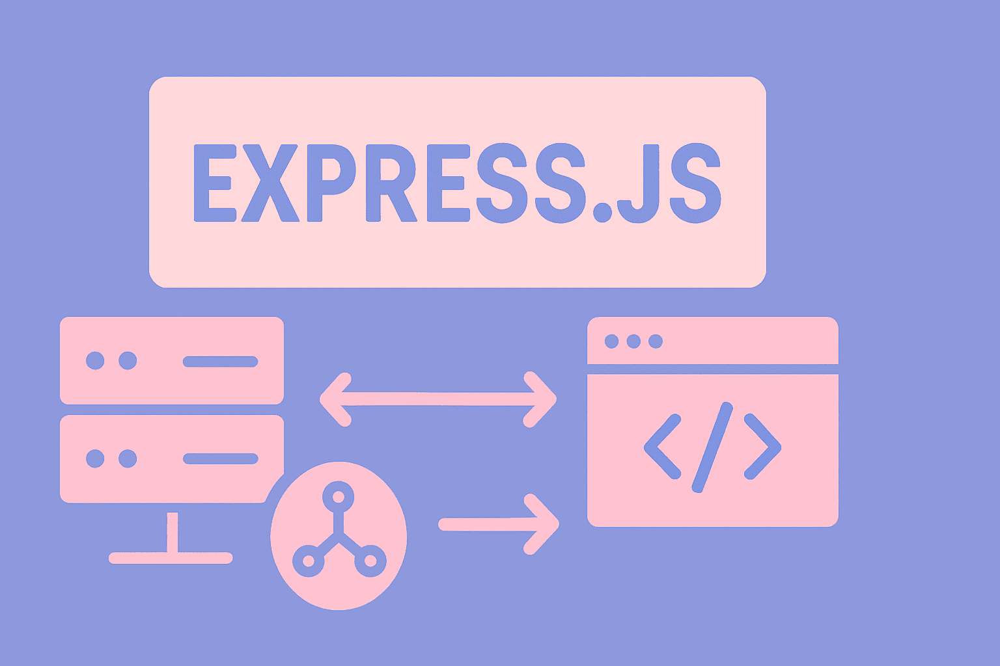

# Learn Express.js Fundamentals




**A Complete Guide to Express.js including routing, middleware, view engines, and advanced techniques for building powerful backends**

If you're building backends with JavaScript, you're likely using Express.js. In this comprehensive guide, we'll cover everything you need to know about Express, including several advanced features that are rarely seen in other tutorials.

## Getting Started with Express.js

### Prerequisites
First, you need to install Node.js on your system. If you haven't installed it yet, download it from the official Node.js website.

### Project Setup
Create a new project and install the necessary dependencies:

```bash
# Create a new npm project
npm init -y

# Install Express
npm install express

# Install nodemon for development (automatically restarts the server)
npm install --save-dev nodemon
```

### Configuring package.json
Add a script for development to your `package.json`:

```json
{
  "scripts": {
    "dev": "nodemon server.js"
  }
}
```

Now you can run `npm run dev` to start your server with automatic restart capabilities.

Nodemon is a utility that monitors your files for changes and automatically restarts your Node.js application, saving you from manually stopping and restarting the server during development.

## Building Your First Server

Create a `server.js` file in your project root:

```javascript
const express = require('express');
const app = express();

// Start the server on port 3000
app.listen(3000, () => {
  console.log('Server running on http://localhost:3000');
});
```

This code creates a basic Express server that listens on port 3000. However, it doesn't have any routes yet.

The `app` object represents your Express application and provides methods for routing HTTP requests, configuring middleware, rendering HTML views, and more. The `listen()` method binds and listens for connections on the specified port.

## Routes

**Routes** in Express determine how your application responds to different **client (user)** requests. Simply put, routes are like signposts that tell your application what to do when a user visits a specific address.

Express supports all common **HTTP methods**:

* **GET:** Retrieve information from the server
* **POST:** Send information to the server to create something new
* **PUT:** Update existing information
* **DELETE:** Delete information

Example:

```javascript
// GET route
app.get('/', (req, res) => {
  console.log('Home page accessed');
  res.send('Hello World!');
});
```

> This route sends a "Hello World!" message when the user visits the homepage (`/`).

```javascript
// POST route
app.post('/users', (req, res) => {
  res.send('Create a new user');
});
```

> When a user sends information to create a new user, the server returns this message.

```javascript
// PUT route
app.put('/users/:id', (req, res) => {
  res.send('Update user');
});
```

> PUT routes are typically used for updating information. `:id` means the server expects to receive a **user identifier**.

```javascript
// DELETE route
app.delete('/users/:id', (req, res) => {
  res.send('Delete user');
});
```

> The DELETE route is used to delete user information with a specific identifier.

### Route Parameters

Routes have important parameters:

* `req`: **request object**, contains information the user has sent (like forms or URL params)
* `res`: **response object**, used to respond to the user
* `next`: typically used for **middleware** and isn't needed in most routes

The `req` (request) object represents the HTTP request and has properties for the request query string, parameters, body, HTTP headers, etc. The `res` (response) object represents the HTTP response that an Express app sends when it receives an HTTP request.

## Working with Response Methods

Express has several methods for sending responses to users. In summary:

### Basic Response Methods

```javascript
app.get('/basic', (req, res) => {
  res.send('Hello World'); // Send plain text
});
```

```javascript
app.get('/status', (req, res) => {
  res.status(500).send('Server Error'); // Send status code with message
});
```

```javascript
app.get('/json', (req, res) => {
  res.json({ message: 'Hello World', status: 'success' }); // Send JSON
});
```

```javascript
app.get('/download', (req, res) => {
  res.download('./server.js'); // Download file from server
});
```

The `res.send()` method is intelligent and automatically sets the Content-Type header based on what you pass it. `res.json()` is specifically for sending JSON responses and will also set the appropriate Content-Type header. `res.status()` allows you to set the HTTP status code (200 for success, 404 for not found, 500 for server error, etc.).

## Organizing Code with Routers

When an Express project grows, **keeping all routes in one file becomes difficult and messy**.
**Routers** help us make routes **modular and separate**, meaning each group of routes is in its own dedicated file.

### Creating a Router File

First, create a folder named `routes` and add a `users.js` file inside it:

```javascript
const express = require('express');
const router = express.Router();

// Routes are relative to the mounted path
router.get('/', (req, res) => {
  res.send('User list');
});

router.get('/new', (req, res) => {
  res.send('New user form');
});

router.post('/', (req, res) => {
  res.send('Create user');
});

// Export the router
module.exports = router;
```

> This file only holds routes related to users. Each route is relative to the **mounted path** (`/users`).

By using routers, you can break your application into smaller, manageable pieces. This follows the principle of separation of concerns and makes your codebase more maintainable as it grows.

### Using the Router in the Main Server

In `server.js`:

```javascript
const express = require('express');
const userRouter = require('./routes/users');
const app = express();

// Mount the router on /users
app.use('/users', userRouter);

app.listen(3000);
```

> This creates the following routes:

* GET `/users/` → Display list of users
* GET `/users/new` → Display form for creating a new user
* POST `/users/` → Create a new user

Simply put: Every route inside the Router file is added to `/users`.

The `app.use('/users', userRouter)` line mounts the router at the `/users` path. This means all routes defined in the userRouter will be prefixed with `/users`. This is called "mounting" a router.

## Dynamic Routes and Parameters

**Dynamic routes** allow you to define parts of the URL as variables and capture them.

```javascript
// Dynamic parameter with colon
router.get('/:id', (req, res) => {
  const userId = req.params.id;
  res.send(`Get user with ID: ${userId}`);
});

// Multiple parameters
router.get('/:id/posts/:postId', (req, res) => {
  const { id, postId } = req.params;
  res.send(`User ${id}, Post ${postId}`);
});
```

> Simple example: If the URL is `/5/posts/10`, then `id = 5` and `postId = 10`.

Dynamic parameters are indicated by a colon (`:`) prefix. The parameter name becomes a property on `req.params`. This is extremely useful for RESTful APIs where you need to identify specific resources.

### Important: Route Order Matters

**Static** routes should be written before dynamic routes, because dynamic routes can also match static paths.

```javascript
// ✅ Correct order
router.get('/new', (req, res) => {
  res.send('New user form');
});

router.get('/:id', (req, res) => {
  res.send(`User ${req.params.id}`);
});
```

```javascript
// ❌ Wrong order
router.get('/:id', (req, res) => { ... }); // Might capture /new
router.get('/new', (req, res) => { ... });
```

If you place the dynamic route first, when someone visits `/users/new`, Express will match it with the `/:id` route and treat "new" as an ID, never reaching the specific `/new` route. Order is critical!

## Advanced Routing Techniques

### Route Chaining

If we have multiple methods for a similar path, we can **chain them together**:

```javascript
router.route('/:id')
  .get((req, res) => {
    res.send(`Get user ${req.params.id}`);
  })
  .put((req, res) => {
    res.send(`Update user ${req.params.id}`);
  })
  .delete((req, res) => {
    res.send(`Delete user ${req.params.id}`);
  });
```

> Instead of defining each method separately, we define them all at once.

Route chaining with `router.route()` creates a more concise and organized way to handle multiple HTTP methods for the same path. This reduces code repetition and makes your routes easier to read and maintain.

## Middleware

**Middleware** in Express acts like an **intermediary between the user's request and the server's response**. These functions execute during the **request-response cycle** and have access to three things:

* `req` → User request information
* `res` → Response to the user
* `next` → Used to move to the next middleware

Simply put, Middleware can:

* Check requests
* Prepare data
* Apply access restrictions

Middleware functions are the backbone of Express applications. They can execute any code, make changes to the request and response objects, end the request-response cycle, or call the next middleware in the stack. Think of them as a pipeline where each middleware performs a specific task.

### Creating Custom Middleware

Example: A middleware for **logging** requests:

```javascript
function logger(req, res, next) {
  console.log(`${req.method} ${req.originalUrl}`);
  next(); // Continue to the next middleware
}

// Global usage
app.use(logger);

// Usage on a specific route
app.get('/', logger, (req, res) => {
  res.send('Home page');
});

// Multiple middleware in sequence
app.get('/protected', auth, logger, (req, res) => {
  res.send('Protected route');
});
```

> Simple explanation: `next()` causes the code after the middleware to execute. Without `next()`, the request stops.

When you call `next()`, you're passing control to the next middleware or route handler. If you don't call `next()`, the request-response cycle hangs and the client never receives a response. You can also pass an error to `next(err)` to trigger error-handling middleware.

### Router-Level Middleware

You can apply middleware **only to a specific router**:

```javascript
// In routes/users.js
function userLogger(req, res, next) {
  console.log('User route accessed');
  next();
}

// Apply to all routes in this router
router.use(userLogger);
```

> This means every time a route from `users.js` executes, `userLogger` runs first.

Router-level middleware works just like application-level middleware, except it's bound to an instance of `express.Router()`. This allows you to have middleware that only applies to a specific group of routes.

### Middleware Execution Order

Middleware executes **in the order they are defined**:

```javascript
app.use(middleware1); // Executes first
app.use(middleware2); // Executes second
app.get('/', middleware3, handler); // middleware3 third, then handler
```

> So the order of writing middleware is very important.

The execution flows from top to bottom through your middleware stack. This is why placement matters - if you have authentication middleware, it needs to come before routes that require authentication.

### Router Parameter Middleware

With `router.param()` you can define **middleware specific to a parameter**.

```javascript
const users = [
  { name: 'Kyle' },
  { name: 'Sally' }
];

// Executes whenever the :id parameter is found
router.param('id', (req, res, next, id) => {
  console.log(`Looking for user with ID: ${id}`);

  // Get the user from array/database
  req.user = users[id];

  // Continue to next middleware/route
  next();
});

router.get('/:id', (req, res) => {
  // req.user is now available
  console.log(req.user);
  res.json(req.user);
});
```

> This middleware runs before any route that has the `:id` parameter and allows:

Parameter middleware is incredibly useful for preprocessing route parameters. Common use cases include validating IDs, loading resources from a database, checking permissions, or transforming parameter values. It runs automatically for all routes that include that parameter, reducing code duplication.

## Built-in Middleware

Express has several **built-in and useful** middleware that make tasks easier.

### Serving Static Files

You can serve static files like HTML, CSS, JavaScript, or images from a folder:

```javascript
app.use(express.static('public'));
```

> Structure of the `public` folder:

```
public/
  ├── index.html
  ├── style.css
  ├── script.js
  └── images/
      └── logo.png
```

> These files are accessible at the following addresses:

* `http://localhost:3000/index.html`
* `http://localhost:3000/style.css`
* `http://localhost:3000/images/logo.png`

The `express.static` middleware serves static assets directly without needing to write route handlers for each file. The path you provide to the files is relative to the directory from where you launch your Node.js process. For security and flexibility, it's often better to use an absolute path.

### Parsing Request Bodies

Built-in middleware can convert form data and JSON into usable objects:

```javascript
// URL-encoded form data
app.use(express.urlencoded({ extended: true }));

// JSON data
app.use(express.json());
```

> Example: If a user submits a form or sends JSON, with this middleware we can read them directly from `req.body`.

The `extended: true` option in `urlencoded` allows for rich objects and arrays to be encoded into the URL-encoded format, using the `qs` library. Without these middleware, `req.body` would be undefined when trying to access form or JSON data.

## Working with Form Data

Forms are tools that allow users to **send information from the browser to the server**. In Express, we can receive and process this data with middleware like `express.urlencoded()`.

### Creating a Form

Example file `views/users/new.ejs`:

```html
<!DOCTYPE html>
<html>
<head>
    <title>New User</title>
</head>
<body>
    <form action="/users" method="POST">
        <input type="text" name="firstName" placeholder="First Name"
               value="<%= locals.firstName || '' %>" required>
        <button type="submit">Create User</button>
    </form>
</body>
</html>
```

> Simple notes:

* `action="/users"` → Address where data is sent
* `method="POST"` → We use HTTP POST because data is being created
* `<%= locals.firstName || '' %>` → If the form was previously filled and an error occurred, the previous value is preserved

The `locals` object in EJS contains local variables passed to the view. Using `locals.firstName || ''` is a safe way to access potentially undefined variables without causing errors. The `required` attribute provides client-side validation, but you should always validate on the server too.

### Processing Form Data

```javascript
const users = [];

router.get('/new', (req, res) => {
  res.render('users/new');
});

router.post('/', (req, res) => {
  const isValid = true; // Validation logic goes here

  if (isValid) {
    const newUser = { firstName: req.body.firstName };
    users.push(newUser);

    const userId = users.length - 1;
    res.redirect(`/users/${userId}`);
  } else {
    res.render('users/new', {
      firstName: req.body.firstName,
      error: 'Invalid input'
    });
  }
});
```

> Simple notes:

* `req.body.firstName` → Value entered by the user
* If data is valid → **User is created and we redirect**
* If invalid → Form is displayed again and user input is preserved

The redirect after a successful POST follows the Post-Redirect-Get (PRG) pattern, which prevents duplicate form submissions if the user refreshes the page. When validation fails, re-rendering the form with the submitted data provides a better user experience.

### Key Concepts in Form Handling

1. **Preserve Input on Error** → User shouldn't have to refill the entire form
2. **Validation** → Always have server-side validation, even if client-side validation exists
3. **Redirect After POST** → Use the **Post-Redirect-Get** pattern to prevent double submission
4. **Error Handling** → Give the user clear feedback

Never trust client-side validation alone. Users can bypass it by disabling JavaScript or manipulating HTTP requests directly. Server-side validation is your last line of defense and ensures data integrity.

## Query Parameters

**Query parameters** are part of the URL that come after `?` and are typically used for **filtering, searching, pagination, and sorting**.

Example URL:

```
http://localhost:3000/users?name=Kyle&age=25
```

### Accessing Query Parameters

```javascript
router.get('/', (req, res) => {
  const name = req.query.name;
  const age = req.query.age;

  // Or with destructuring
  const { name, age } = req.query;

  console.log(`Name: ${name}, Age: ${age}`);

  res.send(`Hello ${name || 'Anonymous'}`);
});
```

> Simple note: `req.query` is an object that contains all query parameters.

Query parameters are automatically parsed by Express and made available through `req.query`. They're always strings, so you may need to convert them to numbers or other types for processing.

### Use Cases for Query Parameters

* **Filtering:**
  `GET /products?category=electronics&price_max=100`

* **Pagination:**
  `GET /users?page=2&limit=10`

* **Search:**
  `GET /search?q=express.js`

* **Sorting:**
  `GET /posts?sort=date&order=desc`

> Simply put: Query parameters allow users to **customize or limit information** without changing the main path.

Query parameters are ideal for optional data that modifies the response but doesn't fundamentally change what resource you're accessing. Unlike route parameters (like `/users/:id`), query parameters are optional and can appear in any order.

## Complete Example: User Management System

Here's a complete example that combines everything:

### server.js
```javascript
const express = require('express');
const userRouter = require('./routes/users');
const app = express();

// View engine
app.set('view engine', 'ejs');

// Middleware
app.use(express.static('public'));
app.use(express.urlencoded({ extended: true }));
app.use(express.json());

// Routes
app.get('/', (req, res) => {
  res.render('index');
});

app.use('/users', userRouter);

app.listen(3000, () => {
  console.log('Server running on http://localhost:3000');
});
```

### routes/users.js
```javascript
const express = require('express');
const router = express.Router();

const users = [
  { firstName: 'Kyle' },
  { firstName: 'Sally' }
];

// Middleware for user parameter
router.param('id', (req, res, next, id) => {
  req.user = users[id];
  next();
});

// Routes
router.get('/', (req, res) => {
  res.render('users/index', { users });
});

router.get('/new', (req, res) => {
  res.render('users/new');
});

router.post('/', (req, res) => {
  const isValid = req.body.firstName && req.body.firstName.trim() !== '';

  if (isValid) {
    users.push({ firstName: req.body.firstName });
    res.redirect(`/users/${users.length - 1}`);
  } else {
    res.render('users/new', {
      firstName: req.body.firstName,
      error: 'First name is required'
    });
  }
});

router.route('/:id')
  .get((req, res) => {
    res.render('users/show', { user: req.user });
  })
  .put((req, res) => {
    req.user.firstName = req.body.firstName;
    res.redirect(`/users/${req.params.id}`);
  })
  .delete((req, res) => {
    users.splice(req.params.id, 1);
    res.redirect('/users');
  });

module.exports = router;
```

This complete example demonstrates a full CRUD (Create, Read, Update, Delete) application. It shows how routers, middleware, parameter middleware, route chaining, and form handling all work together in a real application.

## Final Words

Express.js is a powerful and flexible framework that makes building web servers with Node.js simple and enjoyable. The key concepts we covered in this tutorial include:

- Setting up Express applications and servers
- Creating and organizing routes with routers
- Understanding middleware and its execution flow
- Handling different types of data (JSON, forms, static files)
- Working with dynamic routes and parameters
- Using view engines for server-side rendering

Remember that Express.js is highly extensible through its middleware ecosystem. The npm registry has thousands of middleware packages that can add capabilities like authentication, logging, rate limiting, and much more to your application.
