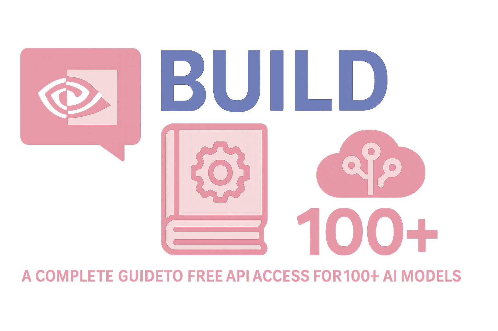

# دیگر برای هوش مصنوعی پول ندهید: چگونه بیش از ۱۰۰ مدل رایگان را به Cursor، Cline، Roo Code و Open WebUI وصل کنیم



🚨 اگر این روزها به صورتحساب Cursor خیره شده‌اید یا مصرف API کلود خود را جیره‌بندی می‌کنید، یک سرویس هست که کمتر کسی درباره‌اش صحبت می‌کند: **NVIDIA Build**. این سرویس یک کلید API واقعی در اختیارتان می‌گذارد که به بیش از صد مدل میزبانی‌شده روی زیرساخت GPU خود NVIDIA متصل است — بدون نیاز به کارت اعتباری. در این راهنما دقیقاً می‌بینیم این سرویس چیست، چطور راه‌اندازی می‌شود، و چطور آن را به ابزارهایی که همین حالا استفاده می‌کنید وصل کنید.

## دقیقاً NVIDIA Build چیست؟

NVIDIA Build (در آدرس [build.nvidia.com](https://build.nvidia.com)) دروازه‌ی عمومی **NIM** است — مخفف NVIDIA Inference Microservices. پروژه‌ی NIM در ابتدا یک محصول سازمانی بود: کانتینرهای از پیش بسته‌بندی‌شده که مدل‌های زبانی بزرگ را با بهینه‌سازی TensorRT-LLM روی GPUهای NVIDIA اجرا می‌کردند و برای استقرار داخل سازمان (on-premise) فروخته می‌شدند. در یک مقطعی، NVIDIA نسخه‌ی میزبانی‌شده‌ی همان کاتالوگ را برای هر کسی که یک حساب توسعه‌دهنده‌ی رایگان بسازد باز کرد؛ این نسخه روی زیرساخت DGX Cloud خودشان اجرا می‌شود.

این کاتالوگ الان بیش از ۱۰۰ مدل را پوشش می‌دهد، و فقط کار خود NVIDIA نیست — تصویر نسبتاً کاملی از دنیای مدل‌های متن‌باز (open-weight) است:

- **DeepSeek** (خانواده V3.1/V4، قوی در استدلال و کد)
- **Meta Llama** (از ۸B تا ۴۰۵B، به‌همراه نسخه‌های چندوجهی/ویژن)
- **Qwen / QwQ** (متخصص‌های علی‌بابا در کدنویسی و ریاضی)
- **GLM** (مدل‌های Zhipu AI برای کارهای عامل‌محور و کدنویسی چندزبانه)
- **Kimi K2** (از Moonshot AI، با پنجره‌ی زمینه‌ی بسیار بزرگ برای کار روی اسناد طولانی)
- **MiniMax**، **Mistral / Mixtral**، **GPT-OSS**، و سری اختصاصی خود NVIDIA یعنی **Nemotron**
- مدل‌های تخصصی برای بینایی ماشین، embedding/بازیابی اطلاعات، و گفتار

نکته‌ای که واقعاً در استفاده‌ی روزمره اهمیت دارد این است: تمام مدل‌ها پشت **همان قالب دقیق درخواستی که OpenAI استفاده می‌کند** قرار دارند. یعنی هر چیزی که از قبل بلد است با `api.openai.com` صحبت کند، می‌تواند به‌جایش با NVIDIA صحبت کند — فقط کافی است دو مقدار را عوض کنید.

## چرا ارزش امتحان کردن دارد؟

- **هیچ‌وقت نیاز به کارت اعتباری نیست**، حداقل در لایه‌ی رایگان. فقط یک ایمیل کافی است.
- **یک اتصال، ده‌ها مدل.** SDK جدیدی یاد نمی‌گیرید — همان قالب OpenAI است.
- **اعتبار رایگان از همان لحظه‌ی ثبت‌نام.** ظرف چند دقیقه می‌توانید اولین درخواست را بفرستید.
- **با ابزارهایی که همین الان نصب دارید کار می‌کند** — Cursor، Cline، Roo Code، Open WebUI، Continue و اساساً هر کلاینتی که گزینه‌ی «OpenAI Compatible» داشته باشد.

## مرحله‌ی اول: ساخت حساب کاربری

1. به آدرس **[build.nvidia.com](https://build.nvidia.com)** بروید.
2. روی **Create an Account** کلیک کنید و در **NVIDIA Developer Program** (رایگان) ثبت‌نام کنید — فقط یک ایمیل معتبر و پذیرفتن قوانین استفاده کافی است. هیچ احراز هویت با مدرک شناسایی یا روش پرداختی لازم نیست.
3. ایمیل‌تان را تأیید کنید. تمام شد.

##  مرحله‌ی دوم: ساخت کلید API

1. بعد از ورود، به آدرس **build.nvidia.com/settings/api-keys** بروید.
2. روی **Generate Key** کلیک کنید.
3. کلید را همان لحظه کپی کنید — با پیشوند `nvapi-` شروع می‌شود و NVIDIA فقط **یک‌بار** آن را نشان می‌دهد. بلافاصله آن را در یک مدیر رمز عبور یا یک متغیر محیطی (`NVIDIA_API_KEY`) ذخیره کنید.

همین. کلید بلافاصله فعال است و از قبل اعتبار دارد.

##  مرحله‌ی سوم: ابزارهای خود را به آن وصل کنید

تمام اتصال‌های زیر روی همین دو مقدار ثابت تکیه دارند:

```
Base URL:  https://integrate.api.nvidia.com/v1
API Key:   nvapi-xxxxxxxxxxxxxxxxxxxxxxxxxxxx
```

شناسه‌ی مدل‌ها با الگوی `provider/model-name` نوشته می‌شوند و در صفحه‌ی هر مدل داخل کاتالوگ قابل مشاهده‌اند — برای مثال `deepseek-ai/deepseek-v3.1`، `meta/llama-3.1-70b-instruct` یا `qwen/qwen3-coder-480b-a35b-instruct`.

### تست سریع با curl یا Python

قبل از وصل‌کردن کلید به یک IDE، بهتر است ابتدا مطمئن شوید که کار می‌کند:

```python
from openai import OpenAI

client = OpenAI(
    base_url="https://integrate.api.nvidia.com/v1",
    api_key="nvapi-xxxxxxxxxxxxxxxxxxxxxxxxxxxx",
)

response = client.chat.completions.create(
    model="meta/llama-3.1-70b-instruct",
    messages=[{"role": "user", "content": "Say hello in five words."}],
)

print(response.choices[0].message.content)
```

اگر پاسخی برگشت، یعنی کلید درست کار می‌کند و می‌توانید آن را به یک ابزار واقعی وصل کنید.

### تنظیمات به تفکیک ابزار

| ابزار | محل تنظیم | چه چیزی وارد کنید |
|---|---|---|
| **Cursor** | Settings → Models → Custom → گزینه‌ی «OpenAI Compatible» | یک نام بگذارید (مثلاً «NVIDIA NIM»)، آدرس Base URL و کلید را وارد کنید، سپس شناسه‌ی مدل‌های موردنظر را دستی اضافه کنید |
| **Cline** (افزونه‌ی VS Code) | آیکن تنظیمات (⚙️) → API Provider → **OpenAI Compatible** | Base URL، API Key و شناسه‌ی دقیق مدل از کاتالوگ |
| **Roo Code** (افزونه‌ی VS Code) | پنل تنظیمات → API Provider → **OpenAI Compatible** | همان سه فیلد: Base URL، API Key، Model |
| **Open WebUI** | Admin Settings → Connections → **Add Connection** (OpenAI) | Base URL و API Key — سپس Open WebUI مدل‌های موجود را از `/v1/models` به‌صورت خودکار پیدا می‌کند |
| **Continue** (افزونه‌ی VS Code) | ویرایش فایل `~/.continue/config.yaml` | یک بلوک مدل با `provider: openai`، `apiBase`، `apiKey` و `model` اضافه کنید (نمونه در پایین) |

**نمونه‌ی تنظیم Continue.dev در فایل config.yaml:**

```yaml
models:
  - name: NVIDIA NIM - Llama 70B
    provider: openai
    model: meta/llama-3.1-70b-instruct
    apiBase: https://integrate.api.nvidia.com/v1
    apiKey: nvapi-xxxxxxxxxxxxxxxxxxxxxxxxxxxx
    roles:
      - chat
      - edit
```

این الگو تقریباً در همه‌ی ابزارهای کدنویسی با هوش مصنوعی تکرار می‌شود: دنبال گزینه‌ای به نام **«OpenAI Compatible»**، **«Custom Provider»** یا یک فیلد خام **`base_url` / `apiBase`** بگردید و آدرس NVIDIA را مستقیم در آن قرار دهید.

## شناخت واقعی لایه‌ی رایگان (تا غافلگیر نشوید)

این بخشی است که خیلی‌ها از کنارش رد می‌شوند، پس نسخه‌ی صادقانه‌اش را می‌گویم:

- **اعتبار اولیه:** حساب‌های جدید همان لحظه‌ی ثبت‌نام حدود **۱۰۰۰ اعتبار رایگان** دریافت می‌کنند. هر درخواست مقدار کمی از این اعتبار را مصرف می‌کند، بسته به مدل — مدل‌های سبک‌تر اعتبار کمتری در هر تماس مصرف می‌کنند و مدل‌های پرچمدار و بزرگ‌تر اعتبار بیشتری.
- **گرفتن اعتبار بیشتر:** از طریق فروم توسعه‌دهندگان NVIDIA یا یک فرم درخواست، امکان افزایش این سقف تا حدود **۵۰۰۰ اعتبار کل** وجود دارد.
- **محدودیت نرخ درخواست، نه محدودیت توکن:** جدا از اعتبار، یک سقف حدوداً **۴۰ درخواست در دقیقه به‌ازای هر مدل** روی سطح حساب اعمال می‌شود — نه سقف توکن روزانه. اگر درخواست‌ها را خیلی سریع بفرستید، خطای HTTP 429 همراه با یک زمان پیشنهادی برای تلاش مجدد دریافت می‌کنید.
- **وقتی اعتبار تمام شود:** مدل‌های پرچمدار/پولی وقتی موجودی‌تان تمام شود خطای HTTP 402 برمی‌گردانند. چند مدل کوچک‌تر بعد از اتمام اعتبار هم، تحت یک سهمیه‌ی پایه‌ی جداگانه، همچنان قابل استفاده می‌مانند.
- **این یک لایه برای نمونه‌سازی است، نه برای محصول نهایی و پرترافیک.** خود NVIDIA صراحتاً می‌گوید این نقاط پایانی رایگان برای توسعه، تست و ارزیابی طراحی شده‌اند، نه برای سرویس‌دهی به ترافیک واقعی کاربران در مقیاس بزرگ. برای آن حالت، NVIDIA کاربران را به سمت کانتینرهای NIM روی زیرساخت خودشان یا ظرفیت پولی DGX Cloud هدایت می‌کند.

یک نکته‌ی صادقانه‌ی دیگر: این اعداد دقیق قبلاً هم تغییر کرده‌اند و ممکن است دوباره تغییر کنند — NVIDIA یک عدد قطعی و یکسان برای همه‌ی مدل‌ها منتشر نمی‌کند. اگر چیزی برایتان عجیب به نظر رسید، همیشه اعداد را در داشبورد حساب خودتان در **build.nvidia.com** چک کنید، چون آن‌جا منبع اصلی و به‌روز است.

## این تنظیمات واقعاً برای چه کارهایی خوب است؟

- **مقایسه‌ی مدل‌ها قبل از انتخاب نهایی** — فقط شناسه‌ی مدل را عوض کنید، همان مجموعه پرامپت را روی پنج شش مدل مختلف اجرا کنید و کیفیت و تأخیر آن‌ها را رایگان مقایسه کنید.
- **نمونه‌سازی ایجنت‌ها و جریان‌های tool-calling** — مدل‌های Llama 3.1، Nemotron و GLM همگی از فراخوانی تابع (function calling) به سبک OpenAI پشتیبانی می‌کنند.
- **کار روی اسناد طولانی** — برخی مدل‌های کاتالوگ پنجره‌ی زمینه‌ی بسیار بزرگی دارند و بدون نیاز به تکه‌تکه‌کردن فایل، اسناد طولانی را پردازش می‌کنند.
- **یادگیری و پروژه‌های درسی** — راهی سریع برای کار عملی با مدل‌های متن‌باز درجه‌یک، بدون نیاز به داشتن یک کلاستر GPU شخصی.

## چند نکته که باید در نظر داشته باشید

- **تأخیر (latency) در حد سرویس‌های تخصصی مثل Groq نیست.** DGX Cloud عمدتاً از مراکز داده‌ی آمریکا سرویس می‌دهد، پس اگر خارج از آمریکای شمالی درخواست می‌فرستید، انتظار تأخیر محسوسی بیشتر از یک سرویس‌دهنده‌ی مخصوص تأخیر پایین را داشته باشید.
- **همه‌ی مدل‌ها بعد از کم‌شدن اعتبار یکسان رفتار نمی‌کنند.** چند مدل از کاتالوگ گاهی ناپایدار یا محدود گزارش شده‌اند؛ اگر یک مدل عملکرد ضعیفی داشت، مدل دیگری از همان خانواده را امتحان کنید.

## مرجع سریع

```
ثبت‌نام:        https://build.nvidia.com
گرفتن کلید:     https://build.nvidia.com/settings/api-keys
Base URL:       https://integrate.api.nvidia.com/v1
احراز هویت:     Bearer token (کلید nvapi- شما)
مستندات:        https://build.nvidia.com/models
```

با فقط پنج دقیقه تنظیمات، یک کلید API در اختیار دارید که به ده‌ها مدل جدی و متن‌باز متصل می‌شود، آن هم با ابزارهایی که احتمالاً از قبل نصب دارید. این جایگزین یک API پولی و آماده‌ی تولید نیست، اما برای نمونه‌سازی، یادگیری و کمک‌گرفتن روزمره در کدنویسی، به‌سختی می‌توان قیمتی بهتر از این پیدا کرد.