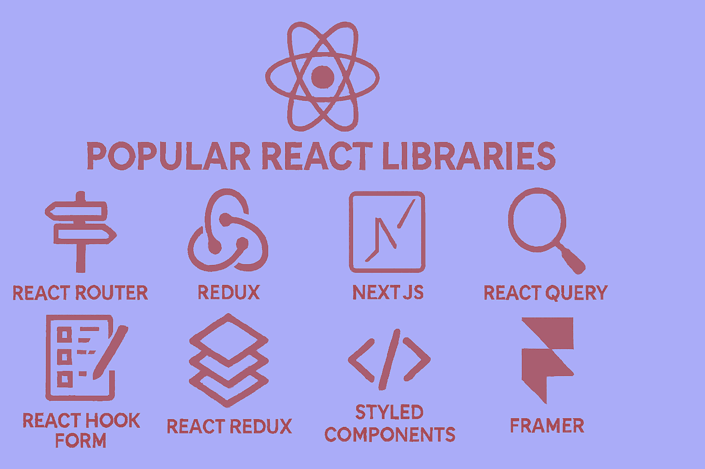

# Introduction to the Best React Libraries You Can Use Alongside React



**Hello to all dear developers!** Today, we're going to discuss one of the most important topics in React development. Many of you who have entered the world of React have probably encountered this question: "Okay, I've learned React, but what other libraries do I need to build a complete project?"

To be honest, React itself is an excellent library for building user interfaces, but for a complete and professional project, we need other supporting libraries. Today, we're going to prepare a comprehensive guide for you to know which libraries to use, when, and why.

## Why Are Supporting Libraries Necessary?

React is fundamentally a minimalist library, meaning it focuses only on its core functionality: managing components and local state. However, when you want to build a real application, you face various challenges:

- How do I navigate between different pages?
- How do I fetch data from the server?
- How do I manage complex forms?
- How do I control global state?

Fortunately, the React community is very active and dynamic, and for each of these challenges, excellent libraries have been developed. Let's take a look at them together.

## 1. Routing: React Router

When building a multi-page application, the first thing you need is a routing system. React Router is considered the gold standard in this area.

```jsx
import { BrowserRouter as Router, Routes, Route } from "react-router-dom";

function App() {
	return (
		<Router>
			<Routes>
				<Route path="/" element={<Home />} />
				<Route path="/about" element={<About />} />
				<Route path="/contact" element={<Contact />} />
			</Routes>
		</Router>
	);
}
```

**Why React Router?**

- Complete support for all modern routing features
- Excellent documentation and large community
- Nested routing capability for complex structures
- Support for lazy loading and code splitting

**Interesting statistic:** React Router is used by over 8 million projects on GitHub!

React Router v6 introduced a more declarative API compared to previous versions, making it easier to define routes. The `element` prop replaces the older `component` and `render` props, providing better TypeScript support and allowing you to pass props more naturally. Nested routing means you can have layouts with sub-routes, which is essential for building complex applications with shared navigation structures.

## 2. State Management

### Zustand: Modern and Simple Choice

If you're a beginner or your project isn't very complex, Zustand is an excellent choice:

```javascript
import { create } from "zustand";

const useCounterStore = create((set) => ({
	count: 0,
	increment: () => set((state) => ({ count: state.count + 1 })),
	decrement: () => set((state) => ({ count: state.count - 1 })),
}));

// In the component
function Counter() {
	const { count, increment, decrement } = useCounterStore();
	return (
		<div>
			<span>{count}</span>
			<button onClick={increment}>+</button>
			<button onClick={decrement}>-</button>
		</div>
	);
}
```

**Advantages of Zustand:**

- High simplicity (less code, easier understanding)
- Excellent performance
- Small file size (2 kilobytes!)
- No need for provider wrapper

Unlike Redux or Context API, Zustand doesn't require wrapping your app in providers. The store is created once and can be imported and used anywhere. It uses React hooks under the hood, making it feel natural to React developers. Zustand also supports middleware for persistence, devtools integration, and more advanced features when needed.

### Redux Toolkit: For Large Projects

If your project is very large and complex, Redux Toolkit is still a powerful option:

```javascript
import { createSlice } from "@reduxjs/toolkit";

const counterSlice = createSlice({
	name: "counter",
	initialState: { value: 0 },
	reducers: {
		increment: (state) => {
			state.value += 1;
		},
		decrement: (state) => {
			state.value -= 1;
		},
	},
});
```

**When to Choose Redux Toolkit?**

- Enterprise projects with large teams
- Need for time travel debugging
- Complex business logic

Redux Toolkit (RTK) dramatically reduces the boilerplate that traditional Redux required. It includes `createSlice` which automatically generates action creators and action types, and uses Immer under the hood to allow "mutating" syntax that's actually immutable. RTK also includes RTK Query for data fetching, making it a complete state management solution. The DevTools integration allows you to inspect every state change and even "time travel" to previous states.

## 3. Data Fetching and Management

### TanStack Query: Revolution in Data Fetching

One of the best things to happen to the React community in recent years has been the introduction of TanStack Query (formerly React Query):

```javascript
import { useQuery } from "@tanstack/react-query";

function Posts() {
	const {
		data: posts,
		isLoading,
		error,
	} = useQuery({
		queryKey: ["posts"],
		queryFn: () => fetch("/api/posts").then((res) => res.json()),
	});

	if (isLoading) return <div>Loading...</div>;
	if (error) return <div>Error: {error.message}</div>;

	return (
		<ul>
			{posts.map((post) => (
				<li key={post.id}>{post.title}</li>
			))}
		</ul>
	);
}
```

**Why TanStack Query?**

- Automatic and intelligent caching
- Background refetching
- Optimistic updates
- Significant reduction in boilerplate code

TanStack Query manages the entire lifecycle of server state: fetching, caching, synchronizing, and updating. It automatically refetches data when the window regains focus or when the network reconnects. The `queryKey` acts as a unique identifier for your data, and Query automatically caches results. When you navigate back to a component, you see cached data instantly while fresh data is fetched in the background. It also handles pagination, infinite scrolling, and mutations with built-in hooks.

### Axios: Powerful HTTP Client

For sending HTTP requests, Axios is still an excellent choice:

```javascript
import axios from "axios";

// Basic configuration
const api = axios.create({
	baseURL: "https://api.example.com",
	timeout: 10000,
	headers: {
		"Content-Type": "application/json",
	},
});

// Adding interceptor for error handling
api.interceptors.response.use(
	(response) => response,
	(error) => {
		console.error("API Error:", error);
		return Promise.reject(error);
	},
);
```

Axios provides advantages over the native Fetch API, including automatic JSON transformation, request/response interceptors for centralized error handling and authentication, request cancellation, and better error handling. Interceptors are particularly powerful—you can add authentication tokens to all requests, handle 401 errors globally by redirecting to login, or implement retry logic for failed requests.

## 4. Form Management

### React Hook Form: High Performance, Less Code

React Hook Form is one of the best libraries for managing forms:

```javascript
import { useForm } from "react-hook-form";

function ContactForm() {
	const {
		register,
		handleSubmit,
		formState: { errors },
	} = useForm();

	const onSubmit = (data) => {
		console.log(data);
	};

	return (
		<form onSubmit={handleSubmit(onSubmit)}>
			<input
				{...register("name", { required: "Name is required" })}
				placeholder="Your name"
			/>
			{errors.name && <span>{errors.name.message}</span>}

			<input
				{...register("email", {
					required: "Email is required",
					pattern: {
						value: /^\S+@\S+$/i,
						message: "Invalid email format",
					},
				})}
				placeholder="Email"
			/>
			{errors.email && <span>{errors.email.message}</span>}

			<button type="submit">Submit</button>
		</form>
	);
}
```

React Hook Form minimizes re-renders by using uncontrolled components and refs instead of storing every input value in state. This makes it significantly faster than alternatives like Formik, especially for large forms. The `register` function connects your inputs to the form state without needing onChange handlers. It integrates seamlessly with UI libraries and supports async validation, field arrays for dynamic forms, and sophisticated conditional logic.

### Zod: Powerful Validation

You can combine Zod with React Hook Form to have an excellent validation system:

```javascript
import { z } from "zod";
import { zodResolver } from "@hookform/resolvers/zod";

const schema = z.object({
	name: z.string().min(2, "Name must be at least 2 characters"),
	email: z.string().email("Enter a valid email"),
	age: z.number().min(18, "Age must be at least 18 years"),
});

const { register, handleSubmit } = useForm({
	resolver: zodResolver(schema),
});
```

Zod is a TypeScript-first schema validation library that provides both runtime validation and compile-time type inference. When you define a Zod schema, TypeScript automatically knows the shape of your validated data. This eliminates the need to write separate TypeScript interfaces. Zod supports complex validations like conditional logic, custom refinements, transformations, and can validate nested objects and arrays. The `zodResolver` adapter seamlessly integrates Zod with React Hook Form.

## 5. UI Components

### Headless UI: Logic Without Appearance

Headless UI gives you components that have logic but no appearance. You define the styling yourself:

```javascript
import { Dialog } from "@headlessui/react";
import { useState } from "react";

function MyModal() {
	const [isOpen, setIsOpen] = useState(false);

	return (
		<>
			<button onClick={() => setIsOpen(true)}>Open Modal</button>

			<Dialog open={isOpen} onClose={() => setIsOpen(false)}>
				<Dialog.Panel className="rounded-lg bg-white p-6">
					<Dialog.Title>Modal Title</Dialog.Title>
					<Dialog.Description>This is a sample modal</Dialog.Description>
					<button onClick={() => setIsOpen(false)}>Close</button>
				</Dialog.Panel>
			</Dialog>
		</>
	);
}
```

Headless UI, created by the Tailwind CSS team, provides fully accessible, unstyled components. "Headless" means they handle all the complex behavior (keyboard navigation, focus management, ARIA attributes, animations) but leave the visual design entirely up to you. This is perfect when you want complete design control without reinventing accessibility. Components include modals, dropdowns, tabs, transitions, and more.

### Shadcn/UI: Copy-Paste Components

Shadcn/UI has a different approach. Instead of installing a package, you copy the component code and place it in your project. This gives you complete control over the code.

Shadcn/UI isn't actually a component library in the traditional sense—it's a collection of beautifully designed, accessible components built with Radix UI and Tailwind CSS that you literally copy into your project. This means you own the code, can customize it however you want, and don't have bundle size concerns from unused components. You use a CLI to add specific components to your project, and they're automatically configured to work with your Tailwind setup. This approach gives you the best of both worlds: high-quality starting points with full ownership and customization ability.

## 6. Animation

### Framer Motion: Professional Animations

For adding beautiful animations to your project:

```javascript
import { motion } from "framer-motion";

function AnimatedBox() {
	return (
		<motion.div
			initial={{ opacity: 0, scale: 0.5 }}
			animate={{ opacity: 1, scale: 1 }}
			transition={{ duration: 0.5 }}
			whileHover={{ scale: 1.1 }}
			whileTap={{ scale: 0.9 }}
			className="h-32 w-32 rounded-lg bg-blue-500"
		>
			Click me!
		</motion.div>
	);
}
```

Framer Motion makes complex animations simple with a declarative API. It handles spring physics, gestures, drag and drop, scroll-triggered animations, layout animations (automatically animating between different layouts), and shared element transitions (like those seen in mobile apps). The library is production-ready with excellent performance through hardware acceleration and intelligent optimizations. It also provides variants for orchestrating animations across multiple children components.

## Additional Useful Libraries

### Managing CSS Classes with clsx

```javascript
import clsx from "clsx";
import { twMerge } from "tailwind-merge";

// Combining clsx and tailwind-merge for better class management
function cn(...inputs) {
	return twMerge(clsx(inputs));
}

// Usage
function Button({ variant, className, ...props }) {
	return (
		<button
			className={cn(
				"rounded-md px-4 py-2 font-medium",
				{
					"bg-blue-500 text-white": variant === "primary",
					"bg-gray-200 text-gray-800": variant === "secondary",
				},
				className,
			)}
			{...props}
		/>
	);
}
```

`clsx` is a tiny utility for conditionally constructing className strings. It handles objects, arrays, and conditional logic elegantly. `tailwind-merge` solves a specific Tailwind CSS problem: when you have conflicting utility classes (like `p-2` and `p-4`), it intelligently keeps only the last one. The combination of these two (`cn` helper) is extremely common in modern React projects, especially those using Tailwind CSS and component libraries like Shadcn/UI.

### Internationalization and Multilingual Sites with i18n

```javascript
import i18n from "i18next";
import { initReactI18next, useTranslation } from "react-i18next";

i18n.use(initReactI18next).init({
	resources: {
		fa: {
			translation: {
				welcome: "Welcome (Persian)",
				goodbye: "Goodbye (Persian)",
			},
		},
		en: {
			translation: {
				welcome: "Welcome",
				goodbye: "Goodbye",
			},
		},
	},
	lng: "fa",
	fallbackLng: "en",
});

function Welcome() {
	const { t } = useTranslation();
	return <h1>{t("welcome")}</h1>;
}
```

react-i18next provides React bindings for i18next, the most popular internationalization framework. It supports features like language detection, lazy loading of translations, pluralization, interpolation (inserting variables into translations), and namespace separation for organizing translations. The `useTranslation` hook makes it easy to access translations in functional components. You can also format dates, numbers, and currencies according to locale, making it essential for applications targeting multiple regions or languages.

### Working with Date and Time with Date-fns

```javascript
import { format, formatDistanceToNow } from "date-fns";
import { faIR } from "date-fns/locale";

// Formatting date
const formattedDate = format(new Date(), "PPP", { locale: faIR });

// Calculating time distance
const timeAgo = formatDistanceToNow(new Date(2023, 0, 1), {
	addSuffix: true,
	locale: faIR,
});
```

date-fns is a modern alternative to Moment.js that's modular (you only import what you need), immutable (doesn't mutate date objects), and tree-shakeable (unused functions are removed from your bundle). It provides over 200 functions for parsing, formatting, comparing, and manipulating dates. Unlike Moment.js which is deprecated and large, date-fns has a smaller footprint and better TypeScript support. The locale system supports over 90 languages, including right-to-left languages like Persian and Arabic.

### react-icons for Using Icons

```javascript
import { FaHome, FaUser, FaCog } from "react-icons/fa";
import { MdEmail, MdPhone } from "react-icons/md";

function Navigation() {
	return (
		<nav>
			<a href="/">
				<FaHome /> Home
			</a>
			<a href="/profile">
				<FaUser /> Profile
			</a>
			<a href="/settings">
				<FaCog /> Settings
			</a>
		</nav>
	);
}
```

react-icons consolidates popular icon libraries (Font Awesome, Material Design, Heroicons, Bootstrap Icons, and many more) into a single package. Instead of installing multiple icon packages or using icon fonts, you import icons as React components. This enables tree-shaking (only icons you actually use are included in your bundle), makes icons easy to style with props, and allows you to apply animations and transformations. Each icon is fully accessible and supports sizing, color, and className customization.

## Recommendations for Starting a New Project

For a new project, I recommend this combination:

**Core Package:**

- React + TypeScript
- Vite for build tool
- Tailwind CSS for styling

**Essential Libraries:**

- **Routing:** React Router
- **State Management:** Zustand (for small to medium projects)
- **Data Fetching:** TanStack Query + Axios
- **Forms:** React Hook Form + Zod
- **UI Components:** Headless UI or Shadcn/UI
- **Icons:** React Icons

**As Needed:**

- **Animation:** Framer Motion
- **Charts:** Recharts
- **Dates:** date-fns
- **Drag & Drop:** Dnd Kit
- **i18n:** i18next

**Additional explanation on the core stack:** **Vite** is a modern build tool that's significantly faster than Create React App or Webpack, with instant hot module replacement and optimized production builds. **TypeScript** adds type safety, better IDE support, and catches errors at compile time rather than runtime. **Tailwind CSS** is a utility-first CSS framework that promotes consistency, reduces CSS file size through purging unused classes, and speeds up development by eliminating the need to write custom CSS. This stack represents current best practices in 2024-2025 for React development.

## Practical Tips for Choosing Libraries

1. **First identify your needs:** Don't install all libraries at once. Only install what you actually need.

2. **Pay attention to bundle size:** Use tools like Bundle Analyzer to see how much each library adds to your final project size.

3. **Read the documentation:** Before choosing a library, definitely check its documentation and see how actively it's maintained.

4. **Use TypeScript:** Most modern libraries support TypeScript, and this significantly improves the development experience.

**Additional practical tips:**

- **Check the npm download trends and GitHub stars** to gauge community adoption and library health
- **Look at the issue tracker** to see how responsive maintainers are and whether there are unresolved critical bugs
- **Consider the learning curve**: sometimes a slightly less powerful library that your team can learn quickly is better than a complex one
- **Evaluate long-term maintenance**: prefer libraries with multiple maintainers or organizational backing rather than solo-maintained projects
- **Test with your specific use case**: create a small proof-of-concept before committing to a library for your entire project

## Final Words

The React world is full of excellent libraries that make development much easier. What's important is knowing which library is suitable for which need and how to combine them together.

Remember that you never need to learn all these libraries at once. Start with the most basic ones (like React Router and a state manager) and gradually add the rest.

I hope this post has been useful for you! If you have questions or experiences, definitely share them with us in the comments.

Good luck! 🚀
