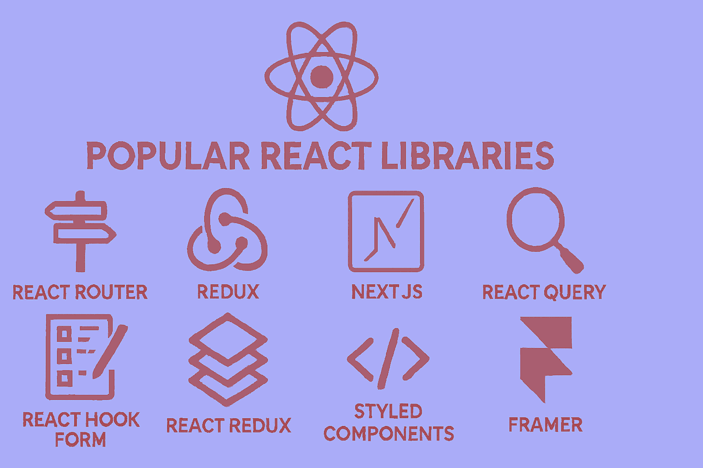

# معرفی بهترین کتابخانه‌هایی که می توانیم کنار React استفاده کنیم



سلام به همه توسعه‌دهندگان عزیز! امروز می‌خوایم باهم راجع به یکی از مهمترین موضوعات در توسعه با React صحبت کنیم. خیلی از شما که وارد دنیای React شدید، احتمالاً این سوال براتون پیش اومده که "خب React رو یاد گرفتم، ولی برای ساختن یه پروژه کامل چه کتابخانه‌های دیگه‌ای هم لازم دارم؟"

راستش رو بخوایم، React خودش یه کتابخانه عالی برای ساخت رابط کاربری هست، ولی برای یه پروژه کامل و حرفه‌ای، نیاز به کتابخانه‌های کمکی دیگه‌ای داریم. امروز می‌خوایم یه راهنمای جامع برای شما تهیه کنیم تا بدونید کدوم کتابخانه‌ها رو کی و چرا استفاده کنید.

## چرا کتابخانه‌های کمکی لازمه؟

React در اصل یه کتابخانه minimalist هست. یعنی فقط روی کار اصلیش متمرکز شده: مدیریت کامپوننت‌ها و state محلی. ولی وقتی می‌خواید یه برنامه واقعی بسازید، با مسائل مختلفی مواجه می‌شید:

- چجوری بین صفحه‌های مختلف حرکت کنم؟
- چجوری داده‌ها رو از سرور بیارم؟
- فرم‌های پیچیده رو چجوری مدیریت کنم؟
- state سراسری رو چجوری کنترل کنم؟

خوشبختانه، جامعه React خیلی فعال و پویا هست و برای هر کدوم از این مسائل، کتابخانه‌های فوق‌العاده‌ای توسعه داده. بیاید باهم نگاهی بهشون بندازیم.

## ۱. مسیریابی (Routing): React Router

وقتی یه برنامه چندصفحه‌ای می‌سازید، اولین چیزی که بهش نیاز دارید، سیستم مسیریابی هست. React Router استاندارد طلایی توی این زمینه محسوب می‌شه.

```jsx
import { BrowserRouter as Router, Routes, Route } from 'react-router-dom';

function App() {
  return (
    <Router>
      <Routes>
        <Route path="/" element={<Home />} />
        <Route path="/about" element={<About />} />
        <Route path="/contact" element={<Contact />} />
      </Routes>
    </Router>
  );
}
```

**چرا React Router؟**
- پشتیبانی کامل از تمام ویژگی‌های مدرن routing
- مستندات عالی و جامعه بزرگ
- قابلیت nested routing برای ساختارهای پیچیده
- پشتیبانی از lazy loading و code splitting

**آماری جالب:** React Router توسط بیش از ۸ میلیون پروژه در GitHub استفاده می‌شه!

## ۲. مدیریت وضعیت (State Management)

### Zustand: انتخاب مدرن و ساده

اگه تازه‌کار هستید یا پروژه‌تون خیلی پیچیده نیست، Zustand یه انتخاب فوق‌العاده هست:

```javascript
import { create } from 'zustand'

const useCounterStore = create((set) => ({
  count: 0,
  increment: () => set((state) => ({ count: state.count + 1 })),
  decrement: () => set((state) => ({ count: state.count - 1 })),
}))

// توی کامپوننت
function Counter() {
  const { count, increment, decrement } = useCounterStore()
  return (
    <div>
      <span>{count}</span>
      <button onClick={increment}>+</button>
      <button onClick={decrement}>-</button>
    </div>
  )
}
```

**مزایای Zustand:**
- سادگی بالا (کد کمتر، درک آسان‌تر)
- عملکرد عالی
- سایز فایل کم (۲ کیلوبایت!)
- نیازی به provider wrapper نیست

### Redux Toolkit: برای پروژه‌های بزرگ

اگه پروژه‌تون خیلی بزرگ و پیچیده هست، Redux Toolkit هنوز هم یه گزینه قدرتمند محسوب می‌شه:

```javascript
import { createSlice } from '@reduxjs/toolkit'

const counterSlice = createSlice({
  name: 'counter',
  initialState: { value: 0 },
  reducers: {
    increment: (state) => {
      state.value += 1
    },
    decrement: (state) => {
      state.value -= 1
    }
  }
})
```

**کی Redux Toolkit رو انتخاب کنیم؟**
- پروژه‌های enterprise با تیم‌های بزرگ
- نیاز به time travel debugging
- منطق پیچیده business logic

## ۳. دریافت و مدیریت داده‌ها

### TanStack Query: انقلاب در data fetching

یکی از بهترین اتفاقات جامعه React در سال‌های اخیر، معرفی TanStack Query (قبلاً React Query) بوده:

```javascript
import { useQuery } from '@tanstack/react-query'

function Posts() {
  const { data: posts, isLoading, error } = useQuery({
    queryKey: ['posts'],
    queryFn: () => fetch('/api/posts').then(res => res.json())
  })

  if (isLoading) return <div>Loading...</div>
  if (error) return <div>Error: {error.message}</div>

  return (
    <ul>
      {posts.map(post => (
        <li key={post.id}>{post.title}</li>
      ))}
    </ul>
  )
}
```

**چرا TanStack Query؟**
- Caching خودکار و هوشمند
- Background refetching
- Optimistic updates
- کاهش چشمگیر کد boilerplate

### Axios: HTTP client قدرتمند

برای ارسال درخواست‌های HTTP، Axios هنوز هم یه انتخاب عالی هست:

```javascript
import axios from 'axios'

// تنظیمات پایه
const api = axios.create({
  baseURL: 'https://api.example.com',
  timeout: 10000,
  headers: {
    'Content-Type': 'application/json'
  }
})

// اضافه کردن interceptor برای error handling
api.interceptors.response.use(
  response => response,
  error => {
    console.error('API Error:', error)
    return Promise.reject(error)
  }
)
```

## ۴. مدیریت فرم‌ها

### React Hook Form: کارایی بالا، کد کم

React Hook Form یکی از بهترین کتابخانه‌ها برای مدیریت فرم‌ها هست:

```javascript
import { useForm } from 'react-hook-form'

function ContactForm() {
  const { register, handleSubmit, formState: { errors } } = useForm()

  const onSubmit = (data) => {
    console.log(data)
  }

  return (
    <form onSubmit={handleSubmit(onSubmit)}>
      <input
        {...register('name', { required: 'نام الزامی است' })}
        placeholder="نام شما"
      />
      {errors.name && <span>{errors.name.message}</span>}

      <input
        {...register('email', {
          required: 'ایمیل الزامی است',
          pattern: {
            value: /^\S+@\S+$/i,
            message: 'فرمت ایمیل نادرست است'
          }
        })}
        placeholder="ایمیل"
      />
      {errors.email && <span>{errors.email.message}</span>}

      <button type="submit">ارسال</button>
    </form>
  )
}
```

### Zod: Validation قدرتمند

Zod رو می‌تونید با React Hook Form ترکیب کنید تا یه سیستم validation فوق‌العاده داشته باشید:

```javascript
import { z } from 'zod'
import { zodResolver } from '@hookform/resolvers/zod'

const schema = z.object({
  name: z.string().min(2, 'نام حداقل ۲ کاراکتر باشد'),
  email: z.string().email('ایمیل معتبر وارد کنید'),
  age: z.number().min(18, 'سن حداقل ۱۸ سال باشد')
})

const { register, handleSubmit } = useForm({
  resolver: zodResolver(schema)
})
```

## ۵. کامپوننت‌های UI

### Headless UI: منطق بدون ظاهر

Headless UI کامپوننت‌هایی رو بهتون می‌ده که منطق دارن ولی ظاهر ندارن. شما خودتون استایلشون رو تعریف می‌کنید:

```javascript
import { Dialog } from '@headlessui/react'
import { useState } from 'react'

function MyModal() {
  const [isOpen, setIsOpen] = useState(false)

  return (
    <>
      <button onClick={() => setIsOpen(true)}>
        باز کردن مودال
      </button>

      <Dialog open={isOpen} onClose={() => setIsOpen(false)}>
        <Dialog.Panel className="bg-white p-6 rounded-lg">
          <Dialog.Title>عنوان مودال</Dialog.Title>
          <Dialog.Description>
            این یک مودال نمونه است
          </Dialog.Description>
          <button onClick={() => setIsOpen(false)}>بستن</button>
        </Dialog.Panel>
      </Dialog>
    </>
  )
}
```

### Shadcn/UI: کامپوننت‌های کپی-پیست

Shadcn/UI یه رویکرد متفاوت داره. به جای نصب یه پکیج، شما کد کامپوننت‌ها رو کپی می‌کنید و توی پروژه‌تون قرار می‌دید. این کار کنترل کاملی روی کد بهتون می‌ده.

## ۶. انیمیشن

### Framer Motion: انیمیشن‌های حرفه‌ای

برای اضافه کردن انیمیشن‌های زیبا به پروژه‌تون:

```javascript
import { motion } from 'framer-motion'

function AnimatedBox() {
  return (
    <motion.div
      initial={{ opacity: 0, scale: 0.5 }}
      animate={{ opacity: 1, scale: 1 }}
      transition={{ duration: 0.5 }}
      whileHover={{ scale: 1.1 }}
      whileTap={{ scale: 0.9 }}
      className="w-32 h-32 bg-blue-500 rounded-lg"
    >
      کلیک کنید!
    </motion.div>
  )
}
```

## کتابخانه‌های کاربردی تکمیلی

### مدیریت کلاس‌های CSS با clsx

```javascript
import clsx from 'clsx'
import { twMerge } from 'tailwind-merge'

// ترکیب clsx و tailwind-merge برای مدیریت بهتر کلاس‌ها
function cn(...inputs) {
  return twMerge(clsx(inputs))
}

// استفاده
function Button({ variant, className, ...props }) {
  return (
    <button
      className={cn(
        "px-4 py-2 rounded-md font-medium",
        {
          "bg-blue-500 text-white": variant === "primary",
          "bg-gray-200 text-gray-800": variant === "secondary",
        },
        className
      )}
      {...props}
    />
  )
}
```

### بین‌المللی‌سازی و سایت چند زبانه با  i18n

```javascript
import i18n from 'i18next'
import { initReactI18next, useTranslation } from 'react-i18next'

i18n.use(initReactI18next).init({
  resources: {
    fa: {
      translation: {
        welcome: "خوش آمدید",
        goodbye: "خداحافظ"
      }
    },
    en: {
      translation: {
        welcome: "Welcome",
        goodbye: "Goodbye"
      }
    }
  },
  lng: "fa",
  fallbackLng: "en"
})

function Welcome() {
  const { t } = useTranslation()
  return <h1>{t('welcome')}</h1>
}
```

### کار با تاریخ و زمان با Date-fns

```javascript
import { format, formatDistanceToNow } from 'date-fns'
import { faIR } from 'date-fns/locale'

// قالب‌بندی تاریخ
const formattedDate = format(new Date(), 'PPP', { locale: faIR })

// محاسبه فاصله زمانی
const timeAgo = formatDistanceToNow(new Date(2023, 0, 1), {
  addSuffix: true,
  locale: faIR
})
```

### react-icons برای استفاده از آیکون‌ها

```javascript
import { FaHome, FaUser, FaCog } from 'react-icons/fa'
import { MdEmail, MdPhone } from 'react-icons/md'

function Navigation() {
  return (
    <nav>
      <a href="/"><FaHome /> خانه</a>
      <a href="/profile"><FaUser /> پروفایل</a>
      <a href="/settings"><FaCog /> تنظیمات</a>
    </nav>
  )
}
```

## پیشنهادات برای شروع پروژه جدید

برای یه پروژه جدید، این ترکیب رو پیشنهاد می‌کنم:

**پکیج اصلی:**
- React + TypeScript
- Vite برای build tool
- Tailwind CSS برای استایل

**کتابخانه‌های ضروری:**
- **مسیریابی:** React Router
- **State Management:** Zustand (برای پروژه‌های کوچک تا متوسط)
- **Data Fetching:** TanStack Query + Axios
- **فرم‌ها:** React Hook Form + Zod
- **UI Components:** Headless UI یا Shadcn/UI
- **آیکون‌ها:** React Icons

**در صورت نیاز:**
- **انیمیشن:** Framer Motion
- **چارت:** Recharts
- **تاریخ:** date-fns
- **Drag & Drop:** Dnd Kit
- **i18n:** i18next

## چند نکته عملی برای انتخاب کتابخانه

۱. **اول نیازتون رو مشخص کنید:** همه کتابخانه‌ها رو یکباره نصب نکنید. فقط اونایی رو که واقعاً بهشون نیاز دارید.

۲. **به اندازه bundle size توجه کنید:** از ابزارهایی مثل Bundle Analyzer استفاده کنید تا ببینید هر کتابخانه چقدر به سایز نهایی پروژه اضافه می‌کنه.

۳. **مستندات رو بخونید:** قبل از انتخاب یه کتابخانه، حتماً مستنداتش رو نگاه کنید و ببینید چقدر فعال نگهداری می‌شه.

۴. **از TypeScript استفاده کنید:** اکثر کتابخانه‌های مدرن از TypeScript پشتیبانی می‌کنن و این کار development experience رو خیلی بهتر می‌کنه.

## سخن آخر

دنیای React پر از کتابخانه‌های فوق‌العاده است که کار توسعه رو خیلی راحت‌تر می‌کنن. مهم اینه که بدونید کدوم کتابخانه برای چه نیازی مناسبه و چجوری باهم ترکیبشون کنید.

یادتون باشه که هیچ‌وقت لازم نیست همه این کتابخانه‌ها رو یکباره یاد بگیرید. شروع کنید با اساسی‌ترین‌ها (مثل React Router و یه state manager) و کم‌کم بقیه رو اضافه کنید.

امیدوارم این پست براتون مفید بوده باشه! اگه سوال یا تجربه‌ای داشتید، حتماً توی کامنت‌ها با ما به اشتراک بذارید.

موفق باشید! 🚀
