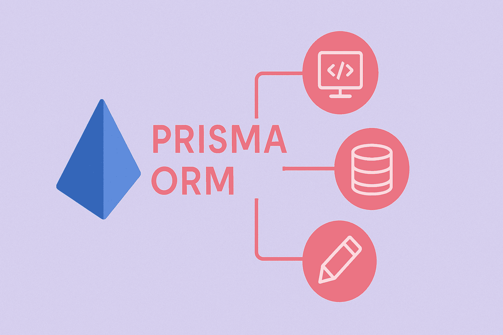

# برسی prisma ; محبوب ترین ORM در اکوسیستم node.js




سلام و خوش اومدید! همین اول کار اینو بگم که قبل از اینکه وارد دنیای ORM ها بشید باید آشنایی اولیه با sql و یک فریمورک برناکه نویسی بک اند (express.js) داشته باشید. ما تو پست های قبلی آموزش express.js رو قرار دادیمم و قراره در اینجا prisma ORM رو که استفاده ازش در express.js خیلی رایج هست رو برسی کنیم. البته که یادگیری prisma باعث میشه به مفاهیم کلی ORM ها مسلط بشید و بتونید اصول آنها رو در هر زبان برنامه نویسی درک کنید.

## اصلا ORM چیه؟

عبارت ORM مخفف Object-Relational Mapping است. به زبان ساده، ORM پلی است میان دو دنیای متفاوت:
۱. دنیای کدنویسی: که در آن ما با "شیء" یا Object (مانند کلاس‌ها در جاوااسکریپت یا پایتون) سر و کار داریم.
۲. دنیای پایگاه‌داده: که در آن داده‌ها در "جداول" (مانند SQL) ذخیره می‌شوند.

بدون ORM، شما مجبورید کدهای طولانی و پیچیده SQL را لابلای کدهای برنامه‌نویسی خود بنویسید. اما با ORM، پایگاه‌داده را دقیقاً شبیه به کدهای معمولی زبان خودتان مدیریت می‌کنید.

**برای درک بهتر، مسیر تعامل با دیتابیس را به سه دوره تقسیم می‌کنیم:**
۱. دوران SQL خالص (دهه ۷۰ تا ۹۰ میلادی)

در این دوران، برنامه‌نویسان باید دستورات متنی SQL را مستقیماً در کد قرار می‌دادند.

- مشکل: احتمال خطای تایپی بالا بود، امنیت پایینی داشت (حملات SQL Injection) و تغییر یک ستون در دیتابیس باعث می‌شد صدها خط کد در برنامه به مشکل بخورند.

۲. ظهور اولین ORMها (اوایل دهه ۲۰۰۰)
با گسترش برنامه‌نویسی "شیء‌گرا" (OOP)، نیاز به ابزاری برای تبدیل خودکار جداول به اشیاء احساس شد.

- Hibernate (۲۰۰۱): برای زبان جاوا معرفی شد و انقلابی در این مسیر بود.
- ActiveRecord (۲۰۰۴): با فریم‌ورک Ruby on Rails معرفی شد و مفهوم سادگی در تعامل با دیتابیس را به اوج رساند.
- Entity Framework (۲۰۰۸): توسط مایکروسافت برای دات‌نت معرفی شد.

۳. دوران مدرن و تایپ‌سیف (۲۰۱۵ تا کنون)
در سال‌های اخیر، ابزارها هوشمندتر شده‌اند. ORMهای مدرن مانند Prisma یا Drizzle به جای فقط کپی کردن اطلاعات، بر روی "امنیت نوع‌ها" (Type Safety) تمرکز دارند تا برنامه‌نویس حتی قبل از اجرای کد، بداند که آیا داده‌ای که از دیتابیس می‌گیرد درست است یا خیر.

**چرا از ORM استفاده می‌کنیم؟**

- سرعت توسعه: به جای نوشتن ۵ خط SQL، یک متد ساده فراخوانی می‌کنید.
- امنیت: ORMها به صورت خودکار از نفوذ هکرها به دیتابیس جلوگیری می‌کنند.
- استقلال از نوع دیتابیس: می‌توانید بدون تغییر در کدهای اصلی، پایگاه‌داده خود را از MySQL به PostgreSQL تغییر دهید.
- مدیریت تغییرات (Migrations): نسخه زدن برای ساختار دیتابیس در Git را امکان پذیر می‌کنند.

**مثال مقایسه‌ای:**
**بدون ORM (استفاده از SQL خام):**
باید دستی کوئری بنویسید، مراقب امنیت باشید و خروجی را خودتان تمیز کنید.

```javascript
// کد خام و سخت
const sql = "SELECT * FROM users WHERE email = ?";
db.execute(sql, ["ali@gmail.com"], (err, rows) => {
	const user = rows[0];
	console.log(user.name);
});
```

**با ORM (مثلاً Prisma):**
انگار دارید با آرایه‌های جاوااسکریپت کار می‌کنید.

```javascript
// کد تمیز و خوانا
const user = await prisma.user.findUnique({
	where: { email: "ali@gmail.com" },
});
console.log(user.name);
```

مفهوم **ORM** یک مفهوم کلی در دنیای برنامه‌نویسی است و تقریباً تمام زبان‌های برنامه‌نویسی که برای Backend استفاده می‌شوند، ORMهای مخصوص خودشان را دارند.

### آشنایی با ORM های زبان های مختلف برنامه نویسی

بیایید ببینیم در زبان‌های برنامه نویسی چه خبر است :

#### ۱. پایتون (Python) 🐍

اگر روزی بخواهید با پایتون کد بزنید (مثلاً با فریم‌ورک Django یا Flask)، ORMهای معروف آن عبارتند از:

- **SQLAlchemy:** قدرتمندترین و معروف‌ترین ORM پایتون (شبیه TypeORM در node.js).
- **Django ORM:** اگر با فریم‌ورک جنگو کار کنید، خودش یک ORM داخلی دارد که بسیار محبوب است.

#### ۲. پی‌اچ‌پی (PHP) 🐘

دنیای PHP هم پر از ORM است:

- **Eloquent:** متعلق به فریم‌ورک Laravel (بسیار محبوب و شبیه Prisma راحت است).
- **Doctrine:** متعلق به فریم‌ورک Symfony (بسیار شبیه Hibernate جاوا).

#### ۳. سی‌شارپ (#C) و دات‌نت 🪟

- **Entity Framework (EF Core):** پادشاه دنیای مایکروسافت. این یکی از پیشرفته‌ترین ORMهای جهان است که Prisma و TypeORM بسیاری از ایده‌هایشان را از آن گرفته‌اند.

#### ۴. جاوا (Java) ☕

- **Hibernate:** پدربزرگ تمام ORMها! بسیار قدرتمند اما پیچیده.

#### ۵. گو (Go) 🐹

- **GORM:** محبوب‌ترین ORM برای زبان Go.

### چرا هر زبان ORM مخصوص خودش را دارد؟

چون هر زبان ساختار متفاوتی دارد:

- در **جاوا** و **سی‌شارپ** همه چیز بر اساس «کلاس» (Class) است.
- در **جاوااسکریپت** ما با «آبجکت» (Object) و JSON سروکار داریم.
- در **Go** ما «استراکچر» (Struct) داریم.

ORM باید به زبان خود آن محیط نوشته شود تا بتواند داده‌های دیتابیس را به ساختار آن زبان (مثلاً آبجکت JS) تبدیل کند.

## برسی prisma ; محبوب ترین ORM در اکوسیستم node.js

Prisma یک **ORM (Object-Relational Mapper)** نسل جدید است. به زبان ساده، به جای نوشتن کدهای SQL پیچیده و خشک، شما با آبجکت‌های جاوااسکریپت (یا تایپ‌اسکریپت) کار می‌کنید و Prisma آن‌ها را به کوئری‌های دیتابیس تبدیل می‌کند.

بیایید یادگیری را در **۶ گام حیاتی** شروع کنیم.

## گام ۱: نصب و راه‌اندازی اولیه (Setup)

در پروژه Express خود، ابتدا باید Prisma را نصب کنید.

۱. **نصب پکیج‌ها:**

```bash
npm install prisma --save-dev
npm install @prisma/client
```

۲. **ایجاد فایل‌های اولیه:**
دستور زیر پوشه‌ی `prisma` و فایل پیکربندی را می‌سازد:

```bash
npx prisma init
```

حالا دو فایل مهم دارید:

- `.env`: برای نگهداری آدرس دیتابیس (Connection String).
- `prisma/schema.prisma`: قلب تپنده Prisma. جایی که جداول (Modelها) را تعریف می‌کنید.

> **نکته:** در فایل `.env`، آدرس دیتابیس خود (PostgreSQL, MySQL, MongoDB, ...) را وارد کنید. برای یادگیری می‌توانید فعلاً از SQLite استفاده کنید که نیاز به نصب سرور دیتابیس ندارد (در فایل `schema.prisma` مقدار `provider` را به `sqlite` تغییر دهید).

> **نکته:** البته که شما می‌توانید بدون استفاده از npx دستورات Prisma را اجرا کنید. ( در صورتی که آن را به صورت global نصب کرده باشید) اما بهتره از npx استفاده کنید چون اگر چندین پروژه با نسخه‌های متفاوت پریزما داشته باشید، نسخه نصب شده روی سیستم ممکن است با نسخه مورد نیاز پروژه سازگار نباشد.

## گام ۲: مدل‌سازی داده‌ها (Modeling)

در backend، همه چیز با تعریف ساختار داده شروع می‌شود. بیایید در فایل `prisma/schema.prisma` یک مدل ساده برای **User** بسازیم.

```prisma
// prisma/schema.prisma

generator client {
  provider = "prisma-client-js"
}

datasource db {
  provider = "sqlite" // یا "postgresql" یا "mysql"
  url      = env("DATABASE_URL")
}

// تعریف مدل کاربر
model User {
  id        Int      @id @default(autoincrement()) // کلید اصلی و افزایش خودکار
  email     String   @unique                       // باید یکتا باشد
  name      String?                                // علامت سوال یعنی می‌تواند نال باشد (Optional)
  createdAt DateTime @default(now())               // زمان ساخت پیش‌فرض
}
```

**مفاهیم کلیدی این بخش:**

- `@id`: نشان‌دهنده Primary Key.
- `@unique`: جلوگیری از داده‌های تکراری.
- `?`: فیلد اختیاری (nullable).

## گام ۳: مایگریشن (Migrations)

حالا که مدل را نوشتیم، باید دیتابیس واقعی را با این مدل هماهنگ کنیم. این کار با **Migration** انجام می‌شود.

دستور زیر را در ترمینال بزنید:

```bash
npx prisma migrate dev --name init
```

**این دستور چه کار می‌کند؟**

1.  یک فایل SQL می‌سازد.
2.  جدول `User` را در دیتابیس ایجاد می‌کند. (اجرای کد sql ساخته شده)
3.  کلاینت Prisma را آپدیت می‌کند تا فیلدهای جدید (`prisma.post.create`, `prisma.post.findMany` …) در کدتان را بشناسد و دردسترس باشند

همچنین کلمه‌ی `dev` یک **sub-command** است و معنی‌اش این است:

> «این مایگریشن در محیط توسعه (development) انجام شود.»

در ادامه انواع subcommand های prisma migrate را برسی میکنیم:

#### انواع subcommand های prisma migrate

۱. `npx prisma migrate dev`
این پرکاربردترین دستور در محیط **توسعه (Development)** است.

- **کاری که انجام می‌دهد:**
  1.  تغییرات فایل `schema.prisma` را بررسی می‌کند.
  2.  یک فایل مایگریشن جدید (SQL) در پوشه `prisma/migrations` می‌سازد.
  3.  آن فایل SQL را روی دیتابیس اجرا می‌کند.
  4.  کلاینت پریزما (`Prisma Client`) را دوباره جنریت می‌کند (مثل `prisma generate`).
- **چه زمانی استفاده کنیم؟**
  - زمانی که در حال کدنویسی هستید و فیلد یا جدولی را تغییر داده‌اید.
- **آپشن مهم:**
  - `--name`: برای نام‌گذاری مایگریشن.
  - مثال: `npx prisma migrate dev --name add_user_model`

۲. `npx prisma migrate deploy`
این دستور مخصوص محیط‌های **CI/CD، Staging و Production** است.

- **کاری که انجام می‌دهد:**
  1.  فایل‌های مایگریشن موجود در پوشه `prisma/migrations` را بررسی می‌کند.
  2.  مایگریشن‌هایی که هنوز روی دیتابیس اعمال نشده‌اند را اجرا می‌کند.
  3.  **نکته مهم:** این دستور فایل مایگریشن جدید **نمی‌سازد** و `schema.prisma` را نگاه نمی‌کند؛ فقط فایل‌های SQL از قبل ساخته شده را اجرا می‌کند.
- **چه زمانی استفاده کنیم؟**
  - زمانی که کد را روی سرور اصلی آپلود کرده‌اید و می‌خواهید دیتابیس سرور را آپدیت کنید.
  - **هشدار:** هرگز در سرور پروداکشن از `migrate dev` استفاده نکنید چون ممکن است دیتابیس را ریست کند.

۳. `npx prisma migrate reset`
یک دستور مخرب و قدرتمند برای شروع دوباره.

- **کاری که انجام می‌دهد:**
  1.  دیتابیس را کاملاً پاک می‌کند (Drop Database).
  2.  یک دیتابیس جدید می‌سازد.
  3.  تمام مایگریشن‌ها را از ابتدا تا انتها دوباره اجرا می‌کند.
  4.  در پایان، اسکریپت `seed` (داده‌های اولیه) را اجرا می‌کند.
- **چه زمانی استفاده کنیم؟**
  - زمانی که در محیط توسعه دیتابیس‌تان به هم ریخته است و می‌خواهید همه چیز را از نو بسازید.
  - **هشدار:** تمام داده‌های دیتابیس پاک خواهند شد.

۴. `npx prisma migrate status`
برای بررسی وضعیت هماهنگی.

- **کاری که انجام می‌دهد:**
  - بررسی می‌کند که آیا دیتابیس با فایل‌های مایگریشن هماهنگ است یا خیر.
  - نشان می‌دهد چند مایگریشن اعمال نشده باقی مانده است.
- **چه زمانی استفاده کنیم؟**
  - زمانی که شک دارید دیتابیس‌تان آپدیت است یا خیر (معمولاً برای دیباگ کردن).

### خلاصه کاربردی:

| دستور        | محیط استفاده      | کارکرد اصلی                     | آیا فایل می‌سازد؟ |
| :----------- | :---------------- | :------------------------------ | :---------------- |
| **`dev`**    | لوکال (Local)     | ساخت مایگریشن + اعمال روی DB    | ✅ بله            |
| **`deploy`** | سرور (Production) | فقط اعمال فایل‌های موجود روی DB | ❌ خیر            |
| **`reset`**  | لوکال (Local)     | پاک کردن کل دیتابیس و ساخت مجدد | ❌ خیر            |
| **`status`** | همه جا            | نمایش وضعیت سینک بودن           | ❌ خیر            |

## گام ۴: عملیات CRUD (حیاتی‌ترین بخش)

حالا بیایید ببینیم چطور می‌توانیم با دیتابیس تعامل کنیم. یک فایل مثل `index.js` بسازید.

ابتدا باید کلاینت را ایمپورت کنید:

```javascript
const { PrismaClient } = require("@prisma/client");
const prisma = new PrismaClient();
```

این‌ها متدهایی هستند که روی `prisma.modelName` صدا می‌زنید.
الگوی کلی این است:
`prisma.[اسم_مدل].[کاری_که_می‌خواهید_بکنید]`

#### ۱. ایجاد داده (Create)

```javascript
async function main() {
	// ساخت یک کاربر
	const user = await prisma.user.create({
		data: {
			email: "ali@example.com",
			name: "Ali",
		},
	});
	console.log("User created:", user);
}
```

#### ۲. خواندن داده (Read)

```javascript
// گرفتن همه کاربران
const allUsers = await prisma.user.findMany();

// گرفتن یک کاربر خاص با ایمیل
const oneUser = await prisma.user.findUnique({
	where: {
		email: "ali@example.com",
	},
});
```

#### ۳. آپدیت داده (Update)

```javascript
const updatedUser = await prisma.user.update({
	where: { email: "ali@example.com" }, // چه کسی؟
	data: { name: "Ali Reza" }, // چه تغییری؟
});
```

#### ۴. حذف داده (Delete)

```javascript
const deletedUser = await prisma.user.delete({
	where: { email: "ali@example.com" },
});
```

## گام ۵: روابط بین جداول (Relations) - بسیار مهم

در دنیای واقعی، داده‌ها به هم وصل هستند. مثلاً هر `User` چندین `Post` دارد (رابطه یک‌به‌چند).

فایل `schema.prisma` را آپدیت کنید:

```prisma
model User {
  id    Int    @id @default(autoincrement())
  email String @unique
  posts Post[] // رابطه: یک کاربر لیست پست‌ها را دارد
}

model Post {
  id        Int     @id @default(autoincrement())
  title     String
  content   String?
  published Boolean @default(false)
  authorId  Int     // کلید خارجی (Foreign Key)
  author    User    @relation(fields: [authorId], references: [id]) // اتصال به User
}
```

بعد از تغییر اسکیما، دوباره دستور مایگریشن را بزنید:
`npx prisma migrate dev --name add_posts`

همونطور که قبلا هم اشاره کردیم این دستور دقیقاً سه کار پشت سر هم انجام می‌دهد:
۱. **تفاوت‌های اسکیما را کشف می‌کند**  
 Prisma تغییراتی که در فایل `schema.prisma` داده‌اید (مثلاً اضافه شدن مدل `Post`) را با وضعیت فعلی دیتابیس مقایسه می‌کند.
۲. **یک فایل SQL مایگریشن می‌سازد**  
 یک فایل SQL در پوشه‌ی `prisma/migrations/...` ایجاد می‌کند که شامل دستورات لازم برای ایجاد جدول `Post`، کلید خارجی (`authorId`) و ایندکس‌های مربوطه است.  
 مقدار `--name add_posts` فقط نام این مایگریشن را مشخص می‌کند تا بعداً بتوانید آن را پیدا کنید.
۳. **دیتابیس را آپدیت و کلاینت را بازنویسی می‌کند**  
 فایل SQL را روی دیتابیس اجرا می‌کند (جدول `Post` را می‌سازد) و سپس `@prisma/client` را regenerate می‌کند تا متدهای جدید (`prisma.post.create`, `prisma.post.findMany` …) در کدتان در دسترس باشند.

**نحوه استفاده از روابط (Relational Queries):**

ساخت کاربر همراه با پست (Nested Write):

```javascript
const userWithPost = await prisma.user.create({
	data: {
		email: "sara@test.com",
		posts: {
			create: {
				title: "سلام دنیا",
				content: "اولین پست من با پریسما",
			},
		},
	},
});
```

گرفتن کاربر **به همراه** پست‌هایش (بسیار مهم: `include`):

```javascript
const users = await prisma.user.findMany({
	include: {
		posts: true, // این دستور معادل JOIN در SQL است
	},
});
// خروجی شامل اطلاعات کاربر و آرایه‌ای از پست‌های او خواهد بود
```

داخل پرانتز توابع بالا، ۴ کلمه کلیدی وجود دارد که مدام تکرار می‌شوند. اگر این ۴ تا را بفهمید، کار تمام است:

1.  **`where`**: همان `if` است. برای فیلتر کردن (پیدا کردن کی؟).
    - مثال: `where: { id: 5 }`
2.  **`data`**: اطلاعاتی که می‌خواهیم بفرستیم (چی بنویسم؟).
    - فقط در `create` و `update` استفاده می‌شود.
3.  **`select`**: انتخاب فیلدهای خاص ( مثلا برای اینکه پسورد کاربر را برنگردانید).
    - مثال: `select: { name: true, email: true }` (فقط نام و ایمیل را بده).
4.  **`include`**: برای جوین کردن جداول (رابطه‌ها).
    - مثال: `include: { posts: true }` (پست‌های کاربر را هم همراهش بیار).

## گام ۶: ترکیب با Express.js

این تمام چیزی است که برای شروع در پروژه Express نیاز دارید. مثال یک Route:

```javascript
const express = require("express");
const { PrismaClient } = require("@prisma/client");

const prisma = new PrismaClient();
const app = express();
app.use(express.json());

// روت برای گرفتن همه کاربران
app.get("/users", async (req, res) => {
	try {
		const users = await prisma.user.findMany();
		res.json(users);
	} catch (error) {
		res.status(500).json({ error: "Something went wrong" });
	}
});

// روت برای ثبت نام
app.post("/signup", async (req, res) => {
	const { email, name } = req.body;
	try {
		const newUser = await prisma.user.create({
			data: { email, name },
		});
		res.json(newUser);
	} catch (error) {
		// مدیریت ارور تکراری بودن ایمیل
		res.status(400).json({ error: "User already exists" });
	}
});

app.listen(3000, () => console.log("Server running on port 3000"));
```

**درواقع:**

1.  **Schema**: تعریف مدل‌ها در `schema.prisma`.
2.  **Migrate**: تبدیل مدل به جدول دیتابیس (`npx prisma migrate dev`).
3.  **Client**: استفاده از توابع `create`, `findMany`, `update`, `delete` در کنترلرهای Express.
4.  **Relations**: استفاده از `include` برای جوین کردن جداول.

## سخن آخر

همه انچه نیاز بود در مورد prisma orm که از بهترین و محبوب ترین ها در اکوسیستم جاوااسکریپت هست رو بدونید کاملا بهش اشاره کردیم. حالا نوبت شماست که نظرتون رو برام بنویسید. 🏀
