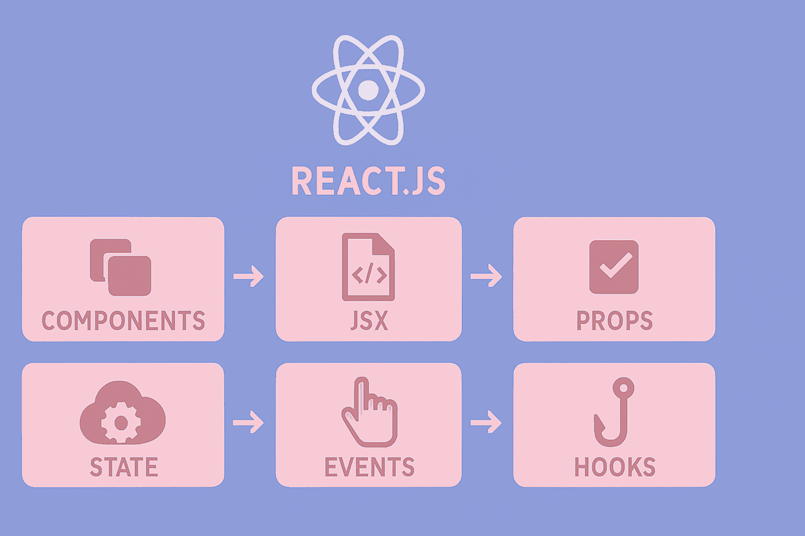

#  مفاهیم اساسی React js : هر چیزی که باید بدانید



نو ین پست جامع قراره همه مفاهیم اساسی React رو با مثال‌های عملی و توضیحات ساده رو با هم شرح بدیم. بریم که شروع کنیم.


##  Component ها در React — بلوک‌های سازنده اپلیکیشن


در React همه‌چیز از **Component** تشکیل می‌شود.
هر قطعه (component) یک بخش از رابط کاربری را می‌سازد و می‌توانی از آن **بارها و بارها** استفاده کنی.

* یک دکمه ➡️ یک Component
* یک کارت محصول ➡️ یک Component
* حتی یک صفحه کامل ➡️ مجموعه‌ای از Component ها

### مثال Component ساده:

```jsx
function Welcome() {
  return <h1>سلام دنیا!</h1>;
}
```

###  Component با ورودی (Props):

```jsx
function Greeting({ name }) {
  return <h1>سلام، {name}!</h1>;
}
```

###  استفاده از Component ها:

```jsx
function App() {
  return (
    <div>
      <Welcome />
      <Greeting name="توسعه‌دهنده React" />
    </div>
  );
}
```


##  JSX — وقتی JavaScript لباس HTML می‌پوشد

JSX یک syntax مخصوص React است که اجازه می‌دهد داخل JavaScript، چیزی شبیه HTML بنویسی.
این یعنی:

* کدت خواناتر می‌شود
* ساختار UI را راحت‌تر می‌بینی
* نوشتن عناصر DOM ساده‌تر می‌شود

### مثال

```jsx
function Button() {
  return <button className="primary">روم کلیک کن</button>;
}
```

###  معادل بدون JSX (سخت‌تر!):

```jsx
function ButtonWithoutJSX() {
  return React.createElement(
    'button',
    { className: 'primary' },
    'روم کلیک کن'
  );
}
```


###  قوانین مهم JSX

 1️⃣ استفاده از camelCase در attributeها

* `className` بجای `class`
* `onClick` بجای `onclick`

 2️⃣ استفاده از `{ }` برای کد جاوااسکریپت

داخل JSX هرجایی می‌خواهی یک مقدار یا محاسبه جاوااسکریپت قرار دهی، باید آن را داخل `{}` بگذاری.


```jsx
function UserCard({ user }) {
  const isOnline = user.lastSeen < Date.now() - 300000; // 5 دقیقه

  return (
    <div className="user-card">
      <h2>{user.name}</h2>
      <p style={{ color: isOnline ? 'green' : 'red' }}>
        {isOnline ? 'آنلاین' : 'آفلاین'}
      </p>
    </div>
  );
}
```


##  Props — انتقال داده بین Component ها

Props مانند **ورودی تابع** هستند.
با استفاده از آن‌ها می‌توانی اطلاعات را از *parent* به *child* بفرستی.

### مثال: یک پست وبلاگ

```jsx
function BlogPost({ title, content, author, publishDate }) {
  return (
    <article>
      <h1>{title}</h1>
      <div className="meta">
        نویسنده: {author} - تاریخ: {publishDate}
      </div>
      <div className="content">{content}</div>
    </article>
  );
}
```

###  استفاده:

```jsx
function App() {
  return (
    <BlogPost
      title="یادگیری React"
      content="React برای ساخت UI عالیه..."
      author="علی احمدی"
      publishDate="۱۴۰۳/۰۳/۱۵"
    />
  );
}
```


###  Prop خاص: Children — محتوای داخلی Component

با prop `children` می‌توانی هر محتوایی را داخل Component بگذاری.

تعریف Card:

```jsx
function Card({ children }) {
  return (
    <div className="card">
      <div className="card-content">
        {children}
      </div>
    </div>
  );
}
```

استفاده:

```jsx
function App() {
  return (
    <Card>
      <h2>عنوان کارت</h2>
      <p>این محتوا به عنوان children منتقل میشه</p>
      <button>دکمه عمل</button>
    </Card>
  );
}
```


###  Prop مهم: Key — برای رندر لیست‌ها

وقتی لیست درست می‌کنی، React نیاز دارد هر آیتم یک `key` داشته باشد تا تغییرات را بهتر دنبال کند.

مثال:

```jsx
function TodoList({ todos }) {
  return (
    <ul>
      {todos.map((todo) => (
        <li key={todo.id}>
          {todo.text}
        </li>
      ))}
    </ul>
  );
}
```

 داده تستی:

```jsx
const todos = [
  { id: 1, text: "یادگیری React" },
  { id: 2, text: "ساخت اپلیکیشن" },
  { id: 3, text: "انتشار در پروداکشن" }
];
```


## Virtual DOM چیست؟

مثل این میمونه که React یک **نقشه‌ی ذهنی از صفحه** نگه می‌داره و هر تغییری که اتفاق می‌افته اول تو اون نقشه بررسی می‌کنه، نه تو DOM واقعی مرورگر.

###  مراحل کار Virtual DOM

1. **تغییر State** → یعنی کاربر دکمه می‌زنه، چیزی تایپ می‌کنه و داده‌ها تغییر می‌کنن.
2. **ساخت Virtual DOM جدید** → React یک نسخه‌ی جدید از صفحه می‌سازه.
3. **Diffing** → نسخه جدید با نسخه قدیمی مقایسه می‌شه.
4. **Reconciliation** → فقط بخش‌هایی که تغییر کردن روی DOM واقعی اعمال می‌شن.

این کار باعث می‌شه React **خیلی سریع و بهینه** باشه. ⚡


### مثال – رندر شدن یک Counter

```jsx
function Counter() {
  const [count, setCount] = useState(0);

  // وقتی count تغییر می‌کنه:
  // 1. Virtual DOM جدید ساخته میشه
  // 2. با نسخه قبلی مقایسه میشه
  // 3. فقط متن شمارنده در DOM واقعی تغییر می‌کنه
  return (
    <div>
      <p>شمارنده: {count}</p>
      <button onClick={() => setCount(count + 1)}>
        افزایش
      </button>
    </div>
  );
}
```


##  Event Handling در React

React برای مدیریت رویدادها (مثل کلیک، تایپ، ارسال فرم) از **Synthetic Events** استفاده می‌کنه.

  Synthetic Event یعنی چی؟

یک **نسخه بهینه و یکسان** از رویدادهای DOM که روی همه مرورگرها رفتار ثابت داره.


### مثال – مدیریت ورودی‌ها و دکمه‌ها

```jsx
function ContactForm() {
  const [formData, setFormData] = useState({
    name: '',
    email: '',
    message: ''
  });

  const handleInputChange = (event) => {
    const { name, value } = event.target;
    setFormData(prev => ({
      ...prev,
      [name]: value
    }));
  };

  const handleSubmit = (event) => {
    event.preventDefault();
    console.log('فرم ارسال شد:', formData);
  };

  const handleButtonClick = () => {
    alert('دکمه کلیک شد!');
  };

  return (
    <form onSubmit={handleSubmit}>
      <input name="name" value={formData.name} onChange={handleInputChange} />
      <input name="email" value={formData.email} onChange={handleInputChange} />
      <textarea name="message" value={formData.message} onChange={handleInputChange} />
      <button type="submit">ارسال پیام</button>
      <button type="button" onClick={handleButtonClick}>کلیک کن</button>
    </form>
  );
}
```


##  State در React

State یعنی **داده‌هایی که در طول زمان تغییر می‌کنند**.
حتی اگر فقط یک مقدار کوچک تغییر کند، React کل کامپوننت را دوباره **re-render** می‌کند (که باعث به‌روز شدن UI می‌شود).


###  Hook مهم: useState

نکته مهم:

وقتی state را تغییر می‌دهیم، **مستقیم مقدار را دستکاری نمی‌کنیم**؛
بلکه از *setter* استفاده می‌کنیم تا React بفهمد باید دوباره رندر کند.


 مثال – مدیریت سبد خرید

```jsx
import { useState } from 'react';

function ShoppingCart() {
  const [items, setItems] = useState([]);
  const [total, setTotal] = useState(0);

  const addItem = (item) => {
    setItems(prev => [...prev, item]);
    setTotal(prev => prev + item.price);
  };

  const removeItem = (itemId) => {
    const item = items.find(i => i.id === itemId);
    setItems(prev => prev.filter(i => i.id !== itemId));
    setTotal(prev => prev - item.price);
  };

  return (
    <div>
      <h2>سبد خرید</h2>
      <p>مجموع: {total} تومان</p>
      <ul>
        {items.map(item => (
          <li key={item.id}>
            {item.name} - {item.price} تومان
            <button onClick={() => removeItem(item.id)}>حذف</button>
          </li>
        ))}
      </ul>
    </div>
  );
}
```


##  Controlled Components

در کامپوننت‌های کنترل‌شده، **مقدار input ها از state می‌آید و با تغییر کاربر، state هم تغییر می‌کند**.

این یعنی React کاملاً کنترل می‌کند کاربر چه می‌نویسد.


###  مثال – فرم ورود

```jsx
function LoginForm() {
  const [credentials, setCredentials] = useState({
    username: '',
    password: ''
  });

  const handleChange = (event) => {
    const { name, value } = event.target;
    setCredentials(prev => ({
      ...prev,
      [name]: value
    }));
  };

  return (
    <form>
      <input
        type="text"
        name="username"
        value={credentials.username}
        onChange={handleChange}
        placeholder="نام کاربری"
      />

      <input
        type="password"
        name="password"
        value={credentials.password}
        onChange={handleChange}
        placeholder="رمز عبور"
      />
    </form>
  );
}
```


##  React Hooks

React Hooks ابزارهایی هستند که به شما اجازه می‌دهند **درون Function Componentها از قابلیت‌های React استفاده کنید**.
یعنی دیگر لازم نیست از Class Component استفاده کنیم!

Hooks پنج دسته اصلی دارند:


### 1️⃣ State Hooks — مدیریت حالت کامپوننت

####  `useState`

برای ذخیره کردن داده‌هایی که باید تغییر کنند، مثل مقدار input یا شمارنده.


```js
const [count, setCount] = useState(0);
setCount(count + 1);
```


#### `useReducer`

وقتی state شما پیچیده‌تر می‌شود (چندین مقدار مختلف یا منطق‌های زیاد)، `useReducer` کمک می‌کند.


```js
function reducer(state, action) {
  if (action.type === "add") return state + 1;
  return state;
}

const [state, dispatch] = useReducer(reducer, 0);
dispatch({ type: "add" });
```


### 2️⃣ Context Hooks — اشتراک داده بین کامپوننت‌ها 🌍

#### `useContext`

برای گرفتن مقدار از یک Context بدون اینکه مجبور شوید props را طبقه‌طبقه پاس دهید.


```js
const user = useContext(UserContext);
```


### Ref Hooks — نگه‌داری مقدار بدون رندر دوباره

#### `useRef`

برای:

* گرفتن دسترسی مستقیم به DOM (مثل input)
* نگه‌داشتن یک مقدار که با تغییر آن کامپوننت دوباره رندر نمی‌شود


```js
const inputRef = useRef(null);
inputRef.current.focus();
```


### 4️⃣ Effect Hooks — انجام کارهایی خارج از UI

#### `useEffect`

برای انجام کارهای جانبی (Side Effects) مثل:

* تغییر document.title
* درخواست API
* کار با localStorage


```js
useEffect(() => {
  document.title = "سلام!";
}, []);
```


### 5️⃣ Performance Hooks — بهبود عملکرد

#### `useMemo`

برای ذخیره نتیجه محاسبات سنگین تا هر بار دوباره انجام نشوند.


```js
const sorted = useMemo(() => heavySort(data), [data]);
```


#### `useCallback`

برای ثابت نگه‌داشتن یک تابع و جلوگیری از ساخت نسخه جدید در هر رندر.


```js
const handleClick = useCallback(() => console.log("clicked"), []);
```


###  مثال کامل — استفاده هم‌زمان از همه Hookهای مهم

کد زیر یک کامپوننت بهینه ساخته که:

* state دارد
* روی input فوکوس می‌کند
* محاسبات سنگین را با useMemo بهینه می‌کند
* توابع تکراری را با useCallback ثابت نگه می‌دارد
* از useEffect برای تغییر عنوان صفحه استفاده می‌کند

```jsx
import { useState, useEffect, useRef, useMemo, useCallback } from 'react';

function OptimizedComponent({ items }) {
  const [filter, setFilter] = useState('');
  const [count, setCount] = useState(0);
  const inputRef = useRef(null);

  // useEffect برای side effects
  useEffect(() => {
    document.title = `شمارنده: ${count}`;
  }, [count]);

  // useMemo برای محاسبات گران
  const filteredItems = useMemo(() => {
    return items.filter(item =>
      item.name.toLowerCase().includes(filter.toLowerCase())
    );
  }, [items, filter]);

  // useCallback برای ارجاعات پایدار تابع
  const handleItemClick = useCallback((item) => {
    console.log('آیتم کلیک شد:', item);
  }, []);

  const focusInput = () => {
    inputRef.current?.focus();
  };

  return (
    <div>
      <input
        ref={inputRef}
        type="text"
        value={filter}
        onChange={(e) => setFilter(e.target.value)}
        placeholder="فیلتر آیتم‌ها..."
      />
      <button onClick={focusInput}>فوکوس روی Input</button>

      <p>شمارنده: {count}</p>
      <button onClick={() => setCount(c => c + 1)}>افزایش</button>

      <ul>
        {filteredItems.map(item => (
          <li key={item.id} onClick={() => handleItemClick(item)}>
            {item.name}
          </li>
        ))}
      </ul>
    </div>
  );
}
```


## Effect و Side Effect در React

  Effect یعنی چی؟

Effect ها (با استفاده از **useEffect**) به ما اجازه می‌دهند کارهایی انجام بدهیم که خارج از کار معمول React هستند.
مثلاً:

* گرفتن اطلاعات از API
* دستکاری مستقیم DOM
* ثبت‌نام یا لغو subscription ها

React به‌طور پیش‌فرض فقط UI را مدیریت می‌کند.
اما وقتی بخواهیم با دنیای بیرون ارتباط بگیریم، از **Effect** استفاده می‌کنیم.

###  مثال: گرفتن اطلاعات کاربر از API

```jsx
import { useState, useEffect } from 'react';

function UserProfile({ userId }) {
  const [user, setUser] = useState(null);   // ذخیره اطلاعات کاربر
  const [loading, setLoading] = useState(true); // وضعیت بارگذاری
  const [error, setError] = useState(null);     // خطاها

  useEffect(() => {
    async function fetchUser() {
      try {
        setLoading(true);
        const response = await fetch(`/api/users/${userId}`);
        if (!response.ok) throw new Error('دریافت کاربر ناموفق');

        const userData = await response.json();
        setUser(userData);
      } catch (err) {
        setError(err.message);
      } finally {
        setLoading(false);
      }
    }

    fetchUser();
  }, [userId]);
  // ❗ این Effect فقط وقتی userId تغییر کند اجرا می‌شود
```


* `useEffect` هر بار که مقدارهای داخلی لیست وابستگی (Dependency Array) تغییر کنند اجرا می‌شود.
* اگر لیست خالی باشد `[]` Effect فقط یک بار اجرا می‌شود.
* مناسب برای درخواست API، تایمرها، تعامل با سیستم خارجی.


###  Cleanup Effect (پاک‌سازی)

کدی که در return داخل useEffect می‌نویسیم، هنگام **Unount** یا اجرای مجدد Effect اجرا می‌شود.

 مثال:

```jsx
  useEffect(() => {
    const timer = setInterval(() => {
      console.log('چک کردن برای آپدیت...');
    }, 30000);

    return () => {
      clearInterval(timer); // حذف تایمر در هنگام خروج
    };
  }, []);
```


## Refs — دسترسی مستقیم به DOM

  Ref چیه؟

Ref ها به ما اجازه می‌دن:

* به یک عنصر DOM مستقیماً دسترسی داشته باشیم
* روی یک input فوکوس کنیم
* اندازه‌گیری انجام بدیم
* با کتابخانه‌های third-party کار کنیم

در React معمولاً از DOM مستقیم استفاده نمی‌کنیم،
اما Ref در مواقع خاص ضروریه.


###  مثال: کنترل پخش ویدیو با useRef

```jsx
import { useRef, useEffect, useState } from 'react';

function VideoPlayer({ src }) {
  const videoRef = useRef(null);
  const [isPlaying, setIsPlaying] = useState(false);

  useEffect(() => {
    videoRef.current?.focus(); // فوکوس بعد از mount
  }, []);

  const togglePlayPause = () => {
    const video = videoRef.current;
    if (!video) return;

    if (isPlaying) video.pause();
    else video.play();

    setIsPlaying(!isPlaying);
  };

  const handleTimeUpdate = () => {
    const video = videoRef.current;
    if (video) {
      console.log(`زمان فعلی: ${video.currentTime}`);
    }
  };

  return (
    <div>
      <video
        ref={videoRef}
        src={src}
        onTimeUpdate={handleTimeUpdate}
        width="100%"
      />
      <button onClick={togglePlayPause}>
        {isPlaying ? 'توقف' : 'پخش'}
      </button>
    </div>
  );
}
```


* `useRef(null)` یک "جعبه" می‌سازد که مقدارش را React تغییر نمی‌دهد.
* تغییر مقدار `ref.current` باعث رندر دوباره نمی‌شود.
* اگر نیاز به اطلاعات پایدار بدون رندر دوباره دارید → `useRef`


## Context — انتقال داده بدون Prop Drilling

  Prop Drilling چیه؟

وقتی یک داده را مجبوریم از چندین سطح کامپوننت عبور بدهیم، حتی اگر بعضی کامپوننت‌ها نیازی به آن نداشته باشند.

 Context این مشکل را حل می‌کند.

###  مراحل ساخت Context

#### 1️⃣ ساخت Context

```jsx
const ThemeContext = createContext();
const UserContext = createContext();
```

#### 2️⃣ ساخت Provider

Provider داده را در اختیار همه کامپوننت‌های زیرمجموعه قرار می‌دهد.

```jsx
function ThemeProvider({ children }) {
  const [theme, setTheme] = useState('light');

  const toggleTheme = () => {
    setTheme(prev => prev === 'light' ? 'dark' : 'light');
  };

  return (
    <ThemeContext.Provider value={{ theme, toggleTheme }}>
      {children}
    </ThemeContext.Provider>
  );
}
```

#### 3️⃣ استفاده از Context داخل کامپوننت (useContext)

```jsx
function Header() {
  const { theme, toggleTheme } = useContext(ThemeContext);
  const { user, logout } = useContext(UserContext);

  return (
    <header className={`header ${theme}`}>
      <h1>اپلیکیشن من</h1>
      <button onClick={toggleTheme}>
        تغییر به حالت {theme === 'light' ? 'تاریک' : 'روشن'}
      </button>

      {user ? (
        <div>
          سلام، {user.name}!
          <button onClick={logout}>خروج</button>
        </div>
      ) : (
        <button>ورود</button>
      )}
    </header>
  );
}
```


##  Portals — رندر کردن خارج از درخت DOM اصلی


به طور معمول، هر کامپوننت React داخل یک ساختار مشخص DOM رندر می‌شود (همان درخت اصلی اپ).
اما گاهی وقت‌ها نیاز داریم محتوایی را **خارج از این درخت** رندر کنیم—مثلاً:

* مودال‌ها (Modal)
* منو‌های بازشونده (Dropdown)
* تولتیپ‌ها (Tooltip)
* اعلان‌ها (Toast)

 Portal‌ها کمک می‌کنن یک کامپوننت React را **در هر جای دلخواه DOM** رندر کنیم، بدون اینکه ارتباطش با state و props قطع بشه.


* چون بعضی المنت‌ها (مثل Modal) باید بالاتر از بقیهٔ عناصر قرار بگیرند.
* دسترسی به CSS بهتر میشه (مثل z-index).
* ساختار صفحه پیچیده نمی‌شود.


###  مثال

```jsx
import { createPortal } from 'react-dom';
import { useState } from 'react';

function Modal({ isOpen, onClose, children }) {
  if (!isOpen) return null;

  return createPortal(
    <div className="modal-overlay" onClick={onClose}>
      <div className="modal-content" onClick={(e) => e.stopPropagation()}>
        <button className="modal-close" onClick={onClose}>
          ×
        </button>
        {children}
      </div>
    </div>,
    document.body
  );
}

function App() {
  const [isModalOpen, setIsModalOpen] = useState(false);

  return (
    <div className="app">
      <h1>اپلیکیشن من</h1>
      <button onClick={() => setIsModalOpen(true)}>باز کردن Modal</button>

      <Modal
        isOpen={isModalOpen}
        onClose={() => setIsModalOpen(false)}
      >
        <h2>محتوای Modal</h2>
        <p>این modal خارج از درخت DOM اپ رندر شده!</p>
      </Modal>
    </div>
  );
}
```


##  Suspense — مدیریت Loading به شکل ساده


وقتی یک کامپوننت به شکل **lazy** لود می‌شود یا در آینده نیاز به **data fetching** دارید، لازم است حالت "در حال بارگذاری…" نشان دهید.

به جای اینکه خودتان همیشه مدیریت کنید، React یک راه ساده داده:

> «اگه کامپوننت من هنوز آماده نیست، یه چیز دیگه نشون بده.»


 چه کارهایی می‌کند؟

* مدیریت loading برای lazy-loaded components
* مدیریت loading برای داده‌ها (در React 18+)
* مرتب‌تر کردن کد


###  مثال

```jsx
import { Suspense, lazy } from 'react';

const LazyComponent = lazy(() => import('./LazyComponent'));

function LoadingSpinner() {
  return (
    <div className="loading-spinner">
      <div className="spinner"></div>
      <p>در حال بارگذاری...</p>
    </div>
  );
}

function App() {
  return (
    <div>
      <h1>اپلیکیشن من</h1>

      <Suspense fallback={<LoadingSpinner />}>
        <LazyComponent />
      </Suspense>

      <Suspense fallback={<div>بارگذاری اطلاعات کاربر...</div>}>
        <UserProfile userId="123" />
      </Suspense>
    </div>
  );
}
```


## Error Boundaries — جلوگیری از Crash کل اپلیکیشن


اگر یک کامپوننت خطا بده، React به طور پیش‌فرض کل UI را از کار می‌اندازد.
اما Error Boundaryها میان و فقط **همان بخش مشکل‌دار** را قطع می‌کنند و یک پیام خطا نمایش می‌دهند.

 درست مثل Try/Catch اما مخصوص UI.


چه خطاهایی را می‌گیرند؟

* خطاهای **runtime** در رندر
* خطاهای lifecycle متدها
* خطاهایی که در زیرکامپوننت‌ها رخ دهد

❗ نکته: Error Boundary خطاهای event handler ها را نمی‌گیرد.


### مثال

```jsx
import { Component } from 'react';

class ErrorBoundary extends Component {
  constructor(props) {
    super(props);
    this.state = { hasError: false, error: null };
  }

  static getDerivedStateFromError(error) {
    return { hasError: true, error };
  }

  componentDidCatch(error, errorInfo) {
    console.error('خطا توسط boundary گرفته شد:', error, errorInfo);
  }

  render() {
    if (this.state.hasError) {
      return (
        <div className="error-boundary">
          <h2>مشکلی پیش اومده!</h2>
          <p>لطفاً صفحه را reload کنید.</p>
          <button onClick={() => this.setState({ hasError: false, error: null })}>
            دوباره امتحان کن
          </button>
        </div>
      );
    }

    return this.props.children;
  }
}

function ProblematicComponent({ user }) {
  if (!user) {
    throw new Error('اطلاعات کاربر ضروریه');
  }

  return <div>سلام، {user.name}!</div>;
}

function App() {
  return (
    <ErrorBoundary>
      <ProblematicComponent user={null} />
    </ErrorBoundary>
  );
}
```


## سحن پایانی

با یادگیری کل این مطالب و تمرین مناسب می تونید مطمین باشید به سطح بسیار خوبی در توسعه و ساخت اپلیکیشن‌های ری اکت رسیده اید.
خوشحال میشم نظراتتون رو در مورد این پست بدونم.


