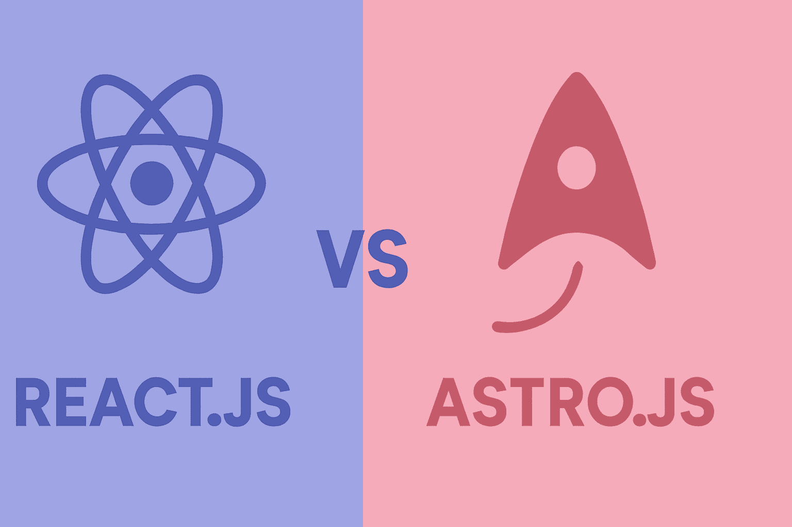

# یادگیری Astro برای React Developer ها



در دنیای توسعه وب امروز، فریم‌ورک‌های زیادی وجود دارن که هر کدوم برای هدف خاصی ساخته شدن. از **React** و **Vue** گرفته تا **Next.js** و **SvelteKit**. اما در این میان، یک فریم‌ورک جدید و قدرتمند به نام **Astro** خیلی سریع توجه برنامه‌نویس‌ها رو به خودش جلب کرده.

چرا؟ 🤔
چون Astro با یک فلسفه متفاوت وارد میدان شده:

> **"ساخت وب‌سایت‌های سریع با کمترین جاوااسکریپت ممکن."**


ما توی آموزش قدم به قدم، از پایه تا پیشرفته، این مباحث رو پوشش میدیم :

1. **شروع کار با Astro**
   - نصب و راه‌اندازی پروژه.
   - ساخت اولین صفحه (`index.astro`).
   - ساخت کامپوننت ساده.
   - مقایسه با React و JSX.

2. **ویژگی‌های پیشرفته‌تر**
   - استفاده از **Layouts** برای ساخت قالب‌های تکرارپذیر.
   - **Routing** استاتیک و داینامیک با `[slug].astro`.
   - مفهوم **جزیره‌ها (Islands Architecture)** و Hydration انتخابی.
   - **Data Fetching** در سمت سرور.
   - ساخت **API Endpoints** درون پروژه.
   - فعال‌سازی **SSR** برای صفحات داینامیک.

3. **کار با محتوا**
   - استفاده از **Markdown** برای نوشتن پست وبلاگ.
   - استفاده از **Slot** (مثل `children` در React).
   - Import مستقیم JSON برای داده‌ها.

4. **پروژه‌های عملی کوچک**
   - **وبلاگ ساده** با Markdown + Layout.
   - **ToDo App** با React جزیره‌ای داخل Astro.
   - **پرتفولیو (Portfolio)** با Routing و Layout.


## Astro چیست؟

Astro یک **Static Site Builder** و در عین حال یک **SSR Framework** است. یعنی:

- می‌تونه صفحات رو کاملاً **استاتیک** بسازه (مناسب برای بلاگ‌ها، داکیومنتیشن، پرتفولیو).
- می‌تونه به صورت **Server-Side Rendering (SSR)** کار کنه (مناسب برای اپلیکیشن‌های داینامیک).
- می‌تونه از **جزیره‌ها (Islands Architecture)** استفاده کنه و فقط بخشی از صفحه رو با React/Vue/Svelte/Vue Hydrate کنه.

به زبان ساده: شما با Astro می‌تونید سریع‌ترین وب‌سایت‌ها رو بسازید، بدون اینکه کل صفحه پر از جاوااسکریپت بشه.


### چرا Astro بهتره؟

- سرعت فوق‌العاده بالا (چون بیشتر خروجی HTML استاتیکه).
- SEO عالی (چون محتوای واقعی از سمت سرور رندر میشه).
- امکان ترکیب چندین فریم‌ورک (React, Vue, Svelte, Solid و حتی Vanilla JS).
- پشتیبانی داخلی از **Markdown و MDX** برای وبلاگ‌نویسی.
- ساختار ساده با **File-based Routing**.


### تفاوت اصلی Astro و React

- در **React** کل صفحه جاوااسکریپت میشه (حتی بخش‌هایی که داینامیک نیستن).
- در **Astro** فقط همون بخش‌هایی که نیاز دارن (مثل یک دکمه یا فرم) به React/Vue تبدیل میشن، و بقیه صفحه HTML خالصه.

این یعنی وب‌سایت سریع‌تر، سبک‌تر و بهینه‌تر برای موتورهای جستجو.

اگر تا الان برای پروژه‌های شخصی یا کاری از **React یا Next.js** استفاده می‌کردید، وقتشه Astro رو هم امتحان کنید.
این فریم‌ورک مخصوصاً برای موارد زیر عالیه:

- بلاگ‌ها و سایت‌های محتوایی
- داکیومنتیشن پروژه‌ها
- پرتفولیو و وب‌سایت‌های شخصی
- اپلیکیشن‌هایی که نیاز به ترکیب محتوای استاتیک و کامپوننت‌های داینامیک دارن

با Astro می‌تونید قدرت **Static HTML + Dynamic Islands** رو در یک پروژه تجربه کنید.

## شروع پروژه Astro

### نصب پروژه جدید:

```bash
# ایجاد پروژه جدید
npm create astro@latest my-astro-app
cd my-astro-app

# نصب پکیج‌ها
npm install

# اجرای سرور
npm run dev
```

### ساختار فایل‌ها:

```
src/
 ┣ components/
 ┣ layouts/
 ┣ pages/
 ┗ styles/
```

- هر چیزی در پوشه **pages/** تبدیل به یک مسیر (route) میشه.


## اولین صفحه در Astro

فایل: `src/pages/index.astro`

#### ✅ Astro:

```astro
const name = "Ali";
<html>
  <head>
    <title>My Astro App</title>
  </head>
  <body>
    <h1>Hello {name} 👋</h1>
    <p>Welcome to Astro!</p>
  </body>
</html>
```

#### 🔄 معادل در React:

```jsx
import React from "react";

export default function App() {
  const name = "Ali";

  return (
    <html>
      <head>
        <title>My React App</title>
      </head>
      <body>
        <h1>Hello {name} 👋</h1>
        <p>Welcome to React!</p>
      </body>
    </html>
  );
}
```

 تفاوت:

- در Astro داخل بلوک `---` می‌نویسی (مثل frontmatter در Markdown).
- در React همه‌چیز داخل JSX و با `return` میاد.


## ساخت Component ساده

#### ✅ Astro Component (`src/components/Greeting.astro`)

```astro
const { name } = Astro.props;
<h2>Hello {name} 🌟</h2>
```

استفاده در صفحه:

```astro
import Greeting from "../components/Greeting.astro";
<html>
  <body>
    <Greeting name="Sara" />
    <Greeting name="Ali" />
  </body>
</html>
```

#### 🔄 معادل در React:

```jsx
function Greeting({ name }) {
  return <h2>Hello {name} 🌟</h2>;
}

export default function App() {
  return (
    <div>
      <Greeting name="Sara" />
      <Greeting name="Ali" />
    </div>
  );
}
```


## اضافه کردن React در Astro

Astro می‌تونه مستقیماً کامپوننت React رو رندر کنه! 

### نصب React در Astro:

```bash
npm install @astrojs/react react react-dom
```

### فعال‌سازی در `astro.config.mjs`

```js
import { defineConfig } from "astro/config";
import react from "@astrojs/react";

export default defineConfig({
  integrations: [react()],
});
```

#### استفاده:

```astro
import MyButton from "../components/MyButton.jsx";
<html>
  <body>
    <h1>Mixing Astro + React</h1>
    <MyButton />
  </body>
</html>
```

 اینجاست که قدرت Astro مشخص میشه: بیشتر سایت رو HTML خالص می‌سازه (بدون JS اضافی)، ولی هرجا نیاز داری React میاد وسط.


## Layouts در Astro

Layout مثل یک قالب کلیه که برای چندین صفحه استفاده می‌شه (header, footer, navigation).

#### ✅ Layout در Astro (`src/layouts/BaseLayout.astro`)

```astro
const { title } = Astro.props;
<html lang="en">
  <head>
    <title>{title}</title>
  </head>
  <body>
    <header>🌐 My Website</header>
    <main>
      <slot /> <!-- محتوا اینجا inject میشه -->
    </main>
    <footer>© 2025 All Rights Reserved</footer>
  </body>
</html>
```

#### استفاده از Layout (`src/pages/about.astro`)

```astro
import BaseLayout from "../layouts/BaseLayout.astro";
<BaseLayout title="About Page">
  <h1>About Us 📖</h1>
  <p>This is an Astro site with layouts!</p>
</BaseLayout>
```


#### 🔄 معادل React Layout

```jsx
function BaseLayout({ title, children }) {
  return (
    <html>
      <head>
        <title>{title}</title>
      </head>
      <body>
        <header>🌐 My Website</header>
        <main>{children}</main>
        <footer>© 2025 All Rights Reserved</footer>
      </body>
    </html>
  );
}

export default function About() {
  return (
    <BaseLayout title="About Page">
      <h1>About Us 📖</h1>
      <p>This is a React site with layouts!</p>
    </BaseLayout>
  );
}
```


## Routing در Astro

Astro **File-based routing** داره (یعنی اسم فایل = مسیر).

```
src/pages/
 ┣ index.astro   →  /
 ┣ about.astro   →  /about
 ┗ blog/
    ┗ [slug].astro →  /blog/:slug
```

### ✅ Dynamic Route (`src/pages/blog/[slug].astro`)

```astro
const { slug } = Astro.params;
<html>
  <body>
    <h1>Blog Post: {slug}</h1>
  </body>
</html>
```

👉 رفتن به `/blog/hello-world` → نمایش: **Blog Post: hello-world**


#### 🔄 معادل React (با React Router)

```jsx
import { BrowserRouter, Routes, Route, useParams } from "react-router-dom";

function BlogPost() {
  const { slug } = useParams();
  return <h1>Blog Post: {slug}</h1>;
}

export default function App() {
  return (
    <BrowserRouter>
      <Routes>
        <Route path="/blog/:slug" element={<BlogPost />} />
      </Routes>
    </BrowserRouter>
  );
}
```


## جزیره‌ها (Islands Architecture)

ایده مهم Astro اینه که کل صفحه HTML استاتیک باشه، فقط بخش‌هایی که نیاز دارن React/Vue/Svelte باشن **Hydrate** میشن.

### ✅ مثال: دکمه React داخل Astro

`src/components/Counter.jsx`

```jsx
import { useState } from "react";

export default function Counter() {
  const [count, setCount] = useState(0);
  return <button onClick={() => setCount(count + 1)}>Count: {count}</button>;
}
```

`src/pages/index.astro`

```astro
import Counter from "../components/Counter.jsx";
<html>
  <body>
    <h1>Astro Island Example 🏝️</h1>
    <Counter client:load /> <!-- فقط اینجا JS اجرا میشه -->
  </body>
</html>
```

🔑 نکته مهم:

- `client:load` → بلافاصله جاوااسکریپت لود میشه
- `client:idle` → وقتی مرورگر بیکار شد
- `client:visible` → وقتی کاربر اسکرول کرد و دید


#### 🔄 معادل در React (کل صفحه JS میشه)

```jsx
import { useState } from "react";

export default function App() {
  const [count, setCount] = useState(0);

  return (
    <div>
      <h1>React Example 🏝️</h1>
      <button onClick={() => setCount(count + 1)}>Count: {count}</button>
    </div>
  );
}
```

📌 تفاوت: در Astro فقط همون دکمه React میشه، بقیه صفحه HTML خالصه. در React کل صفحه Hydrate میشه.


## Data Fetching در Astro

Astro می‌تونه مستقیماً داده‌ها رو در **Server-side build** بگیره.

### ✅ مثال گرفتن داده از API (`src/pages/users.astro`)

```astro
const res = await fetch("https://jsonplaceholder.typicode.com/users");
const users = await res.json();
<html>
  <body>
    <h1>Users 👥</h1>
    <ul>
      {users.map(user => <li>{user.name}</li>)}
    </ul>
  </body>
</html>
```


#### 🔄 معادل در React (Client-side fetching)

```jsx
import { useEffect, useState } from "react";

export default function Users() {
  const [users, setUsers] = useState([]);

  useEffect(() => {
    fetch("https://jsonplaceholder.typicode.com/users")
      .then((res) => res.json())
      .then(setUsers);
  }, []);

  return (
    <div>
      <h1>Users 👥</h1>
      <ul>
        {users.map((user) => (
          <li key={user.id}>{user.name}</li>
        ))}
      </ul>
    </div>
  );
}
```

📌 تفاوت:

- در Astro داده‌ها موقع build یا SSR لود میشن → سریع‌تر برای SEO.
- در React باید در مرورگر fetch بشه → SEO ضعیف‌تر.


## API Endpoints در Astro

Astro می‌تونه مثل Next.js خودش API بسازه.

### ✅ `src/pages/api/hello.js`

```js
export async function GET() {
  return new Response(JSON.stringify({ message: "Hello from Astro API 🚀" }), {
    status: 200,
  });
}
```

👉 مسیر `/api/hello` → خروجی:

```json
{ "message": "Hello from Astro API 🚀" }
```


#### 🔄 معادل در React (Express یا Next.js)

```js
// Express.js
import express from "express";
const app = express();

app.get("/api/hello", (req, res) => {
  res.json({ message: "Hello from Express API 🚀" });
});

app.listen(3000);
```


## SSR (Server-Side Rendering) در Astro

به طور پیش‌فرض Astro **Static Site** می‌سازه، ولی می‌تونی **SSR** رو فعال کنی.

### فعال‌سازی در `astro.config.mjs`

```js
import { defineConfig } from "astro/config";

export default defineConfig({
  output: "server",
});
```

### ✅ صفحه SSR (`src/pages/time.astro`)

```astro
const now = new Date().toLocaleTimeString();
<html>
  <body>
    <h1>Server Time ⏰: {now}</h1>
  </body>
</html>
```

هر بار که رفرش کنی، زمان جدید می‌بینی.


#### 🔄 معادل در React (Next.js SSR)

```jsx
export async function getServerSideProps() {
  return { props: { time: new Date().toLocaleTimeString() } };
}

export default function Time({ time }) {
  return <h1>Server Time ⏰: {time}</h1>;
}
```


## مثال ۱: استفاده از Markdown در Astro

یکی از ویژگی‌های خیلی قوی Astro اینه که به راحتی می‌تونی محتوا رو از فایل‌های Markdown بیاری.

### ✅ `src/pages/blog/first-post.md`

```md
title: "اولین پست وبلاگ"
date: "2025-09-16"

## Astro + Markdown
```

### ✅ `src/pages/blog/index.astro`

```astro
import Post from "./first-post.md";
<html>
  <body>
    <h1>📝 Blog</h1>
    <article>
      <Post />
    </article>
  </body>
</html>
```

🔄 در React برای همین کار باید کتابخونه‌هایی مثل `react-markdown` یا `next-mdx-remote` نصب کنی.

```jsx
import ReactMarkdown from "react-markdown";

const md = `
# سلام دنیا 🌍
این اولین پست من با **React + Markdown** هست.
`;

export default function Blog() {
  return <ReactMarkdown>{md}</ReactMarkdown>;
}
```


## مثال ۲: شرطی‌سازی در Astro

#### ✅ Astro (`src/pages/conditional.astro`)

```astro
const loggedIn = true;
const user = "Ali";
<html>
  <body>
    {loggedIn ? <h1>Welcome {user} 🎉</h1> : <a href="/login">Login</a>}
  </body>
</html>
```

#### 🔄 React

```jsx
export default function Conditional() {
  const loggedIn = true;
  const user = "Ali";

  return (
    <div>
      {loggedIn ? <h1>Welcome {user} 🎉</h1> : <a href="/login">Login</a>}
    </div>
  );
}
```


## مثال ۳: حلقه (Loop) در Astro

#### ✅ Astro (`src/pages/products.astro`)

```astro
const products = [
  { id: 1, name: "Laptop 💻", price: 1200 },
  { id: 2, name: "Phone 📱", price: 800 },
  { id: 3, name: "Headphones 🎧", price: 150 },
];
<html>
  <body>
    <h1>Products</h1>
    <ul>
      {products.map(p => <li>{p.name} - ${p.price}</li>)}
    </ul>
  </body>
</html>
```

#### 🔄 React

```jsx
export default function Products() {
  const products = [
    { id: 1, name: "Laptop 💻", price: 1200 },
    { id: 2, name: "Phone 📱", price: 800 },
    { id: 3, name: "Headphones 🎧", price: 150 },
  ];

  return (
    <ul>
      {products.map((p) => (
        <li key={p.id}>
          {p.name} - ${p.price}
        </li>
      ))}
    </ul>
  );
}
```


## مثال ۴: ترکیب CSS و Astro

Astro بهت اجازه میده هم **Scoped CSS** داشته باشی هم فایل سراسری.

### ✅ `src/components/Card.astro`

```astro
const { title, text } = Astro.props;
<div class="card">
  <h2>{title}</h2>
  <p>{text}</p>
</div>

<style>
  .card {
    border: 2px solid #444;
    padding: 1rem;
    border-radius: 10px;
    background: #f9f9f9;
  }
</style>
```

#### 🔄 React (با CSS Module)

```jsx
import styles from "./Card.module.css";

export default function Card({ title, text }) {
  return (
    <div className={styles.card}>
      <h2>{title}</h2>
      <p>{text}</p>
    </div>
  );
}
```

`Card.module.css`

```css
.card {
  border: 2px solid #444;
  padding: 1rem;
  border-radius: 10px;
  background: #f9f9f9;
}
```


## مثال ۵: استفاده از Slot در Astro (مثل children در React)

#### ✅ Astro (`src/components/Layout.astro`)

```astro
<html>
  <body>
    <header>🔥 Header</header>
    <main>
      <slot /> <!-- محتوا اینجا قرار می‌گیره -->
    </main>
    <footer>⚡ Footer</footer>
  </body>
</html>
```

### استفاده در صفحه

```astro
import Layout from "../components/Layout.astro";
<Layout>
  <h1>Welcome to Slot Example 🌟</h1>
  <p>This content goes inside the layout.</p>
</Layout>
```

#### 🔄 React معادل children

```jsx
function Layout({ children }) {
  return (
    <div>
      <header>🔥 Header</header>
      <main>{children}</main>
      <footer>⚡ Footer</footer>
    </div>
  );
}

export default function Page() {
  return (
    <Layout>
      <h1>Welcome to Children Example 🌟</h1>
      <p>This content goes inside the layout.</p>
    </Layout>
  );
}
```


## مثال ۶: استفاده از Partial Hydration برای بهینه‌سازی

#### ✅ Astro (`src/pages/counter.astro`)

```astro
import Counter from "../components/Counter.jsx";
<html>
  <body>
    <h1>Astro Counter Example ⏱️</h1>
    <Counter client:visible /> <!-- فقط وقتی کاربر دید لود میشه -->
  </body>
</html>
```

#### 🔄 React → همیشه Hydrate میشه (بهینه‌سازی خاصی نداره)

```jsx
import { useState } from "react";

export default function Counter() {
  const [count, setCount] = useState(0);
  return <button onClick={() => setCount(count + 1)}>Count: {count}</button>;
}
```


## مثال ۷: Import JSON مستقیم در Astro

#### ✅ Astro

```astro
import data from "../data/users.json";
<html>
  <body>
    <h1>Users List</h1>
    <ul>
      {data.map(u => <li>{u.name}</li>)}
    </ul>
  </body>
</html>
```

#### 🔄 React

```jsx
import data from "../data/users.json";

export default function Users() {
  return (
    <ul>
      {data.map((u) => (
        <li key={u.id}>{u.name}</li>
      ))}
    </ul>
  );
}
```


## پروژه ۱: وبلاگ ساده (Static Blog)

### ساختار پروژه در Astro

```
src/
 ┣ pages/
 ┃ ┣ index.astro
 ┃ ┗ blog/
 ┃    ┣ first-post.md
 ┃    ┗ second-post.md
 ┗ layouts/
    ┗ BlogLayout.astro
```

### ✅ `src/layouts/BlogLayout.astro`

```astro
<html>
  <body>
    <header>📝 My Blog</header>
    <main><slot /></main>
    <footer>© 2025 Blog</footer>
  </body>
</html>
```

### ✅ `src/pages/blog/first-post.md`

```md
title: "اولین پست"
date: "2025-09-16"

# سلام دنیا 🌍

این اولین پست من در Astro هست.
```

### ✅ `src/pages/blog/index.astro`

```astro
import First from "./first-post.md";
import Second from "./second-post.md";
import BlogLayout from "../../layouts/BlogLayout.astro";
<BlogLayout>
  <h1>All Posts</h1>
  <First />
  <Second />
</BlogLayout>
```


#### 🔄 معادل در React (Next.js)

```jsx
// pages/blog/[slug].js
import fs from "fs";
import path from "path";
import matter from "gray-matter";
import ReactMarkdown from "react-markdown";

export async function getStaticProps({ params }) {
  const filePath = path.join("posts", `${params.slug}.md`);
  const file = fs.readFileSync(filePath, "utf-8");
  const { content, data } = matter(file);

  return { props: { content, data } };
}

export async function getStaticPaths() {
  return {
    paths: [{ params: { slug: "first-post" } }],
    fallback: false,
  };
}

export default function Post({ content }) {
  return <ReactMarkdown>{content}</ReactMarkdown>;
}
```

📌 توی Astro خیلی راحت‌تر شد، بدون نیاز به `fs`, `matter` یا پلاگین اضافه.


## پروژه ۲: ToDo App با جزیره‌ها (Interactive Island)

### ✅ `src/components/Todo.jsx`

```jsx
import { useState } from "react";

export default function Todo() {
  const [tasks, setTasks] = useState([]);
  const [input, setInput] = useState("");

  const addTask = () => {
    if (input.trim() === "") return;
    setTasks([...tasks, input]);
    setInput("");
  };

  return (
    <div>
      <input
        value={input}
        onChange={(e) => setInput(e.target.value)}
        placeholder="Add task..."
      />
      <button onClick={addTask}>➕ Add</button>
      <ul>
        {tasks.map((t, i) => (
          <li key={i}>{t}</li>
        ))}
      </ul>
    </div>
  );
}
```

### ✅ `src/pages/todo.astro`

```astro
import Todo from "../components/Todo.jsx";
<html>
  <body>
    <h1>✅ ToDo App</h1>
    <Todo client:load /> <!-- فقط این بخش React میشه -->
  </body>
</html>
```


#### 🔄 معادل در React

```jsx
import { useState } from "react";

export default function App() {
  const [tasks, setTasks] = useState([]);
  const [input, setInput] = useState("");

  const addTask = () => {
    if (input.trim() === "") return;
    setTasks([...tasks, input]);
    setInput("");
  };

  return (
    <div>
      <h1>✅ ToDo App</h1>
      <input
        value={input}
        onChange={(e) => setInput(e.target.value)}
        placeholder="Add task..."
      />
      <button onClick={addTask}>➕ Add</button>
      <ul>
        {tasks.map((t, i) => (
          <li key={i}>{t}</li>
        ))}
      </ul>
    </div>
  );
}
```

📌 فرق بزرگ:

- در **Astro** فقط اون جزیره ToDo به React هیدرات میشه.
- در **React** کل صفحه جاوااسکریپت میشه.


## پروژه ۳: Portfolio با Routing و Layout

### ساختار

```
src/
 ┣ layouts/
 ┃ ┗ PortfolioLayout.astro
 ┣ pages/
 ┃ ┣ index.astro
 ┃ ┣ about.astro
 ┃ ┗ projects.astro
```

### ✅ `src/layouts/PortfolioLayout.astro`

```astro
<html>
  <body>
    <nav>
      <a href="/">🏠 Home</a> |
      <a href="/about">ℹ️ About</a> |
      <a href="/projects">💼 Projects</a>
    </nav>
    <main><slot /></main>
  </body>
</html>
```

### ✅ `src/pages/index.astro`

```astro
import Layout from "../layouts/PortfolioLayout.astro";
<Layout>
  <h1>👋 Hi, I'm Ali</h1>
  <p>Frontend Developer</p>
</Layout>
```

### ✅ `src/pages/projects.astro`

```astro
import Layout from "../layouts/PortfolioLayout.astro";
const projects = ["Astro Blog", "ToDo App", "Portfolio"];
<Layout>
  <h1>💼 Projects</h1>
  <ul>
    {projects.map(p => <li>{p}</li>)}
  </ul>
</Layout>
```


#### 🔄 معادل در React (React Router)

```jsx
import { BrowserRouter, Routes, Route, Link } from "react-router-dom";

function Layout({ children }) {
  return (
    <div>
      <nav>
        <Link to="/">🏠 Home</Link> |<Link to="/about">ℹ️ About</Link> |
        <Link to="/projects">💼 Projects</Link>
      </nav>
      <main>{children}</main>
    </div>
  );
}

function Home() {
  return <h1>👋 Hi, I'm Ali</h1>;
}

function Projects() {
  const projects = ["Astro Blog", "ToDo App", "Portfolio"];
  return (
    <ul>
      {projects.map((p) => (
        <li key={p}>{p}</li>
      ))}
    </ul>
  );
}

export default function App() {
  return (
    <BrowserRouter>
      <Routes>
        <Route
          path="/"
          element={
            <Layout>
              <Home />
            </Layout>
          }
        />
        <Route
          path="/projects"
          element={
            <Layout>
              <Projects />
            </Layout>
          }
        />
      </Routes>
    </BrowserRouter>
  );
}
```


## حرف آخر

 ما توی آموزش قدم به قدم، از پایه تا پیشرفته، مباحث رو پوشش دادیم حالا نوبت شماست که نظراتتون رو برای ما بنویسید.
