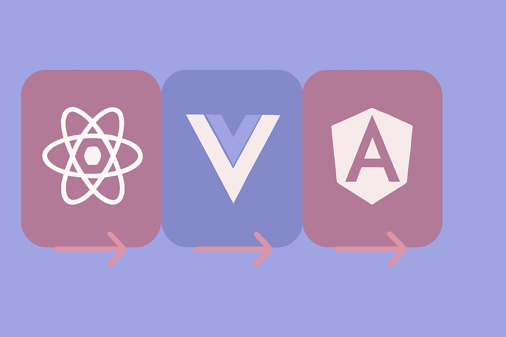

# Simultaneous Comparison of React, Vue, and Angular




In the modern web development world, React, Vue, and Angular are the three main pillars for building dynamic and interactive user interfaces. Each of these frameworks and libraries came with different philosophies, but all were designed to solve one fundamental problem: efficient State management in web applications.

### Why Are These Three Similar?

At first glance, these three tools may seem completely different, but deep down, they share significant commonalities:

**Component-based Architecture:** All three use the concept of reusable components. You divide the UI into small, independent pieces, each with its specific responsibility.

**Reactive Rendering:** They all benefit from a data-driven pattern - when data changes, the UI automatically updates. This is one of their biggest advantages over vanilla JavaScript.

**State Management:** All three offer built-in or integrated solutions for application state management - from useState in React to reactive data in Vue and Services in Angular.

### What Do They Do?

These tools are designed for building Single Page Applications (SPAs) and dynamic user interfaces in the browser. They allow you to:

- Build complex web applications that feel like desktop applications
- Create smooth and fast user experiences without page reloads
- Write maintainable and scalable code

In the first part of this article, we'll examine the core concepts:
1. Component Structure
2. Data Interpolation
3. State Management
4. Event Handling
5. Control Flow (Loops & Conditionals)
6. Forms and Two-Way Binding
7. Lifecycle/Effects
8. Styling

## 1. Component Structure

All three tools use "components". A component is an independent piece of code (like a button or header) that contains HTML, CSS, and Logic (JavaScript).

- **React:** Uses **JSX** (HTML inside JavaScript).
- **Vue:** Uses **Single File Component** system (separate `<template>`, `<script>`, `<style>` sections).
- **Angular:** Uses **Class** and **Decorators** and typically keeps HTML and CSS files separate.

#### Example (A Simple Hello World Component):

**React (Function Component):**
```jsx
// App.jsx
function App() {
  // Program logic goes here
  return (
    <div>
      <h1>Hello World!</h1>
    </div>
  );
}
export default App;
```

**Vue (Composition API):**
```html
<!-- App.vue -->
<template>
  <div>
    <h1>Hello World!</h1>
  </div>
</template>

<script setup>
  // Program logic goes here
</script>
```

**Angular (Component Decorator):**
```typescript
// app.component.ts
import { Component } from '@angular/core';

@Component({
  selector: 'app-root',
  template: `<div><h1>Hello World!</h1></div>`,
})
export class AppComponent {
  // Program logic goes here
}
```

## 2. Data Interpolation and Variables

How do we display a JavaScript variable on the page?

- **React:** Use single curly braces `{ }`.
- **Vue:** Use double curly braces `{{ }}` (known as Mustache syntax).
- **Angular:** Use double curly braces `{{ }}` (like Vue).

#### Example:

**React:**
```jsx
function App() {
  const name = "Ali";
  return <h1>Hello {name}</h1>; // Single brace
}
```

**Vue:**
```html
<script setup>
  const name = "Ali";
</script>

<template>
  <h1>Hello {{ name }}</h1> <!-- Double braces -->
</template>
```

**Angular:**
```typescript
export class AppComponent {
  name = "Ali";
}
// In template: <h1>Hello {{ name }}</h1>
```

## 3. State Management - Most Important Section

When data changes, the UI must update. This changeable data is called **State**.

- **React:** Uses the `useState` hook. You cannot directly change the variable; you must use the "setter" function.
- **Vue:** Uses `ref` (in the modern Composition API). You change the variable directly but must access `.value`.
- **Angular:** Uses Class Properties. Variable changes are automatically tracked by Zone.js (or recently with Signals).

#### Example (Counter):

**React:**
```jsx
import { useState } from 'react';

function Counter() {
  const [count, setCount] = useState(0); // Define state

  const increment = () => setCount(count + 1);

  return <button onClick={increment}>Count: {count}</button>;
}
```

**Vue:**
```html
<script setup>
import { ref } from 'vue';

const count = ref(0); // Define state

const increment = () => count.value++;
</script>

<template>
  <button @click="increment">Count: {{ count }}</button>
</template>
```

**Angular:**
```typescript
export class CounterComponent {
  count = 0; // Simple state definition

  increment() {
    this.count++;
  }
}
// In HTML:
// <button (click)="increment()">Count: {{ count }}</button>
```

### Getting Input from Parent (Props / Input)

In component-based architecture, you need to send data from the Parent component to the Child component. This data is called **Props** (short for Properties).

- **React:** Props are sent as function arguments to the component.
- **Vue:** You must specify which props you receive in the child component (`defineProps`).
- **Angular:** Uses the `@Input()` decorator to specify input variables.

Assumption: A `UserCard` that receives `name`.

**React (Props)**

**Child**
```jsx
export function UserCard({ name }) {
  return <p>User: {name}</p>;
}
```
**Parent**
```jsx
<UserCard name="Ali" />
```

**Vue (Props)**

**Child**
```vue
<script setup>
defineProps({ name: String })
</script>

<template>
  <p>User: {{ name }}</p>
</template>
```
**Parent**
```vue
<UserCard name="Ali" />
```

**Angular (`@Input`)**

**Child**
```ts
import { Component, Input } from '@angular/core';

@Component({
  selector: 'app-user-card',
  template: `<p>User: {{name}}</p>`
})
export class UserCardComponent {
  @Input() name = '';
}
```
**Parent**
```html
<app-user-card [name]="'Ali'"></app-user-card>
```

### Outputting to Parent (Event / Emit / Output)

**React (callback prop)**

**Child**
```jsx
export function AddButton({ onAdd }) {
  return <button onClick={onAdd}>Add</button>;
}
```
**Parent**
```jsx
<AddButton onAdd={() => setCount(c => c + 1)} />
```

**Vue (`emit`)**

**Child**
```vue
<script setup>
const emit = defineEmits(['add'])
</script>

<template>
  <button @click="emit('add')">Add</button>
</template>
```
**Parent**
```vue
<AddButton @add="count++" />
```

**Angular (`@Output` + EventEmitter)**

**Child**
```ts
import { Component, EventEmitter, Output } from '@angular/core';

@Component({
  selector: 'app-add-button',
  template: `<button (click)="add.emit()">Add</button>`,
})
export class AddButtonComponent {
  @Output() add = new EventEmitter<void>();
}
```
**Parent**
```html
<app-add-button (add)="count = count + 1"></app-add-button>
```

## 4. Event Handling

How do we manage user clicks or typing?

- **React:** Uses camelCase words like `onClick`, `onChange`.
- **Vue:** Uses the `@` directive (or `v-on:`). For example, `@click`.
- **Angular:** Uses parentheses `( )`. For example, `(click)`.

#### Example (Calling a function on click):

**React:**
```jsx
<button onClick={handleClick}>Click Me</button>
```

**Vue:**
```html
<button @click="handleClick">Click Me</button>
```

**Angular:**
```html
<button (click)="handleClick()">Click Me</button>
```

## 5. Loops & Conditionals

How do we display lists or hide something?

- **React:** Everything is pure JavaScript. Use `map()` for loops and the ternary operator `? :` or `&&` for conditions.
- **Vue:** Uses special HTML directives like `v-for` and `v-if`.
- **Angular:** Uses structural directives like `*ngFor` and `*ngIf` (or new syntax `@for`, `@if` in newer versions).

#### Example (Displaying a list of users):

Assume we have an array called `users`: `['Ali', 'Reza']`.

**React (using map):**
```jsx
<ul>
  {users.map((user, index) => (
    <li key={index}>{user}</li>
  ))}
</ul>
```

**Vue (using v-for):**
```html
<ul>
  <li v-for="(user, index) in users" :key="index">
    {{ user }}
  </li>
</ul>
```

**Angular (using *ngFor):**
```html
<ul>
  <li *ngFor="let user of users; let i = index">
    {{ user }}
  </li>
</ul>
```

#### Example (Conditional rendering - if admin):

**React:**
```jsx
{isAdmin ? <p>You are admin</p> : <p>Regular user</p>}
```

**Vue:**
```html
<p v-if="isAdmin">You are admin</p>
<p v-else>Regular user</p>
```

**Angular:**
```html
<p *ngIf="isAdmin; else userBlock">You are admin</p>
<ng-template #userBlock><p>Regular user</p></ng-template>
```
*Note: In Angular 17+ the syntax `@if (isAdmin) { ... }` was added which is similar to JavaScript.*

## 6. Forms and Two-Way Data Binding

When the user types something in an `input`, we want our variable to update simultaneously and vice versa.

- **React:** One-way by default. You must connect the `value` to state and update state in `onChange` (Controlled Component).
- **Vue:** Has a magical feature called `v-model` that makes this very simple.
- **Angular:** Has a syntax known as "banana in a box" `[( )]`: `[(ngModel)]`.

#### Example (Typing in input and displaying text simultaneously):

**React (manual):**
```jsx
function Form() {
  const [text, setText] = useState('');

  return (
    <div>
      <input
        value={text}
        onChange={(e) => setText(e.target.value)}
      />
      <p>You wrote: {text}</p>
    </div>
  );
}
```

**Vue (automatic with v-model):**
```html
<script setup>
  import { ref } from 'vue';
  const text = ref('');
</script>

<template>
  <input v-model="text" />
  <p>You wrote: {{ text }}</p>
</template>
```

**Angular (automatic with ngModel):**
```typescript
// Requires importing FormsModule in the module
export class FormComponent {
  text = '';
}
// HTML:
// <input [(ngModel)]="text" />
// <p>You wrote: {{ text }}</p>
```

## 7. Lifecycle - For Example Page Load

Sometimes you want to do something when the component is loaded on the page for the **first time** (for example, fetching data from server/API).

- **React:** Uses the `useEffect` hook with an empty dependency array `[]`.
- **Vue:** Uses the `onMounted` hook.
- **Angular:** Uses the `OnInit` interface and the `ngOnInit` method.

#### Example (Logging a message when component loads):

**React:**
```jsx
import { useEffect } from 'react';

function App() {
  useEffect(() => {
    console.log("Component loaded!");
    // Here we make API requests
  }, []);

  return <div>Content</div>;
}
```

**Vue:**
```html
<script setup>
import { onMounted } from 'vue';

onMounted(() => {
  console.log("Component loaded!");
});
</script>
```

**Angular:**
```typescript
import { Component, OnInit } from '@angular/core';

export class AppComponent implements OnInit {
  ngOnInit() {
    console.log("Component loaded!");
  }
}
```

## 8. Styling (CSS Styles)

How do we add color and styling to components?

- **React:** Has many methods. The simplest is `import './App.css'` or inline style as a JavaScript object.
- **Vue:** Has a `<style>` tag in the same component file. If you add the `scoped` attribute, styles only apply to that component (very popular).
- **Angular:** In the component file, links a file like `styleUrls: ['./app.component.css']`. Angular isolates (scopes) styles by default.

#### Example (Making text red):

**React (Inline Style Object):**
```jsx
// Style in React is an object, not a string
// background-color becomes backgroundColor
<div style={{ color: 'red', fontSize: '20px' }}>
  Red text
</div>
```

**Vue (Scoped CSS):**
```html
<template>
  <div class="my-text">Red text</div>
</template>

<style scoped>
/* This class only works in this file */
.my-text {
  color: red;
  font-size: 20px;
}
</style>
```

**Angular (External SCSS/CSS):**
```typescript
@Component({
  // ...
  styles: [`
    .my-text {
      color: red;
      font-size: 20px;
    }
  `]
})
```

## Conclusion

As we saw, all three (React / Vue / Angular) are built for creating browser-based applications. The "common idea" is: we break the UI into **small components**, keep **data**, change it uniformly with **events**, and the UI **updates** with data changes. The main difference is in syntax and default tools.

This concludes the first series of simultaneous comparison articles on react-vue-angular.

If you have any comments or suggestions, I'd be happy if you leave a comment right here, and hope to see you again.