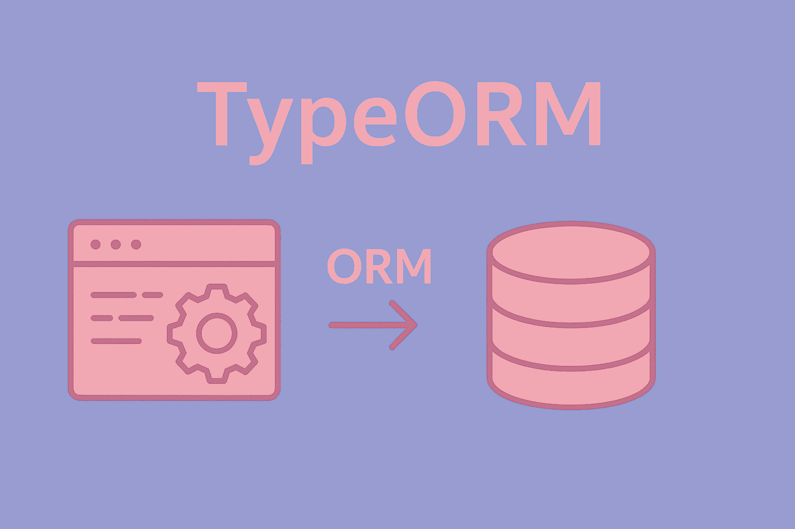

#  TypeORM؛ قدرتمندترین ORM سنتی در اکوسیستم Node.js
 
 
 
 

سلام و خوش اومدید! همین اول کار اینو بگم که قبل از اینکه وارد دنیای ORM ها بشید باید آشنایی اولیه با sql و یک فریمورک برناکه نویسی بک اند   (express.js) داشته باشید. ما تو پست های قبلی آموزش express.js رو قرار دادیمم و قراره  در اینجا  TypeORM  رو که استفاده ازش در express.js خیلی رایج هست رو برسی  کنیم. البته که یادگیری TypeORM باعث میشه به مفاهیم کلی ORM ها مسلط بشید و بتونید اصول  آنها رو در هر زبان برنامه نویسی درک کنید.

## اصلا ORM چیه؟

عبارت ORM مخفف Object-Relational Mapping است. به زبان ساده، ORM پلی است میان دو دنیای متفاوت:
۱. دنیای کدنویسی: که در آن ما با "شیء" یا Object (مانند کلاس‌ها در جاوااسکریپت یا پایتون) سر و کار داریم.
۲. دنیای پایگاه‌داده: که در آن داده‌ها در "جداول" (مانند SQL) ذخیره می‌شوند.

بدون ORM، شما مجبورید کدهای طولانی و پیچیده SQL را لابلای کدهای برنامه‌نویسی خود بنویسید. اما با ORM، پایگاه‌داده را دقیقاً شبیه به کدهای معمولی زبان خودتان مدیریت می‌کنید.


**برای درک بهتر، مسیر تعامل با دیتابیس را به سه دوره تقسیم می‌کنیم:**
۱. دوران SQL خالص (دهه ۷۰ تا ۹۰ میلادی)

در این دوران، برنامه‌نویسان باید دستورات متنی SQL را مستقیماً در کد قرار می‌دادند.
- مشکل: احتمال خطای تایپی بالا بود، امنیت پایینی داشت (حملات SQL Injection) و تغییر یک ستون در دیتابیس باعث می‌شد صدها خط کد در برنامه به مشکل بخورند.

۲. ظهور اولین ORMها (اوایل دهه ۲۰۰۰)
با گسترش برنامه‌نویسی "شیء‌گرا" (OOP)، نیاز به ابزاری برای تبدیل خودکار جداول به اشیاء احساس شد.
- Hibernate (۲۰۰۱): برای زبان جاوا معرفی شد و انقلابی در این مسیر بود.
- ActiveRecord (۲۰۰۴): با فریم‌ورک Ruby on Rails معرفی شد و مفهوم سادگی در تعامل با دیتابیس را به اوج رساند.
- Entity Framework (۲۰۰۸): توسط مایکروسافت برای دات‌نت معرفی شد.

۳. دوران مدرن و تایپ‌سیف (۲۰۱۵ تا کنون)
در سال‌های اخیر، ابزارها هوشمندتر شده‌اند. ORMهای مدرن مانند TypeORM یا Drizzle به جای فقط کپی کردن اطلاعات، بر روی "امنیت نوع‌ها" (Type Safety) تمرکز دارند تا برنامه‌نویس حتی قبل از اجرای کد، بداند که آیا داده‌ای که از دیتابیس می‌گیرد درست است یا خیر.

**چرا از ORM استفاده می‌کنیم؟**
- سرعت توسعه: به جای نوشتن ۵ خط SQL، یک متد ساده فراخوانی می‌کنید.
- امنیت: ORMها به صورت خودکار از نفوذ هکرها به دیتابیس جلوگیری می‌کنند.
- استقلال از نوع دیتابیس: می‌توانید بدون تغییر در کدهای اصلی، پایگاه‌داده خود را از MySQL به PostgreSQL تغییر دهید.
- مدیریت تغییرات (Migrations): نسخه زدن برای ساختار دیتابیس در Git را امکان پذیر می‌کنند.


**مثال مقایسه‌ای:**
**بدون ORM (استفاده از  SQL خام):**
باید دستی کوئری بنویسید، مراقب امنیت باشید و خروجی را خودتان تمیز کنید.
```javascript
// کد خام و سخت
const sql = 'SELECT * FROM users WHERE email = ?';
db.execute(sql, ['ali@gmail.com'], (err, rows) => {
  const user = rows[0]; 
  console.log(user.name);
});
```

**با ORM (مثلاً TypeORM):**
انگار دارید با اشیاء (Objects) و کلاس‌های جاوااسکریپت کار می‌کنید.
```javascript
// کد تمیز و خوانا
const user = await userRepository.findOneBy({ 
  email: 'ali@gmail.com' 
});
console.log(user.name);
```

مفهوم **ORM** یک مفهوم کلی در دنیای برنامه‌نویسی است و تقریباً تمام زبان‌های برنامه‌نویسی که برای Backend استفاده می‌شوند، ORMهای مخصوص خودشان را دارند.

### آشنایی با ORM های زبان های مختلف برنامه نویسی
بیایید ببینیم در زبان‌های برنامه نویسی چه خبر است :
#### ۱. پایتون (Python) 🐍
اگر روزی بخواهید با پایتون کد بزنید (مثلاً با فریم‌ورک Django یا Flask)، ORMهای معروف آن عبارتند از:
*   **SQLAlchemy:** قدرتمندترین و معروف‌ترین ORM پایتون (شبیه TypeORM در node.js).
*   **Django ORM:** اگر با فریم‌ورک جنگو کار کنید، خودش یک ORM داخلی دارد که بسیار محبوب است.

#### ۲. پی‌اچ‌پی (PHP) 🐘
دنیای PHP هم پر از ORM است:
*   **Eloquent:** متعلق به فریم‌ورک Laravel (بسیار محبوب و شبیه Prisma راحت است).
*   **Doctrine:** متعلق به فریم‌ورک Symfony (بسیار شبیه Hibernate جاوا).

#### ۳. سی‌شارپ (#C) و دات‌نت 🪟
*   **Entity Framework (EF Core):** پادشاه دنیای مایکروسافت. این یکی از پیشرفته‌ترین ORMهای جهان است که Prisma و TypeORM بسیاری از ایده‌هایشان را از آن گرفته‌اند.

#### ۴. جاوا (Java) ☕
*   **Hibernate:** پدربزرگ تمام ORMها! بسیار قدرتمند اما پیچیده.

#### ۵. گو (Go) 🐹
*   **GORM:** محبوب‌ترین ORM برای زبان Go.


### چرا هر زبان ORM مخصوص خودش را دارد؟

چون هر زبان ساختار متفاوتی دارد:
*   در **جاوا** و **سی‌شارپ** همه چیز بر اساس «کلاس» (Class) است.
*   در **جاوااسکریپت** ما با «آبجکت» (Object) و JSON سروکار داریم.
*   در **Go** ما «استراکچر» (Struct) داریم.

ORM باید به زبان خود آن محیط نوشته شود تا بتواند داده‌های دیتابیس را به ساختار آن زبان (مثلاً آبجکت JS) تبدیل کند.


## بررسی TypeORM؛ قدرتمندترین ORM سنتی در اکوسیستم Node.js

TypeORM یک **ORM** بالغ و قدرتمند است که از الگوهای **Active Record** و **Data Mapper** پشتیبانی می‌کند. به زبان ساده، شما جداول دیتابیس را به صورت **کلاس‌های جاوااسکریپت/تایپ‌اسکریپت** تعریف می‌کنید و با استفاده از Decoratorها به آن‌ها ویژگی می‌دهید. TypeORM کدهای شما را به کوئری‌های SQL تبدیل می‌کند.

TypeORM رویکرد متفاوتی نسبت به ORM هایی مانند Prisma دارد. در حالی که Prisma بر اساس یک فایل `schema` مرکزی کار می‌کند، TypeORM بر اساس **Class**ها و **Decorator**ها (در TypeScript) عمل می‌کند.

بیایید یادگیری را در **۶ گام حیاتی** شروع کنیم. (پیش‌فرض ما استفاده از **TypeScript** است چون TypeORM با آن بیشترین قدرت را دارد).

## گام ۱: نصب و راه‌اندازی اولیه (Setup)

در پروژه Express خود، ابتدا باید پکیج‌های لازم را نصب کنید.

۱. **نصب پکیج‌ها:**
```bash
npm install typeorm reflect-metadata sqlite3 --save
npm install typescript ts-node @types/node --save-dev
```
*(نکته: ما در اینجا از `sqlite3` استفاده کردیم، برای پستگرس باید `pg` را نصب کنید).*

۲. **پیکربندی TypeScript:**
در فایل `tsconfig.json` حتماً باید دو گزینه زیر فعال باشند تا دکوریتورها کار کنند:
```json
"emitDecoratorMetadata": true,
"experimentalDecorators": true
```

۳. **ایجاد فایل دیتاسورس (Data Source):**
 TypeORM تنظیمات را معمولاً در فایلی به نام `data-source.ts` نگه می‌دارد:

```typescript
// data-source.ts
import { DataSource } from "typeorm";

export const AppDataSource = new DataSource({
    type: "sqlite",
    database: "database.sqlite",
    synchronize: false, // در پروداکشن حتما false باشد
    logging: true,
    entities: ["src/entity/*.ts"], // آدرس مدل‌ها
    migrations: ["src/migration/*.ts"], // آدرس مایگریشن‌ها
    subscribers: [],
});
```

## گام ۲: مدل‌سازی داده‌ها (Modeling/Entities)

در TypeORM، هر جدول یک **کلاس (Class)** است که به آن **Entity** می‌گوییم. بیایید یک فایل در مسیر `src/entity/User.ts` بسازیم.

```typescript
// src/entity/User.ts
import { Entity, PrimaryGeneratedColumn, Column, CreateDateColumn } from "typeorm";

@Entity() // این کلاس یک جدول دیتابیس است
export class User {
    @PrimaryGeneratedColumn() // کلید اصلی و افزایش خودکار
    id: number;

    @Column({ unique: true }) // باید یکتا باشد
    email: string;

    @Column({ nullable: true }) // می‌تواند نال باشد
    name: string;

    @CreateDateColumn() // زمان ساخت پیش‌فرض
    createdAt: Date;
}
```

**مفاهیم کلیدی این بخش:**
*   `@Entity`: کلاس را به جدول تبدیل می‌کند.
*   `@PrimaryGeneratedColumn`: معادل `id` در دیتابیس.
*   `@Column`: تعریف ستون‌های معمولی.


## گام ۳: مدیریت تغییرات دیتابیس (Migrations)

در TypeORM، برای اینکه تغییرات کلاس‌های خود (Entityها) را به دیتابیس منتقل کنید، از سیستم **مایگریشن (Migration)** استفاده می‌شود. این سیستم به شما کمک می‌کند تا تاریخچه‌ای از تغییرات دیتابیس داشته باشید و بتوانید آن را در محیط‌های مختلف (توسعه، تست، پروداکشن) هماهنگ نگه دارید.

از آنجا که دستورات CLI در TypeORM برای پروژه‌های تایپ‌اسکریپت کمی طولانی هستند (چون از `ts-node` برای اجرای مستقیم فایل‌های `ts` استفاده می‌کنند)، فرآیند را به صورت گام‌به‌گام و دقیق بررسی می‌کنیم.

چرخه مایگریشن در TypeORM شامل دو مرحله اصلی است: **تولید فایل** و **اجرای فایل**.

#### ۱. تولید فایل مایگریشن (Generate)
این دستور مخصوص محیط **توسعه** است. زمانی که شما یک Entity را تغییر می‌دهید (مثلاً فیلدی اضافه می‌کنید)، TypeORM کد شما را با وضعیت فعلی دیتابیس مقایسه می‌کند و یک فایل حاوی دستورات SQL (برای اعمال و بازگردانی تغییرات) می‌سازد.

*   **دستور:**
    ```bash
    npx typeorm-ts-node-commonjs migration:generate -d ./data-source.ts ./src/migration/AddUserTable
    ```
*   **تحلیل دستور:**
    *   `-d ./data-source.ts`: مسیر فایل تنظیمات دیتاسورس را مشخص می‌کند.
    *   `./src/migration/AddUserTable`: مسیری که فایل مایگریشن در آن ذخیره می‌شود به همراه نام آن (در اینجا `AddUserTable`).

#### ۲. اجرای مایگریشن‌ها (Run)
پس از اینکه فایل مایگریشن ساخته شد، باید آن را روی دیتابیس اعمال کنید تا جداول و ستون‌ها ساخته شوند. این دستور هم در محیط **توسعه** و هم در **سرور (Production)** استفاده می‌شود.

*   **دستور:**
    ```bash
    npx typeorm-ts-node-commonjs migration:run -d ./data-source.ts
    ```
*   **نکته مهم:** در محیط پروداکشن، شما فقط این دستور را اجرا می‌کنید تا دیتابیس سرور با آخرین تغییرات کدتان هماهنگ شود (در سرور نباید دستور `generate` را اجرا کرد).

#### ۳. بررسی وضعیت (Show)
اگر می‌خواهید بدانید کدام مایگریشن‌ها تاکنون روی دیتابیس اعمال شده‌اند و کدام‌یک در انتظار اجرا هستند، از این دستور استفاده کنید. این ابزار برای دیباگ کردن بسیار مفید است.

*   **دستور:**
    ```bash
    npx typeorm-ts-node-commonjs migration:show -d ./data-source.ts
    ```

#### ۴. پاکسازی کامل دیتابیس (Schema Drop)
اگر در محیط توسعه دیتابیس شما دچار مشکل شده و می‌خواهید همه چیز را پاک کنید و از نو بسازید، از این دستور استفاده می‌شود.

*   **دستور:**
    ```bash
    npx typeorm-ts-node-commonjs schema:drop -d ./data-source.ts
    ```
*   **هشدار:** این دستور تمام جداول و داده‌های دیتابیس را حذف می‌کند. پس از اجرا، باید دوباره دستور `migration:run` را بزنید تا جداول از نو ساخته شوند.


### نکته حرفه‌ای: ساده‌سازی دستورات با `package.json`

همانطور که مشاهده کردید، تایپ کردن `npx typeorm-ts-node-commonjs ...` بسیار زمان‌بر است. استاندارد پروژه‌های TypeORM این است که این دستورات را در بخش `scripts` فایل `package.json` تعریف کنید:

```json
"scripts": {
    "typeorm": "typeorm-ts-node-commonjs",
    "migration:generate": "npm run typeorm migration:generate -d ./data-source.ts",
    "migration:run": "npm run typeorm migration:run -d ./data-source.ts",
    "migration:revert": "npm run typeorm migration:revert -d ./data-source.ts",
    "db:reset": "npm run typeorm schema:drop -d ./data-source.ts && npm run migration:run"
}
```

حالا می‌توانید به سادگی از دستورات کوتاه زیر استفاده کنید:
*   `npm run migration:generate -- ./src/migration/NewChange`
*   `npm run migration:run`

---

### خلاصه کاربردی دستورات TypeORM CLI:

| دستور (Function) | محیط استفاده | کارکرد اصلی | آیا فایل می‌سازد؟ |
| :--- | :--- | :--- | :--- |
| **`migration:generate`** | لوکال (Dev) | مقایسه Entity با دیتابیس و ساخت کد SQL | ✅ بله |
| **`migration:run`** | لوکال و سرور | اجرای فایل‌های مایگریشن روی دیتابیس | ❌ خیر |
| **`schema:drop`** | لوکال (Dev) | حذف کامل تمام جداول دیتابیس | ❌ خیر |
| **`migration:show`** | همه جا | نمایش لیست مایگریشن‌های اعمال شده | ❌ خیر |
| **`migration:revert`** | همه جا | برگشت دادن آخرین تغییر (Undo) | ❌ خیر |


## گام ۴: عملیات CRUD (حیاتی‌ترین بخش)

برای کار با دیتابیس، ما از **Repository** استفاده می‌کنیم. ابتدا باید دیتاسورس را Initialize کنیم (معمولا در فایل اصلی برنامه).

```typescript
// index.ts
import { AppDataSource } from "./data-source";
import { User } from "./src/entity/User";

AppDataSource.initialize().then(async () => {
    
    // دریافت ریپازیتوری مربوط به User
    const userRepository = AppDataSource.getRepository(User);

    // ۱. ایجاد داده (Create)
    const user = userRepository.create({
        email: "ali@example.com",
        name: "Ali"
    });
    await userRepository.save(user); // ذخیره نهایی در دیتابیس
    console.log("User created:", user);

    // ۲. خواندن داده (Read)
    const allUsers = await userRepository.find();
    
    const oneUser = await userRepository.findOneBy({
        email: "ali@example.com"
    });

    // ۳. آپدیت داده (Update)
    // روش اول: واکشی و ذخیره (پیشنهاد شده)
    if (oneUser) {
        oneUser.name = "Ali Reza";
        await userRepository.save(oneUser);
    }
    // روش دوم: آپدیت مستقیم
    await userRepository.update({ email: "ali@example.com" }, { name: "Ali Reza" });

    // ۴. حذف داده (Delete)
    await userRepository.delete({ email: "ali@example.com" });

}).catch(error => console.log(error));
```

## گام ۵: روابط بین جداول (Relations) - بسیار مهم

فرض کنید می‌خواهیم رابطه `User` و `Post` (یک به چند) را ایجاد کنیم. اینجا باید در هر دو کلاس تغییر ایجاد کنید.

**۱. آپدیت مدل User:**
```typescript
// src/entity/User.ts
import { OneToMany, ... } from "typeorm";
import { Post } from "./Post";

@Entity()
export class User {
    // ... سایر فیلدها

    @OneToMany(() => Post, (post) => post.author)
    posts: Post[];
}
```

**۲. ساخت مدل Post:**
```typescript
// src/entity/Post.ts
import { Entity, PrimaryGeneratedColumn, Column, ManyToOne } from "typeorm";
import { User } from "./User";

@Entity()
export class Post {
    @PrimaryGeneratedColumn()
    id: number;

    @Column()
    title: string;

    @ManyToOne(() => User, (user) => user.posts)
    author: User;
}
```

بعد از تغییرات، باید دستور `migration:generate` و سپس `migration:run` را اجرا کنید.

**نحوه استفاده از روابط (Relational Queries):**

ساخت کاربر همراه با پست (Cascade Insert):
*(نکته: برای اینکه این کار کند، باید در دکوریتور OneToMany گزینه `{ cascade: true }` را اضافه کنید)*

```typescript
const user = new User();
user.email = "sara@test.com";
const post = new Post();
post.title = "Hello TypeORM";
user.posts = [post]; // اتصال آبجکت‌ها

await userRepository.save(user); // هم کاربر و هم پست ذخیره می‌شوند
```

گرفتن کاربر **به همراه** پست‌هایش:

```typescript
const users = await userRepository.find({
    relations: {
        posts: true, // این معادل JOIN است
    },
});
```

## گام ۶: ترکیب با Express.js

یک مثال کامل از راه اندازی سرور:

```typescript
import express from "express";
import { AppDataSource } from "./data-source";
import { User } from "./src/entity/User";

const app = express();
app.use(express.json());

// اتصال به دیتابیس قبل از بالا آمدن سرور
AppDataSource.initialize().then(() => {
    
    const userRepo = AppDataSource.getRepository(User);

    // روت برای گرفتن همه کاربران
    app.get("/users", async (req, res) => {
        const users = await userRepo.find({ relations: { posts: true } });
        res.json(users);
    });

    // روت برای ثبت نام
    app.post("/signup", async (req, res) => {
        const { email, name } = req.body;
        try {
            // ایجاد نمونه کلاس
            const newUser = userRepo.create({ email, name });
            // ذخیره در دیتابیس
            const result = await userRepo.save(newUser);
            res.json(result);
        } catch (error) {
            res.status(400).json({ error: "Error creating user" });
        }
    });

    app.listen(3000, () => console.log("Server running on port 3000"));

}).catch(error => console.log("TypeORM connection error: ", error));
```


## سخن آخر
همه انچه نیاز بود در مورد TypeORM  که از بهترین و محبوب ترین ها در اکوسیستم جاوااسکریپت هست رو بدونید کاملا بهش اشاره کردیم. حالا نوبت شماست که نظرتون رو برام بنویسید. 🏀

