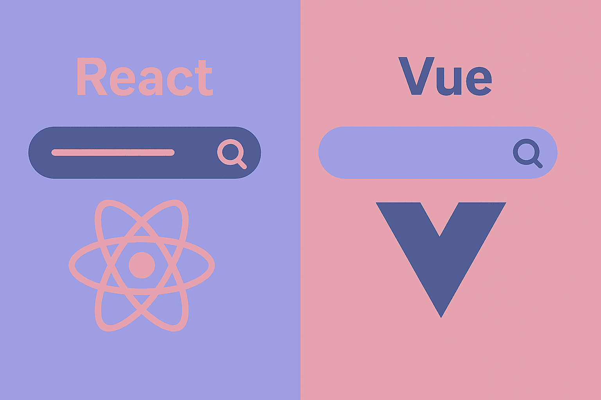

# یادگیری Vue.js برای توسعه دهندگان React 



اگر توسعه دهنه react هستید و می خواهید وارد دنیای vue شوید یا حتی توسعه vue هستید و می خواهید از react سر در بیاورید باید بگویم جای درستی آمده اید! تنها یادگیری همین مقاله شما رو به هر آنچه که نیاز دارید میرسونه و می تونید با اعتماد بنفس کامل مطمین باشید از کد های این دو فریم ورک بخوبی سر در میارید و میتوانید بلدبودن آنها را با خیال راحت به رزومه تان اضافه کنید.

**در این مطلب چه چیزهایی یاد می‌گیریم؟**
در ادامه، قدم‌به‌قدم این مفاهیم را بررسی می‌کنیم (همراه با مقایسه مستقیم React و Vue):

1. **ساختار کامپوننت‌ها**  
    تفاوت JSX در React با ساختار سه‌تکه‌ی فایل‌های `.vue`  
    _(script / template / style)_
    
2. **مدیریت State و Reactivity**  
    مقایسه `useState` با `ref` و `reactive`  
    و این‌که چرا Mutation در Vue مشکلی ایجاد نمی‌کند.
    
3. **شرط‌ها و حلقه‌ها**  
    استفاده از جاوااسکریپت خالص در React  
    در مقابل Directives مثل `v-if` و `v-for` در Vue.
    
4. **Props و ارتباط والد–فرزند**  
    از destructuring پراپ‌ها در React  
    تا `defineProps` و `defineEmits` در Vue.
    
5. **Side Effects و Lifecycle**  
    معادل‌های `useEffect` مثل `onMounted`، `watch` و `onUnmounted`.
    
6. **Computed Values**  
    مقایسه `useMemo` با قابلیت قدرتمند `computed` در Vue.
    
7. **فرم‌ها و Two-way Binding**  
    تفاوت کنترل دستی اینپوت‌ها در React  
    با جادوی `v-model` در Vue.
    
8. **Children در React و Slots در Vue**  
    دو رویکرد متفاوت برای تزریق محتوا به کامپوننت‌ها.
    
9. **اشتراک داده در عمق کامپوننت‌ها**  
    Context API در React  
    در مقابل Provide / Inject در Vue.
    
10. **استفاده مجدد از منطق**  
    Custom Hooks در React  
    در برابر Composables در Vue و تفاوت‌های عملکردی مهم آن‌ها.
    
11. **دسترسی به DOM**  
    `useRef` در React  
    در مقابل Template Refs در Vue.
    
12. **مدیریت State سراسری**  
    مقایسه Redux / Zustand  
    با راهکار رسمی Vue یعنی **Pinia**.
    
13. **یک پروژه ساده (To-Do List)**  
    پیاده‌سازی یک مثال واقعی اما ساده.
    

بزن بریم 🚀


## ۱. ساختار کامپوننت (Component Structure)

در React، منطق (Logic) و قالب (Template/JSX) در یک تابع جاوااسکریپتی ترکیب شده‌اند. در Vue، ما معمولاً از فایل‌های `.vue` استفاده می‌کنیم که سه بخش مجزا دارند:
1.  `<script setup>`: منطق برنامه (جاوااسکریپت)
2.  `<template>`: ظاهر برنامه (HTML)
3.  `<style>`: استایل‌ها (CSS)

**React:**
```jsx
// App.jsx
import { useState } from 'react';

export default function App() {
  const [name, setName] = useState('Ali');

  return (
    <div className="container">
      <h1>Hello {name}</h1>
    </div>
  );
}
```

**Vue:**
```html
<!-- App.vue -->
<script setup>
import { ref } from 'vue';

const name = ref('Ali');
</script>

<template>
  <div class="container">
    <!-- نیازی به آکولاد دوتایی برای اتریبیوت‌ها نیست اما برای متن هست -->
    <h1>Hello {{ name }}</h1>
  </div>
</template>

<style scoped>
.container {
  padding: 10px;
}
</style>
```

## ۲. مدیریت State (Reactive State)

در React از `useState` استفاده می‌کنید. در Vue دو راه اصلی داریم: `ref` (برای داده‌های ساده مثل عدد و رشته) و `reactive` (برای آبجکت‌ها).

**نکته مهم:** در Vue وقتی از `ref` در قسمت `<script>` استفاده می‌کنید، برای تغییر یا خواندن مقدار باید از `.value` استفاده کنید. اما در `<template>` نیازی به `.value` نیست (خودش باز می‌شود).

**React:**
```jsx
const [count, setCount] = useState(0);

const increment = () => {
  setCount(count + 1); // یا setCount(prev => prev + 1)
};
```

**Vue:**
```html
<script setup>
import { ref } from 'vue';

const count = ref(0);

const increment = () => {
  count.value++; // تغییر مستقیم مقدار! (React Immutability اینجا اجباری نیست)
};
</script>

<template>
  <button @click="increment">Count is: {{ count }}</button>
</template>
```

## ۳. شرط‌ها و حلقه‌ها (Conditionals & Loops)

React از قدرت جاوااسکریپت (`map`, `&&`, `ternary`) استفاده می‌کند. Vue از **Directives** (دستوراتی که با `v-` شروع می‌شوند) در HTML استفاده می‌کند.

#### شرط‌ها (Conditions)

**React:**
```jsx
{isLoggedIn ? <UserPanel /> : <LoginBtn />}
{isVisible && <p>Hello</p>}
```

**Vue:**
```html
<UserPanel v-if="isLoggedIn" />
<LoginBtn v-else />

<p v-show="isVisible">Hello</p> <!-- v-show فقط display:none می‌کند -->
```

#### حلقه‌ها (Lists)

**React:**
```jsx
<ul>
  {items.map((item) => (
    <li key={item.id}>{item.name}</li>
  ))}
</ul>
```

**Vue:**
```html
<ul>
  <li v-for="item in items" :key="item.id">
    {{ item.name }}
  </li>
</ul>
```

## ۴. پراپ‌ها (Props)

در React پراپ‌ها آرگومان‌های تابع هستند. در Vue باید آن‌ها را با `defineProps` تعریف کنید.

**React:**
```jsx
function Child({ title, count }) {
  return <h1>{title}: {count}</h1>;
}
```

**Vue:**
```html
<!-- Child.vue -->
<script setup>
// نیازی به ایمپورت defineProps نیست (ماکرو است)
const props = defineProps({
  title: String,
  count: Number
});
</script>

<template>
  <h1>{{ title }}: {{ count }}</h1>
</template>
```

## ۵. افکت‌ها و چرخه حیات (Side Effects / Lifecycle)

معادل `useEffect` در Vue معمولاً `onMounted` (فقط یک‌بار اجرا شدن) یا `watch` (برای رصد تغییرات) است.

**React (اجرا در هنگام Mount):**
```jsx
useEffect(() => {
  console.log("Component mounted");
  // cleanup function
  return () => console.log("Unmounted");
}, []);
```

**Vue:**
```html
<script setup>
import { onMounted, onUnmounted } from 'vue';

onMounted(() => {
  console.log("Component mounted");
});

onUnmounted(() => {
  console.log("Unmounted");
});
</script>
```

**React (رصد تغییرات متغیر):**
```jsx
useEffect(() => {
  console.log("Count changed", count);
}, [count]);
```

**Vue:**
```html
<script setup>
import { watch } from 'vue';

watch(count, (newVal, oldVal) => {
  console.log("Count changed to", newVal);
});
</script>
```

## ۶. ویژگی Computed (معادل useMemo)

یکی از قدرتمندترین ویژگی‌های Vue است. اگر مقداری بر اساس State دیگر محاسبه می‌شود، از `computed` استفاده کنید.

**React:**
```jsx
const doubleCount = useMemo(() => {
  return count * 2;
}, [count]);
```

**Vue:**
```html
<script setup>
import { computed } from 'vue';

// وابستگی‌ها را خودش تشخیص می‌دهد، نیازی به آرایه وابستگی نیست
const doubleCount = computed(() => count.value * 2);
</script>
```

## ۷. فرم‌ها (Two-way Binding)

اینجا جایی است که Vue می‌درخشد. در React شما باید `value` و `onChange` را جداگانه بنویسید. در Vue از `v-model` استفاده می‌کنیم که جادو می‌کند.

**React:**
```jsx
<input 
  value={text} 
  onChange={(e) => setText(e.target.value)} 
/>
```

**Vue:**
```html
<input v-model="text" />
```


## ۸. Children vs Slots

در React وقتی می‌خواهید محتوایی را بین تگ‌های کامپوننت قرار دهید، از `props.children` استفاده می‌کنید.

**React:**
```jsx
// Card.jsx
function Card({ children }) {
  return <div className="card">{children}</div>;
}

// Usage
<Card>
  <h1>Title</h1>
</Card>
```

در Vue، ما از تگ مخصوص `<slot />` استفاده می‌کنیم.

**Vue (Card.vue):**
```html
<template>
  <div class="card">
    <!-- محتوای پاس داده شده اینجا قرار می‌گیرد -->
    <slot /> 
  </div>
</template>

<style>
.card { border: 1px solid #ccc; padding: 10px; }
</style>
```

**استفاده:**
```html
<Card>
  <h1>Title</h1>
</Card>
```


## ۹. اشتراک داده در عمق (Context API vs Provide/Inject)

در React برای جلوگیری از "Prop Drilling" (پاس دادن پراپ‌ها از پدربزرگ به نوه)، از **Context API** استفاده می‌کنید (`createContext`, `Provider`, `useContext`).

در Vue، این مکانیسم **Provide / Inject** نام دارد.

**React:**
```jsx
// Context creation
const ThemeContext = createContext('light');

// Parent
<ThemeContext.Provider value="dark">
  <Child />
</ThemeContext.Provider>

// GrandChild
const theme = useContext(ThemeContext);
```

**Vue:**
نیازی به ساخت فایل جداگانه برای Context نیست.
```html
<!-- Parent.vue -->
<script setup>
import { provide, ref } from 'vue';

const theme = ref('dark');
// کلید (که می‌تواند رشته باشد) و مقدار را پاس می‌دهیم
provide('themeKey', theme); 
</script>

<!-- GrandChild.vue -->
<script setup>
import { inject } from 'vue';

// مقدار پیش‌فرض (light) هم می‌توان داد
const theme = inject('themeKey', 'light'); 
</script>

<template>
  <div>Theme is: {{ theme }}</div>
</template>
```
*نکته:* اگر `theme` در کامپوننت والد `ref` باشد و تغییر کند، در فرزند هم آپدیت می‌شود (Reactivity حفظ می‌شود).


## ۱۰. استفاده مجدد از منطق (Custom Hooks vs Composables)

این یکی از مهم‌ترین بخش‌هاست.
در React ما **Custom Hooks** داریم. در Vue به آن‌ها **Composables** می‌گوییم. ساختارشان به شدت شبیه است، اما یک تفاوت بزرگ در عملکرد دارند.

**تفاوت مهم عملکردی:**
*   **React Hooks:** هر بار که کامپوننت رندر می‌شود، هوک دوباره اجرا می‌شود (مگر اینکه Memoize شود).
*   **Vue Composables:** کدهای داخل `setup` (یا همان Composable) فقط **یک‌بار** در زمان ایجاد کامپوننت اجرا می‌شوند. این یعنی نگرانی‌های `useCallback` و `useMemo` در Vue بسیار کمتر است.

بیایید یک Composable برای موقعیت موس بسازیم:

**React (useMouse.js):**
```javascript
import { useState, useEffect } from 'react';

export function useMouse() {
  const [x, setX] = useState(0);
  const [y, setY] = useState(0);

  useEffect(() => {
    const update = (e) => { setX(e.clientX); setY(e.clientY); };
    window.addEventListener('mousemove', update);
    return () => window.removeEventListener('mousemove', update);
  }, []);

  return { x, y };
}
```

**Vue (useMouse.js):**
دقیقاً همان منطق است! معمولاً فایل‌های Composable را در پوشه `composables` نگه می‌دارند.
```javascript
import { ref, onMounted, onUnmounted } from 'vue';

export function useMouse() {
  const x = ref(0);
  const y = ref(0);

  const update = (e) => {
    x.value = e.clientX;
    y.value = e.clientY;
  };

  onMounted(() => window.addEventListener('mousemove', update));
  onUnmounted(() => window.removeEventListener('mousemove', update));

  // مقدار ref را برمی‌گردانیم تا در کامپوننت استفاده شود
  return { x, y };
}
```

**استفاده در کامپوننت Vue:**
```html
<script setup>
import { useMouse } from './composables/useMouse';

const { x, y } = useMouse();
</script>

<template>
  Mouse position: {{ x }}, {{ y }}
</template>
```


## ۱۱. دسترسی به DOM (useRef vs Template Refs)

در React برای دسترسی مستقیم به یک المنت HTML (مثلاً برای فوکوس کردن روی اینپوت) از `useRef` استفاده می‌کنید.

**React:**
```jsx
const inputRef = useRef(null);

useEffect(() => {
  inputRef.current.focus();
}, []);

return <input ref={inputRef} />;
```

**Vue:**
در Vue کافیست یک متغیر `ref` هم‌نام با اتریبیوت `ref` در تمپلیت بسازید.

```html
<script setup>
import { ref, onMounted } from 'vue';

// باید null باشد در ابتدا
const inputElem = ref(null);

onMounted(() => {
  // دسترسی به DOM با .value
  inputElem.value.focus();
});
</script>

<template>
  <!-- نام متغیر و اتریبیوت ref باید یکی باشد -->
  <input ref="inputElem" />
</template>
```


## ۱۲. مدیریت استیت سراسری (Redux/Zustand vs Pinia)

در دنیای React، شما گزینه‌های زیادی دارید (Redux Toolkit, Zustand, Context, Recoil).
در دنیای Vue، کتابخانه استاندارد رسمی وجود دارد که **Pinia** نام دارد (قبلاً Vuex بود، اما Pinia مدرن‌تر و ساده‌تر است).

پینیا (Pinia) بسیار شبیه به **Zustand** در React است. خیلی ساده و بدون Boilerplate اضافی.

**یک Store ساده در Pinia:**

```javascript
// stores/counter.js
import { defineStore } from 'pinia';
import { ref, computed } from 'vue';

export const useCounterStore = defineStore('counter', () => {
  // State
  const count = ref(0);
  
  // Getters (Computed)
  const doubleCount = computed(() => count.value * 2);
  
  // Actions
  function increment() {
    count.value++;
  }

  return { count, doubleCount, increment };
});
```

**استفاده در کامپوننت:**
```html
<script setup>
import { useCounterStore } from '@/stores/counter';

const store = useCounterStore();
// حالا به store.count و store.increment دسترسی دارید
</script>

<template>
  <button @click="store.increment">
    Count: {{ store.count }} (Double: {{ store.doubleCount }})
  </button>
</template>
```


## ۱۳.پروژه ساده: To-Do List

 بیایید آموخته‌های بخش قبل را در قالب یک پروژه کوچک **"لیست کارها" (To-Do List)** پیاده‌سازی کنیم .
 
در این مثال ما یک لیست داریم که می‌توان آیتم جدید اضافه کرد، آن را انجام شده (تیک) زد و یا حذف کرد.

ابتدا با react شروع می کنیم:

**React:**

```jsx
import React, { useState } from 'react';

export default function TodoApp() {
  const [newTask, setNewTask] = useState('');
  const [tasks, setTasks] = useState([
    { id: 1, text: 'یادگیری React', done: true },
    { id: 2, text: 'یادگیری Vue', done: false },
  ]);

  const addTask = () => {
    const text = newTask.trim();
    if (!text) return;

    setTasks(prev => [
      ...prev,
      { id: Date.now(), text, done: false },
    ]);

    setNewTask('');
  };

  const toggleTask = (id) => {
    // در React بهتر است وضعیت را به‌صورت immutable به‌روزرسانی کنیم
    setTasks(prev => prev.map(t => t.id === id ? { ...t, done: !t.done } : t));
  };

  const removeTask = (id) => {
    setTasks(prev => prev.filter(t => t.id !== id));
  };

  return (
    <div className="max-w-md mx-auto p-4">
      <div className="flex gap-2 mb-4">
        <input
          className="flex-1 border rounded px-3 py-2"
          value={newTask}
          onChange={(e) => setNewTask(e.target.value)}
          onKeyDown={(e) => e.key === 'Enter' && addTask()}
          placeholder="کار جدید..."
        />
        <button
          className="px-4 py-2 rounded bg-blue-600 text-white"
          onClick={addTask}
        >
          افزودن
        </button>
      </div>

      <ul className="space-y-2">
        {tasks.map(task => (
          <li key={task.id} className="flex items-center justify-between">
            <span
              className={`flex-1 cursor-pointer ${task.done ? 'line-through text-gray-400' : ''}`}
              onClick={() => toggleTask(task.id)}
            >
              {task.text}
            </span>

            <button onClick={() => removeTask(task.id)} aria-label={`حذف ${task.text}`}>
              ❌
            </button>
          </li>
        ))}
      </ul>
    </div>
  );
}
```


**Vue:**
```html
<script setup>
import { ref } from 'vue';

// 1. State Definition
const newTask = ref('');
const tasks = ref([
  { id: 1, text: 'یادگیری React', done: true },
  { id: 2, text: 'یادگیری Vue', done: false }
]);

// 2. Methods
const addTask = () => {
  if (newTask.value.trim() === '') return;
  
  tasks.value.push({
    id: Date.now(),
    text: newTask.value,
    done: false
  });
  
  newTask.value = ''; // پاک کردن اینپوت
};

const toggleTask = (task) => {
  task.done = !task.done; // Mutating state directly!
};

const removeTask = (id) => {
  tasks.value = tasks.value.filter(t => t.id !== id);
};
</script>

<template>
  <div class="app">
    <!-- 3. Event Modifiers -->
    <!-- در ریکت: onKeyDown={(e) => e.key === 'Enter' && addTask()} -->
    <input 
      v-model="newTask" 
      @keyup.enter="addTask" 
      placeholder="کار جدید..." 
    />
    <button @click="addTask">افزودن</button>

    <ul>
      <li v-for="task in tasks" :key="task.id">
        <!-- 4. Class Binding -->
        <!-- در ریکت: className={task.done ? 'done' : ''} -->
        <span 
          :class="{ 'done-style': task.done }" 
          @click="toggleTask(task)"
        >
          {{ task.text }}
        </span>

        <button @click="removeTask(task.id)">❌</button>
      </li>
    </ul>
  </div>
</template>

<style scoped>
.done-style {
  text-decoration: line-through;
  color: gray;
  cursor: pointer;
}
</style>
```


