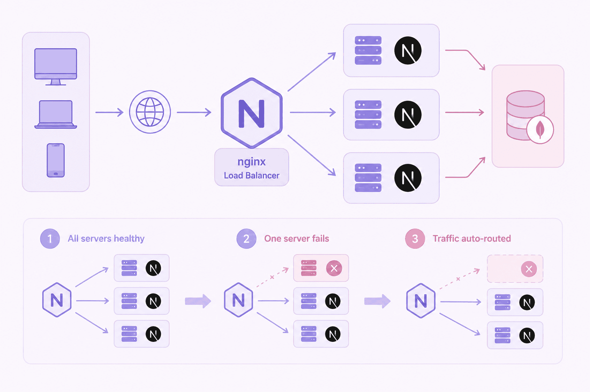

---
title: "Next.js Load Balancing & Failover Demo"
description: "A practical demonstration of load balancing and failover using Next.js, Nginx, Docker, and Docker Compose."
publishDate: 2026-06-08
techStack:
  - Next.js
  - Nginx
  - Docker
  - Docker Compose
  - Round-robin Load Balancing
  - Health-aware Upstream Configuration
githubUrl: "https://github.com/aMIrmxc/nginx-failover-loadbalancer"
demoUrl: "https://www.aparat.com/v/tcy26we"

---

# Next.js Load Balancing & Failover Demo



A practical demonstration of load balancing and failover using Next.js, Nginx, Docker, and Docker Compose.


This project demonstrates how to deploy multiple instances of a Next.js application behind an Nginx load balancer using Docker Compose. It's designed to help developers understand high availability architecture and failover mechanisms in distributed systems.

### Main Goals

- Run multiple Next.js containers
- Distribute incoming traffic using Nginx
- Identify which container serves each request
- Simulate high availability (HA)
- Demonstrate automatic failover when one container becomes unavailable

## Architecture

```
                    ┌─────────────┐
                    │   Client    │
                    └──────┬──────┘
                           │
                           ▼
                ┌──────────────────┐
                │  Nginx Load      │
                │   Balancer       │
                └──────┬─────┬─────┘
                       │     │
             ┌─────────┘     └─────────┐
             ▼                         ▼
    ┌─────────────────┐      ┌─────────────────┐
    │ Next.js Node 1  │      │ Next.js Node 2  │
    │ SERVER_NAME=A   │      │ SERVER_NAME=B   │
    └─────────────────┘      └─────────────────┘
```

## Technologies Used

### Core Infrastructure
- **Next.js** - React framework for production applications
- **Nginx** - High-performance reverse proxy and load balancer
- **Docker** - Containerization platform for consistent deployments
- **Docker Compose** - Multi-container orchestration tool

### Key Features
- Round-robin load balancing
- Health-aware upstream configuration
- Automatic failover when nodes become unavailable
- Containerized deployment for portability
- Dynamic server identification via environment variables

## Project Structure

```
.
├── app/
├── nginx/
│   └── nginx.conf
├── Dockerfile
├── docker-compose.yml
└── README.md
```

## How It Works

Each Next.js container receives a unique `SERVER_NAME` environment variable (`Server-Primary` or `Server-Backup`). When a request reaches the application, the server name is displayed on the page, allowing you to verify which container processed the request.

Nginx acts as a reverse proxy and distributes requests between available application instances using round-robin scheduling. If one instance becomes unavailable, Nginx temporarily removes it from the upstream pool and forwards traffic to the remaining healthy instance—demonstrating automatic failover.

## Running the Project

### Build and Start All Services

```bash
docker-compose up --build -d
```

### Open Your Browser

Navigate to: `http://localhost`

### Verifying Load Balancing

Refresh the page multiple times. The displayed server name should alternate between:
- **Server-Primary**
- **Server-Backup**

This indicates that requests are being distributed across both containers.

### Testing Failover

1. Stop one of the application containers:
   ```bash
   docker stop nextjs-node-1
   ```

2. Refresh the page—all requests should now be served by **Server-Backup**.

3. Restart the stopped container:
   ```bash
   docker start nextjs-node-1
   ```

4. After a short period, Nginx will resume routing traffic to both containers.

## Learning Objectives

This lab helps you understand:

✅ Reverse Proxy concepts  
✅ Load Balancing strategies  
✅ High Availability architecture  
✅ Container orchestration with Docker Compose  
✅ Nginx upstream configuration  
✅ Failover mechanisms in distributed systems  

## Watch the Demo

🎥 [Video Demo on Aparat](https://www.aparat.com/v/tcy26we)

## Get the Code

💻 [GitHub Repository](https://github.com/aMIrmxc/nginx-failover-loadbalancer)


